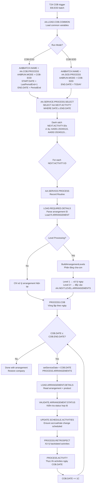
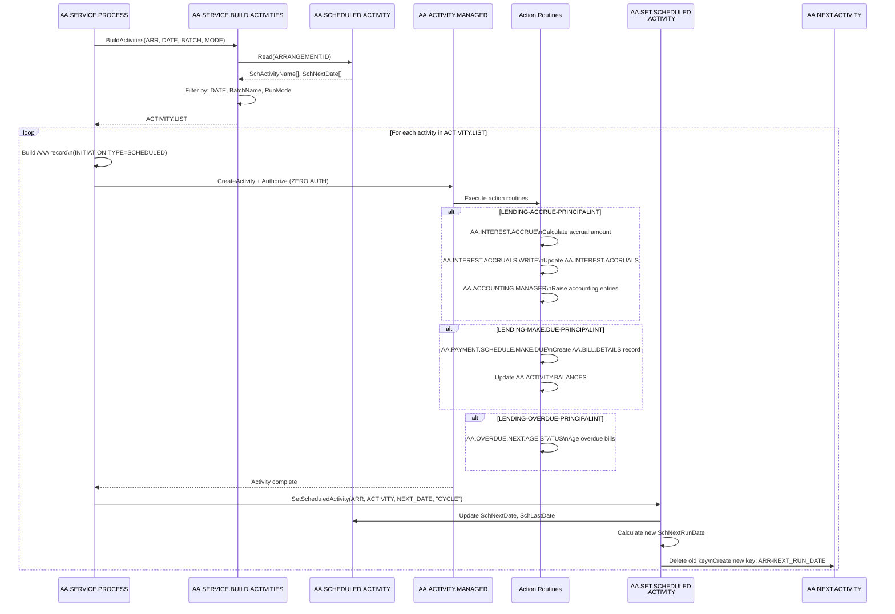
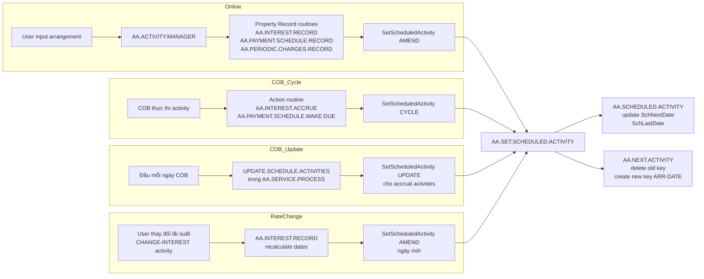
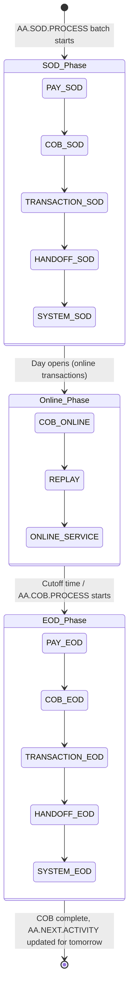

# Báo cáo: Luồng COB (Close of Business) trong AA

> Nguồn: phân tích code tại `/T24.BP/`.  
> Phạm vi: từ khi batch COB khởi động đến khi từng activity được thực thi cho từng arrangement.

---

## Mục lục

1. [Tổng quan kiến trúc COB](#1-tổng-quan-kiến-trúc-cob)
2. [Bảng AA.SCHEDULED.ACTIVITY — dữ liệu lịch chạy](#2-bảng-aascheduledactivity)
3. [Bảng AA.NEXT.ACTIVITY — index chọn lọc](#3-bảng-aanextactivity)
4. [Luồng dữ liệu vào AA.SCHEDULED.ACTIVITY](#4-luồng-dữ-liệu-vào-aascheduledactivity)
5. [Khởi động COB — AA.LOAD.COB.COMMON](#5-khởi-động-cob--aaloadcobcommon)
6. [Chọn arrangement cần xử lý — SELECT](#6-chọn-arrangement-cần-xử-lý)
7. [Xử lý từng arrangement — AA.SERVICE.PROCESS](#7-xử-lý-từng-arrangement--aaserviceprocess)
8. [Phân tầng xử lý (Batch Stages)](#8-phân-tầng-xử-lý-batch-stages)
9. [Xử lý linked arrangements và Level Processing](#9-xử-lý-linked-arrangements-và-level-processing)
10. [Sơ đồ tổng thể](#10-sơ-đồ-tổng-thể)

---

## 1. Tổng quan kiến trúc COB

COB trong AA là một **dịch vụ batch hướng sự kiện** — không phải một quy trình tuần tự cứng. Thay vì hệ thống biết trước "hôm nay phải làm gì", mỗi arrangement **tự lưu lịch** (AA.SCHEDULED.ACTIVITY) và COB chỉ đến đọc lịch đó để thực thi.

**Ba thành phần cốt lõi:**

```
AA.SCHEDULED.ACTIVITY    ← "Lịch hoạt động" của từng arrangement
AA.NEXT.ACTIVITY         ← Index tối ưu: arrangement nào đến hạn hôm nay?
AA.SERVICE.PROCESS       ← Engine thực thi: đọc lịch → chạy activity
```

**Hai giai đoạn chính trong một ngày:**

| Giai đoạn | Batch name | Thời điểm | Làm gì |
|-----------|-----------|-----------|--------|
| **SOD** (Start of Day) | `AA.SOD.PROCESS` | Đầu ngày, sau khi ngày mới mở | Intraday accrual, payment SOD |
| **EOD** (End of Day) | `AA.EOD.PROCESS` / `AA.COB.PROCESS` | Cuối ngày, sau cutoff | Accrual ngày, phí định kỳ, overdue aging, payment schedule |

---

## 2. Bảng AA.SCHEDULED.ACTIVITY

**Stereotype:** L-file (list/index file)  
**Key:** `ARRANGEMENT.ID`  
**Một record per arrangement**, multivalue structure.

### 2.1 Cấu trúc record

```
AA.SCHEDULED.ACTIVITY record (key = ARRANGEMENT.ID)
│
├── SchActivityName   <MV>  ← tên activity (ví dụ: LENDING-ACCRUE-PRINCIPALINT)
├── SchNextDate       <MV>  ← ngày chạy tiếp theo cho activity đó
├── SchLastDate       <MV>  ← ngày chạy lần cuối (để tránh chạy lại)
├── SchEventDate      <MV>  ← ngày hiệu lực (nếu khác với next date)
├── SchNextRunDate    <1>   ← ngày sớm nhất trong tất cả SchNextDate (dùng cho AA.NEXT.ACTIVITY)
└── (các MV tương ứng 1-1 theo position)
```

**Ví dụ thực tế** — một arrangement có 3 activities:

```
Position  ActivityName                    NextDate    LastDate    EventDate
   1      LENDING-ACCRUE-PRINCIPALINT     20240115    20240114    (blank)
   2      LENDING-MAKE.DUE-PRINCIPALINT   20240201    20231201    (blank)
   3      LENDING-CHANGE-INTEREST         (blank)     20240101    (blank)
```

`SchNextRunDate` = `20240115` (ngày nhỏ nhất trong các NextDate có giá trị).

### 2.2 Ý nghĩa các MODE khi gọi AA.SET.SCHEDULED.ACTIVITY

| MODE | Ý nghĩa |
|------|---------|
| `AMEND` | Thay đổi lịch chạy (không cycle). Dùng khi có thay đổi tham số (rate change, term change). |
| `CYCLE` | Chuyển NextDate → LastDate, gán NextDate mới. Dùng sau khi activity đã chạy xong một chu kỳ. |
| `DELETE` | Xóa activity khỏi lịch. Dùng khi arrangement đóng hoặc activity bị disable. |
| `LINK` | Dùng cho BUNDLE arrangement khi cần tái cấu trúc NextActivity keys. |

---

## 3. Bảng AA.NEXT.ACTIVITY

**Stereotype:** Key-only L-file (chỉ lưu key, không có data)  
**Key format:** `<ARRANGEMENT.ID>-<NEXT.RUN.DATE>`  
**Mục đích:** Index O(1) — COB SELECT chỉ cần `SELECT AA.NEXT.ACTIVITY WHERE KEY LIKE *-<TODAY>` để lấy toàn bộ arrangement đến hạn.

**Ví dụ keys trong file:**
```
AA2024010001-20240115
AA2024010002-20240115
AA2024010003-20240201
AA2024010004-20240115
```

Khi COB chạy ngày 20240115, SELECT sẽ lấy được:  
`AA2024010001`, `AA2024010002`, `AA2024010004`.

**AA.NEXT.ACTIVITY được cập nhật** mỗi khi `AA.SET.SCHEDULED.ACTIVITY` thay đổi `SchNextRunDate` của arrangement:
- Key cũ bị xóa
- Key mới `<ARRANGEMENT.ID>-<NEW.NEXT.RUN.DATE>` được tạo

**Early processing** (intraday): Key có suffix `-EARLY` (ví dụ: `AA2024010001-20240115-EARLY`). SELECT filter riêng: `@ID LIKE ...-EARLY`.

---

## 4. Luồng dữ liệu vào AA.SCHEDULED.ACTIVITY

### 4.1 Khi nào AA.SCHEDULED.ACTIVITY được tạo/cập nhật?

**Nguồn 1 — Khi activity online được authorize** (ví dụ: tạo mới arrangement):

```
User input AA.ARRANGEMENT.ACTIVITY
    → AA.ACTIVITY.MANAGER
        → Property action routines (AA.INTEREST.RECORD, AA.PAYMENT.SCHEDULE.RECORD, ...)
            → Mỗi property tính lịch chạy tiếp theo
            → Gọi AA.Framework.SetScheduledActivity(ARRANGEMENT.ID, ACTIVITY.NAME, DATE, "AMEND")
                → AA.SET.SCHEDULED.ACTIVITY cập nhật AA.SCHEDULED.ACTIVITY
                → Cập nhật AA.NEXT.ACTIVITY
```

**Nguồn 2 — Khi COB chạy xong một activity** (cycle):

```
AA.SERVICE.PROCESS thực thi activity
    → AA.ACTIVITY.MANAGER
        → Action routine (ví dụ: AA.INTEREST.ACCRUE)
            → Sau khi xử lý, tính ngày chạy tiếp theo
            → Gọi AA.Framework.SetScheduledActivity(..., "CYCLE")
                → SchNextDate mới được ghi vào AA.SCHEDULED.ACTIVITY
```

**Nguồn 3 — Khi COB bắt đầu mỗi ngày** (UPDATE_SCHEDULE.ACTIVITIES trong SERVICE.PROCESS):

```
Mỗi ngày COB, trước khi xử lý activities:
    → GET.INTEREST.CHARGE.PROPERTIES → lấy danh sách interest/charge properties
    → GET.ACCRUAL.ACTIVITIES → xác định accrual activity names
    → GET.RATE.CHANGE.ACTIVITIES → xác định rate change activity names
    → For each activity:
        → AA.Framework.SetScheduledActivity(ARR, ACTIVITY, COB.DATE, "UPDATE")
           ← "UPDATE" = đảm bảo accrual activity luôn được schedule cho ngày COB hiện tại
```

**Nguồn 4 — Khi có thay đổi tham số** (rate change, term change):

```
User thay đổi lãi suất → AA.INTEREST.CHANGE activity
    → AA.INTEREST.RECORD
        → Tính lại payment schedule, ngày accrual
        → Gọi SetScheduledActivity với date mới (AMEND)
```

### 4.2 Ai gọi AA.SET.SCHEDULED.ACTIVITY?

| Routine gọi | Khi nào | Mode |
|-------------|---------|------|
| `AA.INTEREST.RECORD` | Tạo/thay đổi interest property | AMEND |
| `AA.PAYMENT.SCHEDULE.RECORD` | Tạo/thay đổi payment schedule | AMEND |
| `AA.PERIODIC.CHARGES.RECORD` | Tạo/thay đổi periodic charge | AMEND |
| `AA.OVERDUE.RECORD` | Tạo overdue config | AMEND |
| `AA.INTEREST.ACCRUE` (action) | Sau mỗi accrual cycle | CYCLE |
| `AA.PERIODIC.CHARGES.ACCRUE` | Sau mỗi charge accrual | CYCLE |
| `AA.PAYMENT.SCHEDULE.MAKE.DUE` | Sau khi make due | CYCLE |
| `AA.SERVICE.PROCESS` | Đầu mỗi ngày COB | UPDATE |

---

## 5. Khởi động COB — AA.LOAD.COB.COMMON

`AA.LOAD.COB.COMMON` được gọi **một lần đầu mỗi batch session** để load các common variable dùng chung cho toàn bộ quá trình COB.

### 5.1 Các bước thực thi

```
AA.LOAD.COB.COMMON
├─ INITIALISE
│   ├─ Clear AA$BATCH.NAME, AA$RUN.MODE, AA$START.DATE, AA$END.DATE
│   ├─ Clear AA$ACCRUAL.DATA, AA$ACCRUAL.COMPANY (accrual frequency cache)
│   ├─ Clear R$BI.DATES/KEYS, R$PI.DATES/KEYS (rate change tracking)
│   ├─ Clear AA$LEVEL.PROCESSING
│   └─ Set AA$BATCH.NAME từ EB.Service.getProcessName() (tên batch đang chạy)
│
├─ LOAD.COB.MODE
│   ├─ Gọi AA.Framework.GetActivityStage() → lấy activityMode + activityStage
│   └─ Map sang run mode:
│       ├─ COB + SOD → "COB-SOD"
│       ├─ ONLINE-SERVICE + SOD → "COB-SOD", batch = "AA.SOD.PROCESS"
│       ├─ ONLINE-SERVICE + EOD → "ONLINE-EOD", batch = "AA.EOD.PROCESS"
│       └─ Default → "COB-EOD"
│
└─ LOAD.COB.START.END.DATES
    ├─ EOD mode:
    │   ├─ START.DATE = LastPeriodEnd + 1C
    │   └─ END.DATE = PeriodEnd (current period end)
    └─ SOD mode:
        ├─ START.DATE = LastPeriodEnd + 1C
        └─ END.DATE = TODAY (system date)
```

### 5.2 Common variables quan trọng

| Variable | Getter/Setter | Ý nghĩa |
|----------|--------------|---------|
| `AA$BATCH.NAME` | `getBatchName()` | Tên batch đang chạy: `AA.COB.PROCESS`, `AA.SOD.PROCESS`... |
| `AA$RUN.MODE` | `getRunMode()` | `COB-EOD` / `COB-SOD` / `ONLINE-EOD` |
| `AA$START.DATE` | `getStartDate()` | Ngày bắt đầu range COB |
| `AA$END.DATE` | `getEndDate()` | Ngày kết thúc range COB |
| `AA$SERVICE.DATE` | `getServiceDate()` | Ngày COB hiện tại đang xử lý (cập nhật từng ngày trong vòng lặp) |
| `AA$ACCRUAL.DATA` | `getAccrualData()` | Cache toàn bộ `AA.ACCRUAL.PARAM` records (tránh đọc lại nhiều lần) |
| `AA$LEVEL.PROCESSING` | `getLevelProcessing()` | Flag: batch này có dùng level processing không |

---

## 6. Chọn arrangement cần xử lý

### 6.1 AA.SERVICE.PROCESS.SELECT (SELECT routine)

```
AA.SERVICE.PROCESS.SELECT
    └─ EB.Service.BatchBuildList(LIST.PARAMETERS)
        └─ SELECT AA.NEXT.ACTIVITY
           ├─ Thông thường: lấy tất cả keys (key = ARR-DATE, DATE ≤ COB.END.DATE)
           └─ ONLINE-EOD (intraday): filter "@ID LIKE ...-EARLY"
```

Kết quả: danh sách `NEXT.ACTIVITY.ID` (ví dụ: `AA2024010001-20240115`).  
Mỗi ID này sẽ được truyền vào `AA.SERVICE.PROCESS` như một **Record Routine** của batch job.

### 6.2 AA.SERVICE.PROCESS.LOAD (LOAD routine, tùy chọn)

Filter thêm trước khi xử lý:
- Kiểm tra arrangement còn active không
- Arrangement bị lock bởi linked parent → skip (parent sẽ kéo nó theo)

---

## 7. Xử lý từng arrangement — AA.SERVICE.PROCESS

`AA.SERVICE.PROCESS(NEXT.ACTIVITY.ID)` là **Record Routine** của batch — được gọi một lần cho mỗi arrangement.

### 7.1 Luồng chính

```
AA.SERVICE.PROCESS(NEXT.ACTIVITY.ID)
│
├─ LOAD.REQUIRED.DETAILS
│   ├─ Parse NEXT.ACTIVITY.ID → tách ARRANGEMENT.ID và COB date
│   ├─ Đọc R.ARRANGEMENT
│   ├─ Load COB range: COB.DATE = start, COB.END.DATE = end
│   └─ Check LEVEL.PROCESSING (có cần xử lý theo tầng cha-con không)
│
├─ GET.LINKED.ARRANGEMENTS
│   ├─ Nếu LEVEL.PROCESSING=1: gọi BuildArrangementLevels → lấy first-level arrangements
│   └─ Ngược lại: chỉ xử lý arrangement hiện tại
│
└─ DO.PROCESS
    └─ PROCESS.COB ← vòng lặp theo ngày
        │
        LOOP: COB.DATE → COB.END.DATE (tăng +1 ngày mỗi iteration)
        │
        ├─ setServiceDate(COB.DATE)       ← set ngày COB hiện tại vào common
        └─ PROCESS.ARRANGEMENTS           ← vòng lặp qua từng linked arrangement
            │
            ├─ LOAD.ARRANGEMENT.DETAILS   ← đọc R.ARRANGEMENT, product, property list
            ├─ VALIDATE.ARRANGEMENT.STATUS ← kiểm tra status (AUTH, ACTIVE, CLOSED...)
            │   └─ Nếu AUTH-FWD và COB.DATE ≥ start date → chuyển sang CURRENT
            │
            ├─ UPDATE.SCHEDULE.ACTIVITIES  ← đảm bảo accrual/rate change được schedule
            │   ├─ GET.INTEREST.CHARGE.PROPERTIES
            │   ├─ GET.ACCRUAL.ACTIVITIES
            │   ├─ GET.RATE.CHANGE.ACTIVITIES
            │   └─ SetScheduledActivity(..., "UPDATE") cho mỗi activity
            │
            ├─ PROCESS.RETROSPECT          ← kiểm tra có activity backdated cần chạy
            ├─ PROCESS.ACTIVITY            ← **thực thi activities theo batch stage**
            └─ CHECK.FACILITY              ← xử lý đặc biệt cho FACILITY arrangement
```

### 7.2 PROCESS.ACTIVITY — chi tiết thực thi

```
PROCESS.ACTIVITY
│
├─ AA.SERVICE.BUILD.ACTIVITIES
│   ├─ Đọc AA.SCHEDULED.ACTIVITY của arrangement
│   ├─ Filter activities theo:
│   │   ├─ NextDate ≤ COB.DATE
│   │   ├─ BatchName khớp với CURRENT.BATCH
│   │   └─ RunMode (SOD vs EOD)
│   └─ Trả về ACTIVITY.LIST
│
└─ For each activity in ACTIVITY.LIST:
    │
    ├─ Validate: activity chưa chạy hôm nay (SchLastDate ≠ COB.DATE)
    ├─ Xây dựng AAA record (AA.ARRANGEMENT.ACTIVITY) với:
    │   ├─ ACTIVITY = activity name
    │   ├─ EFFECTIVE.DATE = SchEventDate hoặc COB.DATE
    │   └─ INITIATION.TYPE = "SCHEDULED"
    │
    ├─ Gọi AA.Framework.CreateActivity → ghi AA.ARRANGEMENT.ACTIVITY vào INAU
    ├─ Authorize (ZERO.AUTH = 1 → auto-authorize)
    │
    ├─ AA.ACTIVITY.MANAGER (thực thi activity)
    │   └─ Gọi action routines cho từng property class
    │       ├─ AA.INTEREST.ACCRUE → tính và ghi lãi
    │       ├─ AA.PERIODIC.CHARGES.ACCRUE → tính phí
    │       ├─ AA.PAYMENT.SCHEDULE.MAKE.DUE → tạo bill
    │       ├─ AA.OVERDUE.NEXT.AGE → aging overdue
    │       └─ ... (các action routines khác)
    │
    └─ Sau khi activity xong:
        └─ SetScheduledActivity(..., "CYCLE")  ← cập nhật ngày chạy tiếp theo
```

---

## 8. Phân tầng xử lý (Batch Stages)

COB không xử lý tất cả activities trong một lần. Activities được phân loại theo **batch stage** và **run mode**, đảm bảo thứ tự xử lý đúng.

### 8.1 Danh sách batch stages theo thứ tự

```
Stage sequence (AA$BATCH.LIST):

SOD phases:
  1. PAY-SOD          ← Xử lý thanh toán SOD (payment receive/send)
  2. COB-SOD          ← COB activities loại SOD (ví dụ: accrual sớm)
  3. TRANSACTION-SOD  ← Giao dịch SOD
  4. HANDOFF-SOD      ← Handoff sang hệ thống ngoài (SOD)
  5. SYSTEM-SOD       ← System activities SOD

Online phases:
  6. COB-ONLINE       ← Xử lý online trong ngày
  7. REPLAY           ← Replay lại failed activities
  8. ONLINE-SERVICE   ← Intraday EOD service

EOD phases:
  9. PAY-EOD          ← Thanh toán EOD
 10. COB-EOD          ← COB activities chính (accrual, make due, aging...)
 11. TRANSACTION-EOD  ← Giao dịch EOD
 12. HANDOFF-EOD      ← Handoff EOD
 13. SYSTEM-EOD       ← System activities EOD
```

### 8.2 Mỗi AA.ACTIVITY record có batch stage nào?

Trong `AA.ACTIVITY.CLASS`, mỗi activity được gắn với:
- **BATCH.NAME** — tên batch stage (ví dụ: `COB-EOD`, `PAY-SOD`)
- **ZERO.AUTH** — YES: auto-authorize trong COB (không cần human approval)

`AA.SERVICE.BUILD.ACTIVITIES` chỉ đưa vào danh sách xử lý những activities mà `BATCH.NAME` khớp với batch đang chạy.

### 8.3 Ví dụ phân loại activities

| Activity | Batch Stage | Lý do |
|----------|-------------|-------|
| `LENDING-ACCRUE-PRINCIPALINT` | COB-EOD | Accrual lãi cuối ngày |
| `LENDING-MAKE.DUE-PRINCIPALINT` | COB-EOD | Tạo bill phải trả |
| `LENDING-OVERDUE-PRINCIPALINT` | COB-EOD | Aging overdue |
| `LENDING-PAY-PRINCIPALINT` | PAY-EOD | Thu nợ tự động |
| `DEPOSITS-ACCRUE-INTEREST` | COB-EOD | Accrual lãi tiền gửi |
| `ACCOUNT-CHARGE.HANDOFF` | HANDOFF-EOD | Handoff phí sang module khác |

---

## 9. Xử lý linked arrangements và Level Processing

### 9.1 Tại sao cần linked arrangements?

Khi một arrangement có parent-child relationship (ví dụ: FACILITY → LENDING drawings), thứ tự xử lý phải đảm bảo:
- Parent (FACILITY) được xử lý **trước**
- Sau đó mới xử lý các child drawings

### 9.2 Level Processing

Khi batch `AA.SERVICE.PROCESS` có job `AA.PROCESS.LEVEL.ARRANGEMENTS` đi kèm:

```
AA.LOAD.COB.COMMON → CheckLevelProcessing
    → Đọc batch record → kiểm tra có "AA.PROCESS.LEVEL.ARRANGEMENTS" job không
    → Nếu có: AA$LEVEL.PROCESSING = "1"

AA.SERVICE.PROCESS:
    → BuildArrangementLevels(ARRANGEMENT.ID, ...)
        → Phân tích toàn bộ cây cha-con
        → Trả về: Level 1 arrangements, Level 2 arrangements, ...
    → UpdateArrangementLevels(LEVEL.ARRANGEMENTS)
        → Ghi Level 2+ vào "AA.NEXT.LEVEL.ARRANGEMENTS" list file
        → Format key: <ArrangementId>-<Level>
    → Chỉ xử lý Level 1 trong job hiện tại
    → Level 2+ sẽ được xử lý bởi job "AA.PROCESS.LEVEL.ARRANGEMENTS" tiếp theo
```

### 9.3 Linked rate changes

Khi arrangement A có lãi suất linked tới arrangement B:
- Khi B thay đổi rate → COB tự động trigger `CHANGE-INTEREST` cho A
- Tracked qua: `LINKED.RATE.ARRANGEMENT` + `LINKED.RATE.PROPERTY` arrays
- Sau khi xử lý xong: `AA.Interest.UpdateLinkRate("CLEAR", ...)` để dọn dẹp

---

## 10. Sơ đồ tổng thể

### 10.1 Tổng quan luồng COB (Flowchart)



### 10.2 Chi tiết PROCESS.ACTIVITY (Sequence Diagram)



### 10.3 Cách AA.SCHEDULED.ACTIVITY được sinh ra (sơ đồ)



### 10.4 Cấu trúc batch stages (State Diagram)



---

## Tóm tắt bảng tham chiếu nhanh

| Bảng | Ai đọc | Ai ghi | Khi nào |
|------|--------|--------|---------|
| `AA.SCHEDULED.ACTIVITY` | `AA.SERVICE.BUILD.ACTIVITIES`, `AA.GET.NEXT.COB.ACTIVITY` | `AA.SET.SCHEDULED.ACTIVITY` | Mỗi khi property thay đổi lịch hoặc activity complete cycle |
| `AA.NEXT.ACTIVITY` | `AA.SERVICE.PROCESS.SELECT` (batch SELECT) | `AA.SET.SCHEDULED.ACTIVITY` | Mỗi khi `SchNextRunDate` thay đổi |
| `AA.ARRANGEMENT.ACTIVITY` | `AA.ACTIVITY.MANAGER` | `AA.SERVICE.PROCESS` (tạo mới cho mỗi COB activity) | Mỗi activity execution trong COB |
| `AA.INTEREST.ACCRUALS` | Action routines | `AA.INTEREST.ACCRUALS.WRITE` | Sau mỗi ACCRUE cycle |
| `AA.BILL.DETAILS` | `AA.PAYMENT.SCHEDULE.MAKE.DUE` | `AA.PAYMENT.SCHEDULE.MAKE.DUE` | Khi MAKE.DUE activity chạy |
| `AA.ACTIVITY.BALANCES` | Nhiều routines | Action routines | Sau mỗi activity ảnh hưởng balance |
