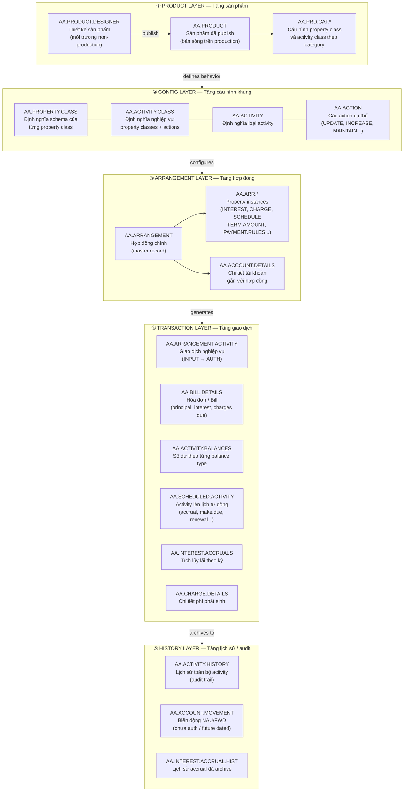
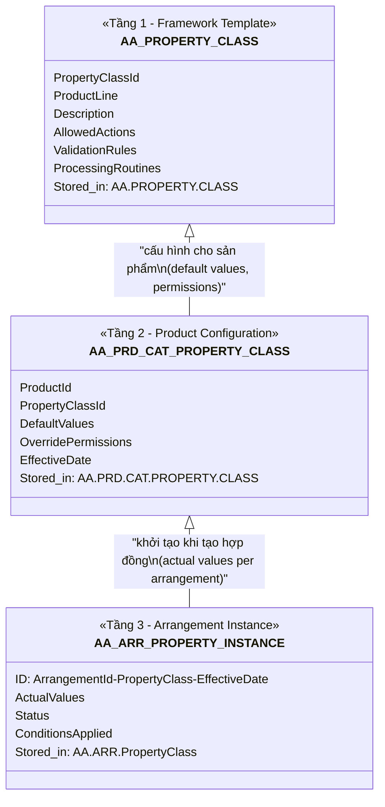
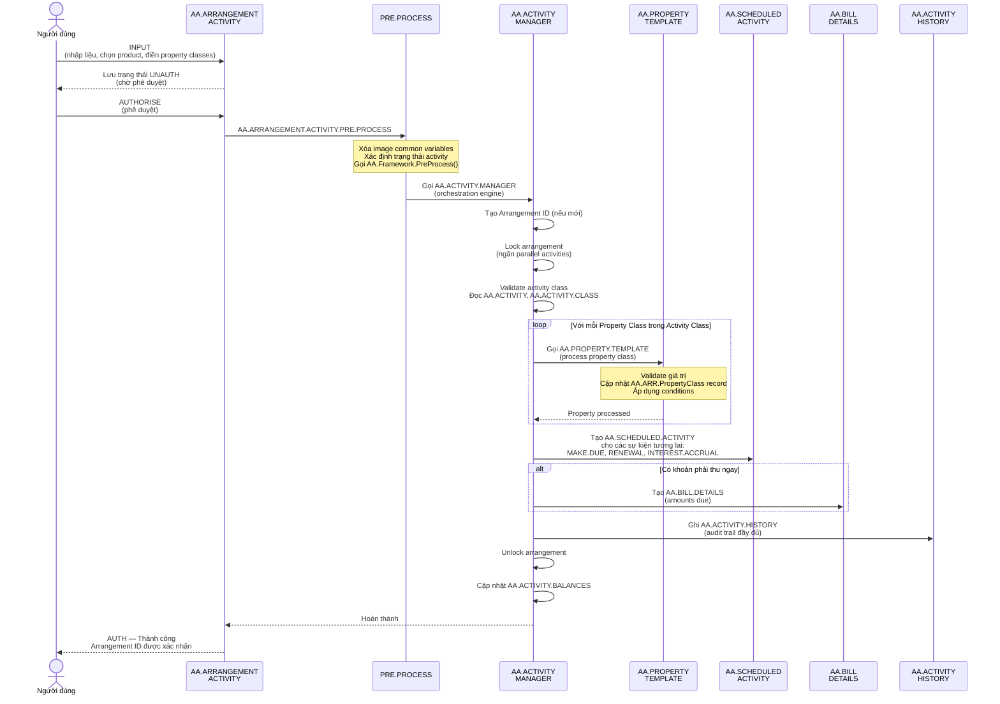
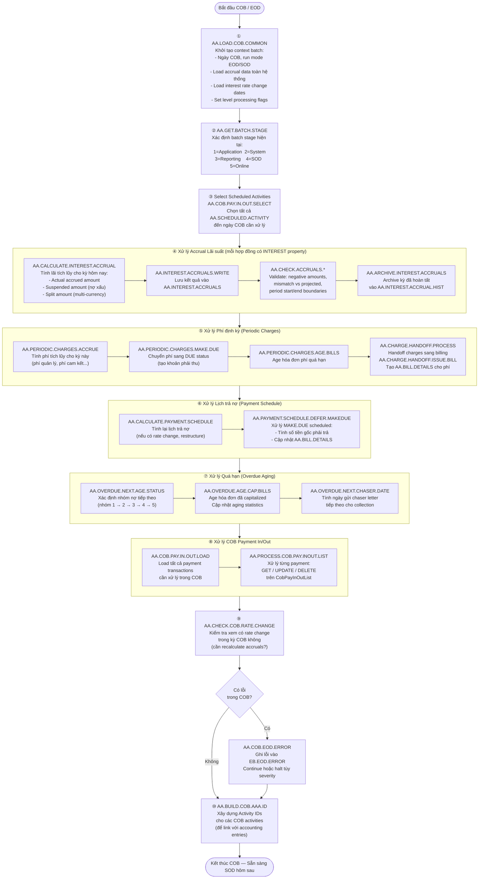
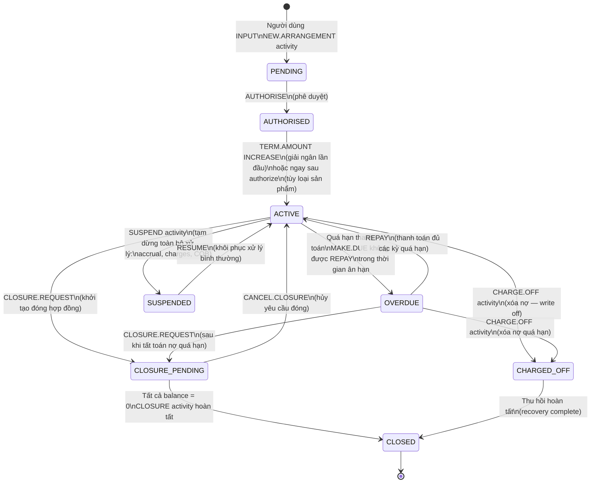

# Báo cáo tổng quan khung AA (Arrangement Architecture) — T24 Temenos

> **Phạm vi:** Toàn bộ khung AA trong T24, bao gồm kiến trúc dữ liệu, luồng xử lý online, và luồng COB (Close of Business).
> **Nguồn tham khảo:** Mã nguồn BASIC (~500 file) trong `T24.BP/`, cấu hình hệ thống tại ngân hàng VN-001-0001 (Hội Sở).

---

## Mục lục

1. [Giới thiệu khung AA](#1-giới-thiệu-khung-aa)
2. [Kiến trúc phân tầng](#2-kiến-trúc-phân-tầng)
3. [Các bảng dữ liệu cốt lõi và mối liên hệ](#3-các-bảng-dữ-liệu-cốt-lõi-và-mối-liên-hệ)
4. [Property Class — thiết kế dựa trên thuộc tính](#4-property-class--thiết-kế-dựa-trên-thuộc-tính)
5. [Activity Class — cơ chế điều phối nghiệp vụ](#5-activity-class--cơ-chế-điều-phối-nghiệp-vụ)
6. [Luồng xử lý online](#6-luồng-xử-lý-online)
7. [Luồng COB (Close of Business)](#7-luồng-cob-close-of-business)
8. [Vòng đời hợp đồng — Arrangement Lifecycle](#8-vòng-đời-hợp-đồng--arrangement-lifecycle)

---

## 1. Giới thiệu khung AA

### AA là gì?

**Arrangement Architecture (AA)** là khung xử lý sản phẩm tài chính thế hệ mới của Temenos T24, được thiết kế để thay thế các module truyền thống (LD — Loans & Deposits, MM — Money Market, FT — Funds Transfer, v.v.). Thay vì mỗi module có riêng bảng dữ liệu, logic xử lý và màn hình nhập liệu, AA cung cấp **một engine duy nhất** có thể vận hành bất kỳ sản phẩm tài chính nào thông qua cấu hình.

### Vấn đề AA giải quyết

Trong kiến trúc module truyền thống của T24:
- Mỗi module có bảng dữ liệu và logic xử lý riêng biệt → khó bảo trì, khó mở rộng
- Khi ngân hàng muốn ra sản phẩm mới, phải viết code mới hoặc sửa code cũ
- Không có framework thống nhất cho lifecycle quản lý hợp đồng (tạo, giải ngân, thu nợ, đóng)

AA giải quyết bằng cách:
- **Tách biệt cấu hình và xử lý**: business rules được định nghĩa trong data (property classes, activity classes), không nằm trong code
- **Tái sử dụng engine**: cùng một engine xử lý tất cả sản phẩm — vay, gửi, thế chấp, đồng tài trợ
- **Vòng đời chuẩn hóa**: mọi hợp đồng đều đi qua lifecycle chung (tạo → active → thu nợ → đóng)

### Các product line sử dụng AA

| Product Line | Mô tả |
|---|---|
| `LENDING` | Cho vay tiêu dùng, tín dụng doanh nghiệp, overdraft |
| `DEPOSITS` | Tiền gửi có kỳ hạn, tiết kiệm, tiền gửi không kỳ hạn |
| `MORTGAGE` | Vay thế chấp bất động sản |
| `ASSET.FINANCE` | Tài trợ mua sắm tài sản, cho thuê tài chính |
| `TRADE.FINANCE` | Tài trợ thương mại, bảo lãnh, L/C |

### Hai khái niệm trung tâm

```
Property Class  →  Định nghĩa một "khía cạnh" của hợp đồng (lãi suất, phí, lịch trả nợ...)
                   Mỗi hợp đồng có N property class instances
                   Giống như: mỗi hợp đồng có nhiều "phụ lục điều khoản"

Activity Class  →  Định nghĩa một "nghiệp vụ" có thể thực hiện trên hợp đồng
                   (tạo mới, giải ngân, thu nợ, tái cơ cấu, đóng...)
                   Giống như: danh sách các "giao dịch được phép" và cách thực hiện
```

---

## 2. Kiến trúc phân tầng

Khung AA được tổ chức thành 5 tầng từ trên xuống, mỗi tầng có vai trò riêng biệt:



---

## 3. Các bảng dữ liệu cốt lõi và mối liên hệ

### Danh sách bảng chính

| Bảng | Loại | Mô tả |
|---|---|---|
| `AA.PRODUCT` | L-file (Live) | Sản phẩm đã publish — nền tảng để tạo hợp đồng |
| `AA.PRODUCT.DESIGNER` | H-file | Workspace thiết kế sản phẩm trước khi publish |
| `AA.PROPERTY.CLASS` | H-file | Schema định nghĩa từng property class |
| `AA.ACTIVITY.CLASS` | H-file | Cấu hình nghiệp vụ: property classes + actions + user input |
| `AA.ACTIVITY` | H-file | Định nghĩa các loại activity (NEW.ARRANGEMENT, DISBURSEMENT...) |
| `AA.ACTION` | H-file | Các action cụ thể trong property class (UPDATE, INCREASE...) |
| `AA.ARRANGEMENT` | L-file | Hợp đồng chính — record trung tâm của toàn bộ khung |
| `AA.ACCOUNT.DETAILS` | L-file | Chi tiết tài khoản gắn với hợp đồng (ngày, trạng thái, số tài khoản) |
| `AA.ARR.*` | L-file | Property instances (AA.ARR.INTEREST, AA.ARR.CHARGE, AA.ARR.PAYMENT.SCHEDULE...) |
| `AA.ARRANGEMENT.ACTIVITY` | H-file | Giao dịch nghiệp vụ — entry point của người dùng |
| `AA.ACTIVITY.HISTORY` | L-file | Lịch sử mọi activity đã authorized (audit trail) |
| `AA.BILL.DETAILS` | L-file | Hóa đơn/Bill — theo dõi khoản phải thu (principal, lãi, phí) |
| `AA.CHARGE.DETAILS` | L-file | Chi tiết từng khoản phí phát sinh |
| `AA.SCHEDULED.ACTIVITY` | L-file | Danh sách activity hệ thống tự chạy theo lịch (COB trigger) |
| `AA.ACTIVITY.BALANCES` | L-file | Số dư tổng hợp theo từng balance type cho hợp đồng |
| `AA.INTEREST.ACCRUALS` | L-file | Lãi tích lũy theo kỳ — cập nhật mỗi COB |
| `AA.INTEREST.ACCRUAL.HIST` | L-file | Lịch sử accrual đã archive sau khi kỳ kết thúc |
| `AA.ACCOUNT.MOVEMENT` | L-file | Biến động số dư chưa authorized (NAU) hoặc future-dated (FWD) |
| `AA.ACCRUAL.FREQUENCY` | H-file | Cấu hình tần suất tính lãi (daily, monthly...) |

### Sơ đồ quan hệ (ER Diagram)

```mermaid
erDiagram
    AA_PRODUCT {
        string ProductId PK
        string ProductLine
        string Category
        string Status
    }
    AA_PROPERTY_CLASS {
        string PropertyClassId PK
        string Description
        string ProductLine
        string AllowedActions
    }
    AA_ACTIVITY_CLASS {
        string ActivityClassId PK
        string ProductLine
        string ProcessId
        string ClassId
        string ActivityTypes
    }
    AA_ARRANGEMENT {
        string ArrangementId PK
        string ProductId FK
        string CustomerNo
        string Currency
        string StartDate
        string MaturityDate
        string Status
    }
    AA_ACCOUNT_DETAILS {
        string ArrangementId PK_FK
        string AccountNo
        string StartDate
        string MaturityDate
        string StatusCode
    }
    AA_ARR_PROPERTY {
        string Id PK
        string ArrangementId FK
        string PropertyClass
        string EffectiveDate
        string PropertyValues
    }
    AA_ARRANGEMENT_ACTIVITY {
        string ActivityId PK
        string ArrangementId FK
        string ActivityClass
        string EffectiveDate
        string Status
        string Inputter
    }
    AA_ACTIVITY_HISTORY {
        string ActivityId PK_FK
        string ArrangementId FK
        string ActivityClass
        string DateAuthorised
        string PropertiesUpdated
    }
    AA_BILL_DETAILS {
        string BillId PK
        string ArrangementId FK
        string DueDate
        string Status
        decimal PrincipalDue
        decimal InterestDue
        decimal ChargesDue
        string AgingStatus
    }
    AA_CHARGE_DETAILS {
        string ChargeId PK
        string ArrangementId FK
        string BillId FK
        string ChargeType
        decimal Amount
        string AccrualMethod
    }
    AA_SCHEDULED_ACTIVITY {
        string ScheduleId PK
        string ArrangementId FK
        string ActivityClass
        string ScheduleDate
        string Status
        string Parameters
    }
    AA_ACTIVITY_BALANCES {
        string ArrangementId PK_FK
        string BalanceType
        decimal Amount
        string LastUpdated
    }
    AA_INTEREST_ACCRUALS {
        string Id PK
        string ArrangementId FK
        string PropertyClass
        decimal AccruedAmount
        decimal SuspendedAmount
        decimal SplitAmount
        string LastAccrualDate
    }
    AA_ACCOUNT_MOVEMENT {
        string Id PK
        string ArrangementId FK
        string BalanceType
        decimal NauAmount
        decimal FwdAmount
        string ValueDate
        string ActivityId FK
    }

    AA_PRODUCT ||--o{ AA_ARRANGEMENT : "tạo hợp đồng từ"
    AA_ARRANGEMENT ||--|| AA_ACCOUNT_DETAILS : "có tài khoản"
    AA_ARRANGEMENT ||--o{ AA_ARR_PROPERTY : "có các property"
    AA_ARRANGEMENT ||--o{ AA_ARRANGEMENT_ACTIVITY : "ghi nhận activity"
    AA_ARRANGEMENT_ACTIVITY ||--|| AA_ACTIVITY_HISTORY : "lưu lịch sử"
    AA_ARRANGEMENT ||--o{ AA_BILL_DETAILS : "sinh ra bill"
    AA_BILL_DETAILS ||--o{ AA_CHARGE_DETAILS : "chứa phí"
    AA_ARRANGEMENT ||--o{ AA_SCHEDULED_ACTIVITY : "lên lịch activity"
    AA_ARRANGEMENT ||--|| AA_ACTIVITY_BALANCES : "theo dõi số dư"
    AA_ARRANGEMENT ||--o{ AA_INTEREST_ACCRUALS : "tích lũy lãi"
    AA_ARRANGEMENT ||--o{ AA_ACCOUNT_MOVEMENT : "ghi biến động"
    AA_ARRANGEMENT_ACTIVITY ||--o{ AA_ACCOUNT_MOVEMENT : "tạo ra"
```

---

## 4. Property Class — thiết kế dựa trên thuộc tính

### Cơ chế hoạt động

Property Class là đơn vị cấu hình nhỏ nhất trong AA. Mỗi property class đại diện cho **một khía cạnh nghiệp vụ** của hợp đồng — ví dụ: INTEREST đại diện cho toàn bộ logic lãi suất, PAYMENT.SCHEDULE đại diện cho toàn bộ logic lịch trả nợ.

Hệ thống hoạt động theo 3 tầng kế thừa:



**Ví dụ về ID của property instance:**
```
AA000001-INTEREST-20240101
│         │        └── Effective date (ngày có hiệu lực)
│         └── Property Class
└── Arrangement ID
```

Một hợp đồng có thể có nhiều phiên bản của cùng một property class (theo thời gian thay đổi điều kiện).

### Danh sách Property Class

| Property Class | Mô tả | Vai trò trong hợp đồng |
|---|---|---|
| `ACCOUNT` | Account Static | Thông tin tài khoản gắn với hợp đồng |
| `ACCOUNTING` | Accounting | Cấu hình kế toán, booking entity |
| `ACTIVITY.API` | Activity API | Tích hợp API bên ngoài khi có sự kiện |
| `ACTIVITY.CHARGES` | Activity Charges | Phí phát sinh khi thực hiện activity |
| `ACTIVITY.MAPPING` | Activity Mapping | Ánh xạ activity sang sự kiện kế toán |
| `ACTIVITY.MESSAGING` | Activity Messaging | Cấu hình template thông báo / advice |
| `ACTIVITY.RESTRICTION` | Activity Restriction | Hạn chế các activity được phép |
| `AGENT.COMMISSION` | Agent Commission | Hoa hồng đại lý / kênh phân phối |
| `ALERTS` | Alerts Definition | Cảnh báo và notification |
| `BALANCE.MAINTENANCE` | Balance Maintenance | Yêu cầu duy trì số dư tối thiểu |
| `CHANGE.PRODUCT` | Change Product | Điều kiện thay đổi sản phẩm |
| `CHARGE` | Charge Definition | Định nghĩa các loại phí áp dụng |
| `CHARGEOFF` | Charge-Off Rules | Quy tắc và phân loại xóa nợ |
| `CLOSURE` | Closure Rules | Quy tắc đóng hợp đồng sớm / đúng hạn |
| `CONSTRAINT` | Backdating Constraint | Giới hạn hạch toán lùi ngày |
| `CUSTOMER` | Customer | Thông tin khách hàng gắn với hợp đồng |
| `DORMANCY` | Dormancy | Xử lý tài khoản không hoạt động |
| `ELIGIBILITY` | Eligibility | Điều kiện vay / đánh giá định kỳ |
| `EVIDENCE` | Covenants and Conditions | Điều kiện ràng buộc (covenants) |
| `FACILITY` | Facility | Liên kết và cấu trúc hạn mức tín dụng |
| `INTEREST` | Interest Calculation | Lãi suất, phương thức tính, kỳ accrual |
| `LIMIT` | Account Limit | Hạn mức tín dụng của hợp đồng |
| `OFFICERS` | Officers | Cán bộ phụ trách, đơn vị kinh doanh |
| `OVERDUE` | Overdue Processing | Xử lý quá hạn, lãi phạt, nhóm nợ |
| `PARTICIPANT` | Participant | Đồng tài trợ (syndicated lending) |
| `PAYMENT.RULES` | Payment Rules | Thứ tự knock-off, xử lý thanh toán |
| `PAYMENT.SCHEDULE` | Payment Schedule | Lịch trả nợ gốc và lãi |
| `PAYOUT.RULES` | Payout Rules | Quy tắc chi trả tiền ra ngoài |
| `PAYOFF` | Payoff Rules | Tất toán trước hạn |
| `PERIODIC.CHARGES` | Periodic Charges | Phí định kỳ tự động (quản lý, duy trì) |
| `PRICING.GRID` | Pricing Grid | Lưới định giá theo ngưỡng |
| `PRICING.RULES` | Pricing Rules | Quy tắc định giá tổng hợp |
| `REPORTING` | Reporting | Cấu hình báo cáo |
| `RESTRUCTURE.RULES` | Restructure Rules | Quy tắc tái cơ cấu nợ |
| `SETTLEMENT` | Settlement Instructions | Thông tin thanh toán / settlement |
| `STATEMENT` | Statement | Cấu hình sao kê |
| `TAX` | Tax Definition | Thuế GTGT, thuế khấu lưu |
| `TERM.AMOUNT` | Term Amount | Số tiền hạn mức / giải ngân |

---

## 5. Activity Class — cơ chế điều phối nghiệp vụ

### Activity Class là gì?

Mỗi **Activity Class** định nghĩa đầy đủ cách thực hiện một nghiệp vụ trên hợp đồng. Ví dụ `LENDING-NEW-ARRANGEMENT` định nghĩa toàn bộ quy trình tạo mới hợp đồng cho vay.

Một Activity Class gồm:
- **Activity Types**: loại xử lý (`User`, `Position.management`, `Cashflow`, `Limit.check`...)
- **Danh sách Property Class + Action**: từng bước xử lý nghiệp vụ
- **User Input flag**: property nào cần người dùng nhập (Yes) và property nào hệ thống tự xử lý (No)

### Phân loại theo User Input

| User Input | Ý nghĩa | Ví dụ |
|---|---|---|
| `Yes` | Hiện trên màn hình để người dùng nhập/chỉnh sửa | INTEREST UPDATE, TERM.AMOUNT INCREASE |
| `No` | Hệ thống tự xử lý sau khi authorize, không hiện trên UI | ACTIVITY.CHARGES CALCULATE, ACTIVITY.MESSAGING SEND.MESSAGE |

### Các loại Action phổ biến

| Action | Mô tả |
|---|---|
| `UPDATE` | Lưu và validate giá trị mới cho property class |
| `MAINTAIN` | Tạo/cập nhật record liên quan (ví dụ: tài khoản) |
| `INCREASE` | Tăng số tiền (TERM.AMOUNT) |
| `EVALUATE` | Đánh giá điều kiện, không thay đổi giá trị |
| `CALCULATE` | Tính toán phí/lãi, không hiện trên UI |
| `ISSUE.ORDER` | Tạo lệnh thanh toán |
| `CHECK.MEMO` | Kiểm tra điều kiện nội bộ |
| `CHECK.PROJECTION` | Kiểm tra xem có cần online projection |
| `SEND.MESSAGE` | Gửi thông báo / advice |
| `SEND.EVENT` | Gửi event sang module khác (Agent Commission...) |
| `LINK.UPDATE` | Cập nhật quan hệ liên kết |
| `ALTERNATE` | Xử lý điều kiện thay thế |

### Một số Activity Class quan trọng trong LENDING

| Activity Class | Mô tả |
|---|---|
| `LENDING-NEW-ARRANGEMENT` | Tạo mới hợp đồng vay |
| `LENDING-DISBURSE-TERM.AMOUNT` | Giải ngân |
| `LENDING-REPAY-TERM.AMOUNT` | Thu nợ gốc |
| `LENDING-MAKE.DUE-TERM.AMOUNT` | Chuyển sang trạng thái DUE |
| `LENDING-CAPITALISE-INTEREST` | Gộp lãi vào gốc |
| `LENDING-RESTRUCTURE` | Tái cơ cấu hợp đồng |
| `LENDING-CLOSURE` | Đóng hợp đồng |
| `LENDING-CHARGEOFF` | Xóa nợ |

---

## 6. Luồng xử lý online

Khi người dùng thực hiện một nghiệp vụ (ví dụ: tạo mới hợp đồng vay), luồng xử lý diễn ra như sau:



### Giải thích các bước quan trọng

**1. AA.ARRANGEMENT.ACTIVITY (entry point)**
- Là màn hình giao dịch duy nhất người dùng tương tác
- Hỗ trợ: INPUT, AUTHORISE, REVERSE, DELETE
- Mỗi activity có trạng thái: UNAUTH → AUTH → REVERSED

**2. PRE.PROCESS (tiền xử lý)**
- Chạy trước khi ACTIVITY.MANAGER, cả khi INPUT lẫn khi AUTH
- Xử lý zero-auth arrangements (hệ thống tự authorize ngay)
- Ẩn/hiện property fields tùy cấu hình

**3. AA.ACTIVITY.MANAGER (engine trung tâm)**
- Điều phối toàn bộ luồng xử lý
- Áp dụng arrangement-level locking để ngăn xung đột
- Gọi lần lượt từng property class theo thứ tự trong activity class
- Xử lý cả primary và secondary activities (activities được tạo ra tự động trong quá trình)

**4. AA.PROPERTY.TEMPLATE (xử lý property)**
- Một engine chung cho tất cả property classes
- Gọi các routine riêng theo property class: `AA.INTEREST.UPDATE.b`, `AA.CHARGE.UPDATE.b`...
- Kết quả: AA.ARR.* record được tạo/cập nhật

**5. AA.SCHEDULED.ACTIVITY (lên lịch)**
- Mỗi hợp đồng mới tạo ra nhiều scheduled activities
- Ví dụ: ngày trả nợ đầu tiên → scheduled MAKE.DUE
- COB đọc các scheduled activities này để tự động xử lý

---

## 7. Luồng COB (Close of Business)

COB là quy trình xử lý hàng ngày (End-of-Day) của AA, chạy tự động qua T24 Service framework. COB xử lý tất cả các sự kiện đến hạn trong ngày.



### Batch stages trong COB

| Stage | ID | Mô tả |
|---|---|---|
| Application | 1 | Xử lý chính của application (activities đến hạn) |
| System | 2 | Xử lý hệ thống (accruals, balances, limits) |
| Reporting | 3 | Sinh báo cáo, số liệu cuối ngày |
| SOD (Start of Day) | 4 | Chuẩn bị cho ngày làm việc tiếp theo |
| Online | 5 | Online service processing (HVT, real-time) |

### Luồng xử lý Interest Accrual chi tiết

Trong mỗi COB, lãi tích lũy được tính cho **từng property class có cấu hình lãi** của mỗi hợp đồng:

```
AA.INTEREST.ACCRUALS record: ArrangementId-PropertyClass
├── AccruedAmount    : tổng lãi tích lũy đến hôm nay
├── SuspendedAmount  : lãi tạm hoãn (nợ xấu, suspend)
├── SplitAmount      : phần lãi đã split ra
└── LastAccrualDate  : ngày tính lãi gần nhất
```

Nếu ngày hôm nay là ngày kỳ kế toán kết thúc → lãi được `hạch toán vào P&L` và accrual được reset.

---

## 8. Vòng đời hợp đồng — Arrangement Lifecycle



### Mô tả các trạng thái

| Trạng thái | Mô tả | COB hoạt động? |
|---|---|---|
| `PENDING` | Hợp đồng đã nhập nhưng chưa authorize | Không |
| `AUTHORISED` | Đã authorize, chờ giải ngân | Có (limited) |
| `ACTIVE` | Hợp đồng đang hoạt động bình thường | Có — đầy đủ |
| `OVERDUE` | Có khoản quá hạn chưa thanh toán | Có — thêm xử lý quá hạn |
| `SUSPENDED` | Tạm hoãn toàn bộ (accrual, charges) | Không |
| `CHARGED_OFF` | Đã xóa nợ, theo dõi thu hồi | Có — limited |
| `CLOSURE_PENDING` | Đang trong quy trình đóng | Có — tất toán |
| `CLOSED` | Đóng hoàn toàn, không còn balance | Không |

### Activity COB quan trọng theo trạng thái ACTIVE

```
Hàng ngày (EOD):
├── INTEREST ACCRUE       → Tính lãi tích lũy vào AA.INTEREST.ACCRUALS
├── PERIODIC.CHARGES ACCRUE → Tính phí định kỳ
└── Kiểm tra rate change  → Recalculate nếu cần

Theo lịch (SCHEDULED.ACTIVITY):
├── MAKE.DUE              → Chuyển gốc/lãi sang DUE, tạo AA.BILL.DETAILS
├── INTEREST CAPITALISE   → Gộp lãi vào gốc (nếu cấu hình capitalise)
├── CHARGE MAKE.DUE       → Chuyển phí sang DUE
└── RENEWAL               → Tự động gia hạn (nếu cấu hình)

Theo người dùng:
├── REPAY                 → Ghi nhận thanh toán, knock-off DUE balances
├── DISBURSEMENT          → Giải ngân thêm (revolving credit)
└── CHANGE.PRODUCT        → Thay đổi điều kiện sản phẩm
```

---

## Phụ lục: Bảng tổng hợp file nguồn quan trọng

| File | Vai trò |
|---|---|
| `AA.ACTIVITY.MANAGER.b` | Engine trung tâm điều phối toàn bộ online processing |
| `AA.ARRANGEMENT.ACTIVITY.PROCESS.b` | Wrapper cho activity execution |
| `AA.ARRANGEMENT.ACTIVITY.PRE.PROCESS.b` | Tiền xử lý trước khi vào ACTIVITY.MANAGER |
| `AA.LOAD.COB.COMMON.b` | Khởi tạo COB context |
| `AA.CALCULATE.INTEREST.ACCRUAL.b` | Tính lãi tích lũy mỗi COB |
| `AA.PERIODIC.CHARGES.ACCRUE.b` | Tính phí định kỳ mỗi COB |
| `AA.CALCULATE.PAYMENT.SCHEDULE.b` | Tính lịch trả nợ |
| `AA.PROCESS.CHARGE.MAKE.DUE.b` | Xử lý chuyển phí sang DUE |
| `AA.ACCOUNT.MAINTAIN.b` | Tạo/cập nhật tài khoản từ hợp đồng |
| `AA.SETTLEMENT.ISSUE.ORDER.b` | Tạo lệnh thanh toán |
| `AA.ALERTS.EVALUATE.b` | Kích hoạt cảnh báo |
| `AA.ACTIVITY.MESSAGING.SEND.MESSAGE.b` | Gửi thông báo / advice |
| `AA.OVERDUE.NEXT.AGE.STATUS.b` | Tính nhóm nợ quá hạn |
| `AA.COB.WRAPPER.b` | Dispatcher cho COB components |
| `AA.COB.EOD.ERROR.b` | Xử lý lỗi COB/EOD |

---

*Báo cáo được tổng hợp từ phân tích mã nguồn BASIC T24 tại `/T24.BP/`, phiên bản hệ thống VN-001-0001 (Hội Sở). Ngày tổng hợp: 26/05/2026.*
