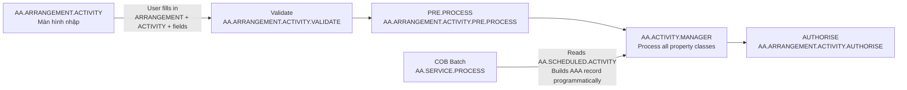
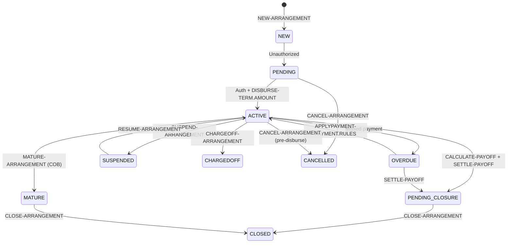
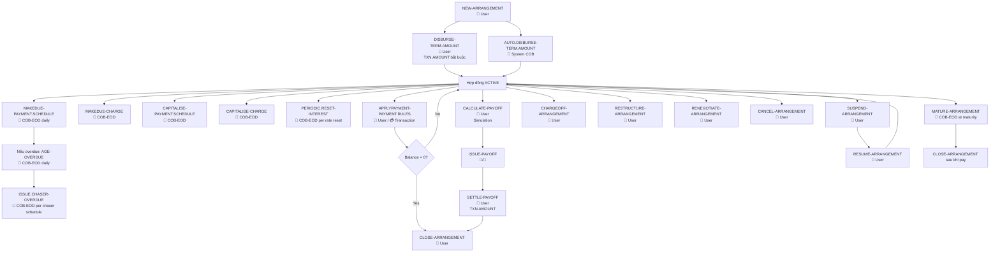
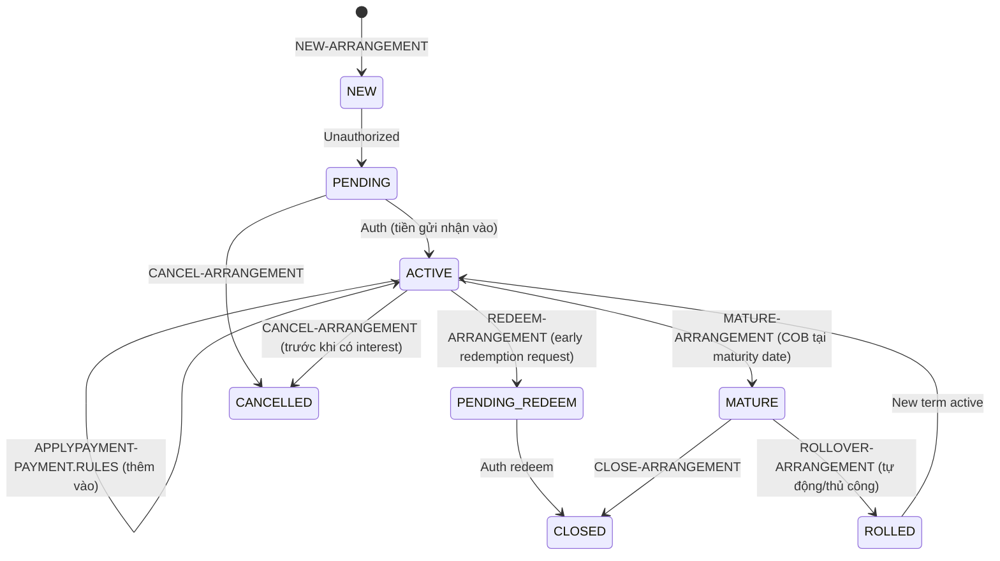
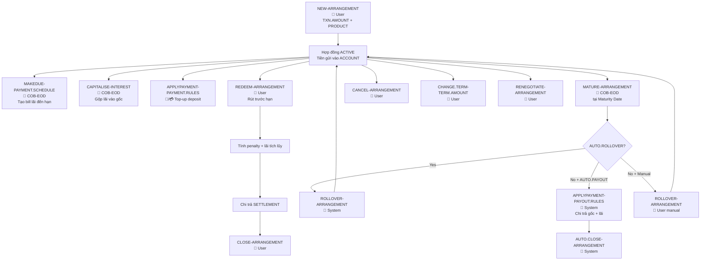
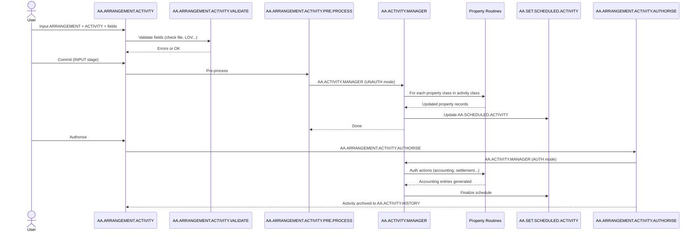
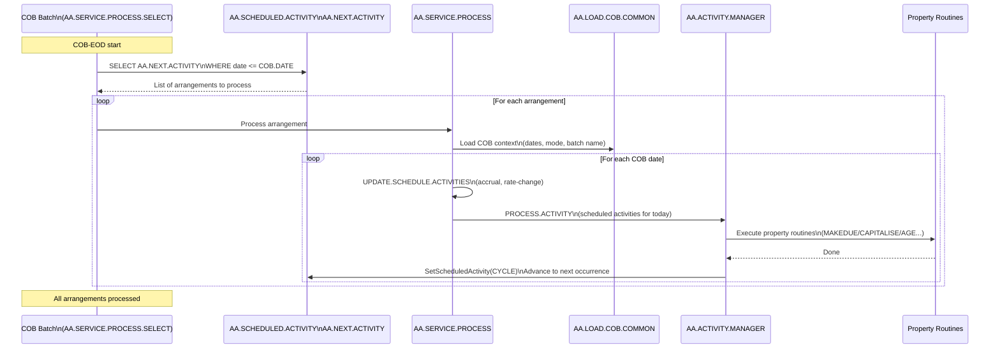
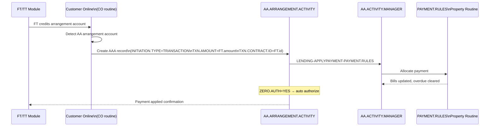

# Báo cáo: Activities của LENDING và DEPOSITS trong T24 AA Framework

## Mục lục
1. [Giới thiệu](#1-giới-thiệu)
2. [Cấu trúc Activity Class](#2-cấu-trúc-activity-class)
3. [Màn hình AA.ARRANGEMENT.ACTIVITY](#3-màn-hình-aaarrrangementactivity)
4. [LENDING Activities](#4-lending-activities)
5. [DEPOSITS Activities](#5-deposits-activities)
6. [So sánh LENDING vs DEPOSITS](#6-so-sánh-lending-vs-deposits)
7. [Luồng xử lý theo trigger type](#7-luồng-xử-lý-theo-trigger-type)

---

## 1. Giới thiệu

Trong T24 AA Framework, mỗi **Activity** là một đơn vị công việc được thực hiện trên một arrangement. Activity được định nghĩa theo quy tắc:

```
<PRODUCT.LINE>-<ACTION>-<PROPERTY.CLASS>
```

Ví dụ: `LENDING-DISBURSE-TERM.AMOUNT`
- PRODUCT.LINE = `LENDING`
- ACTION = `DISBURSE`
- PROPERTY.CLASS = `TERM.AMOUNT`

Có hai loại trigger:
- **User-triggered**: Người dùng khởi tạo thông qua màn hình `AA.ARRANGEMENT.ACTIVITY`
- **System-triggered**: Hệ thống tự chạy trong COB hoặc qua batch scheduled, không cần màn hình input

**ZERO.AUTH** là cờ đặc biệt trên activity class: khi = YES, activity tự authorize ngay sau khi commit (không cần bước Auth riêng). Tất cả system COB activities đều có ZERO.AUTH = YES.

---

## 2. Cấu trúc Activity Class

Bảng `AA.ACTIVITY.CLASS` (ID = `<PRODUCT.LINE>-<ACTION>-<PROPERTY.CLASS>`) định nghĩa:

| Trường | Ý nghĩa |
|---|---|
| `PRODUCT.LINE` | LENDING / DEPOSITS / ACCOUNTS |
| `PROCESS.ID` (ACTION) | Hành động: DISBURSE, MAKEDUE, APPLYPAYMENT... |
| `CLASS.ID` (PROPERTY.CLASS) | Property class xử lý: TERM.AMOUNT, PAYMENT.SCHEDULE... |
| `USER.INPUT` | YES = hiện trên màn hình nhập, No = system-only |
| `ZERO.AUTH` | YES = tự authorize (COB activities) |
| `BATCH.NAME` | Tên batch job (COB activities) |
| `BATCH.SEQ` | Thứ tự chạy trong batch |
| `ACTIVITY.TYPE` | ACCRUAL / RATE.CHANGE / SOD-PROCESS... |
| `LINKED.PROPERTY.CLASS` | Các property class khác cũng xử lý trong activity này |

Khi một activity được thực thi, `AA.ACTIVITY.MANAGER` sẽ lần lượt gọi action routine của từng property class được liệt kê trong activity class.

---

## 3. Màn hình AA.ARRANGEMENT.ACTIVITY

### 3.1 Tổng quan

`AA.ARRANGEMENT.ACTIVITY` (viết tắt **AAA**) là màn hình trung tâm để thực hiện mọi user-triggered activity trên hợp đồng AA. Đây là application T24 chuẩn với file định nghĩa fields tại `AA.ARRANGEMENT.ACTIVITY.FIELDS.b`.

Key (ID) của record AAA: `<ARR.SEQUENCE>` — được auto-generate theo format `<ARRANGEMENT.ID>-<SEQ>`.

### 3.2 Các trường chính trên màn hình

| Trường | Type | Mô tả | Bắt buộc |
|---|---|---|---|
| `ARRANGEMENT` | ARR | ID hợp đồng cần xử lý | Bắt buộc |
| `ACTIVITY` | A (lookup AA.ACTIVITY) | Tên activity cần thực hiện | Bắt buộc |
| `EFFECTIVE.DATE` | D | Ngày hiệu lực của activity | Bắt buộc |
| `CUSTOMER` | CUS (MV) | Khách hàng liên quan | Tùy activity |
| `CURRENCY` | CCY | Tiền tệ giao dịch | Tùy activity |
| `PRODUCT` | A (lookup AA.PRODUCT) | Sản phẩm (cho NEW-ARRANGEMENT) | Bắt buộc với NEW |
| `TRADE.DATE` | D | Ngày giao dịch (NEW/ROLLOVER/CHANGE.PRODUCT) | Tùy |
| `TXN.AMOUNT` | AMT | Số tiền giao dịch (giải ngân, trả nợ...) | Tùy activity |
| `TXN.AMOUNT.LCY` | AMT | Số tiền quy đổi LCY | Tùy |
| `TXN.EXCH.RATE` | R | Tỉ giá quy đổi | Tùy |
| `TXN.CONTRACT.ID` | A | ID hợp đồng đối ứng (FT, TT số) | Tùy |
| `TXN.SYSTEM.ID` | A | System của giao dịch đối ứng (FT/TT/SC...) | Tùy |
| `LINKED.ACTIVITY` | A (MV) | Activity phụ được kết nối | System |
| `INITIATION.TYPE` | LOV | Loại khởi tạo (SCHEDULED/USER/TRANSACTION...) | System |
| `PROPERTY` (MV) | A | Property override trong activity | Tùy |
| `FIELD.NAME` / `FIELD.VALUE` | ANY | Override giá trị trường cụ thể | Tùy |
| `NARRATIVE` (MV) | ANY | Ghi chú tự do | Tùy |
| `REASON` | TEXT | Lý do thực hiện (closure, cancellation...) | Tùy |
| `CLOSURE.REASON` | LOV | Lý do đóng hợp đồng | Khi CLOSE/CANCEL |
| `CLOSURE.NOTES` (MV) | A | Ghi chú đóng hợp đồng | Tùy |
| `AGENT.ID` (MV) | CUS | Broker/Agent | Tùy |
| `AGENT.ROLE` | LOV | Vai trò agent | Tùy |
| `CHANNEL` | A (lookup EB.CHANNEL) | Kênh giao dịch | Tùy |
| `BRANCH` | A (lookup ST.BRANCH) | Chi nhánh | Tùy |
| `CONTEXT.NAME` / `CONTEXT.VALUE` | ANY (MV) | Context data | Tùy |
| `ALTERNATE.ID` | A | ID thay thế để launch | Tùy |
| `MASTER.ARRANGEMENT` | ARR | Parent arrangement | Facility setup |
| `PROCESSING.MODE` | LOV | PRELIMINARY / blank | Simulation |
| `AUTO.RUN` | LOV | SIMULATE / EXECUTE / DIRECT.EXECUTE | Simulation |

### 3.3 INITIATION.TYPE

Giá trị của `INITIATION.TYPE` cho biết cách activity được khởi tạo:

| Giá trị | Ý nghĩa |
|---|---|
| `USER` | Người dùng nhập tay qua màn hình |
| `SCHEDULED` | COB/batch tự trigger theo lịch |
| `SCHEDULED*EOD` | Scheduled hoạt động trong giai đoạn EOD |
| `SCHEDULED*SOD` | Scheduled hoạt động trong giai đoạn SOD |
| `TRANSACTION` | Được trigger từ giao dịch FT/TT khác |
| `TRANSACTION*SOD` / `TRANSACTION*EOD` | Transaction vào SOD/EOD stage |
| `PAY*SOD` / `PAY*EOD` | Payment processing stage |
| `SECONDARY` | Activity phụ được trigger từ activity chính |
| `SYSTEM.CREATED` | Hệ thống tạo |
| `SYSTEM*EOD` / `SYSTEM*SOD` | Trigger từ application khác trong EOD/SOD |
| `HANDOFF*EOD` | Handoff stage EOD |

### 3.4 Activities nào xuất hiện trên màn hình AAA?

Chỉ những activity có `USER.INPUT = YES` trong AA.ACTIVITY.CLASS mới hiển thị để nhập liệu. Các system/COB activities (ZERO.AUTH=YES, INITIATION.TYPE=SCHEDULED) **không** có màn hình input.



---

## 4. LENDING Activities

### 4.1 Tổng quan Product Line LENDING

LENDING là product line cho các sản phẩm **tín dụng/cho vay**: personal loan, mortgage, term loan, revolving credit, overdraft... Hợp đồng LENDING có vòng đời phức tạp với các giai đoạn: tạo mới → giải ngân → trả nợ → đáo hạn/tất toán.

Property classes chính của LENDING:
- `TERM.AMOUNT` — số tiền cho vay, limit, disbursement
- `PAYMENT.SCHEDULE` — lịch trả nợ gốc/lãi
- `INTEREST` / `PRINCIPALINT` — lãi suất, tính lãi
- `PAYMENT.RULES` — quy tắc phân bổ khi có thanh toán
- `OVERDUE` — quản lý nợ quá hạn
- `CHARGE` / `PERIODIC.CHARGES` — phí
- `ACCOUNT` — tài khoản vay (balance types: LIVEDB, INTEREST, PENALTY...)
- `SETTLEMENT` — tài khoản giải ngân/thu nợ
- `PAYOFF` — tính và xử lý tất toán trước hạn

### 4.2 Danh sách LENDING Activities



#### 4.2.1 NEW-ARRANGEMENT — Tạo hợp đồng mới

| Thuộc tính | Giá trị |
|---|---|
| **Activity Class** | `LENDING-NEW-ARRANGEMENT` |
| **Trigger** | User (màn hình AAA) |
| **ZERO.AUTH** | No — cần authorize riêng |
| **Initiation Type** | USER |

**Mục đích**: Khởi tạo hợp đồng vay mới. Đây là activity đầu tiên trong vòng đời, tạo ra record `AA.ARRANGEMENT` và tất cả property class instances.

**Input bắt buộc trên AAA:**

| Trường | Bắt buộc | Ghi chú |
|---|---|---|
| `ARRANGEMENT` | Blank (auto-gen) | Hệ thống tự tạo ID |
| `ACTIVITY` | Bắt buộc | Nhập `LENDING-NEW-ARRANGEMENT` |
| `EFFECTIVE.DATE` | Bắt buộc | Ngày hiệu lực hợp đồng |
| `CUSTOMER` | Bắt buộc | Khách hàng vay |
| `PRODUCT` | Bắt buộc | Sản phẩm vay |
| `CURRENCY` | Bắt buộc | Tiền tệ |
| `PROPERTY / FIELD.NAME / FIELD.VALUE` | Tùy product | Override các thuộc tính (amount, rate, term...) |

**Actions chạy trong activity này** (gọi từng property class):
- `NEW` trên TERM.AMOUNT → tạo AA.ARR.TERM.AMOUNT, set COMMITTED.AMOUNT
- `NEW` trên INTEREST/PRINCIPALINT → tạo AA.ARR.INTEREST, set rate, basis
- `NEW` trên PAYMENT.SCHEDULE → tạo AA.ARR.PAYMENT.SCHEDULE, xây lịch trả nợ
- `NEW` trên ACCOUNT → tạo T24 ACCOUNT record cho arrangement
- `NEW` trên SETTLEMENT → ghi nhận tài khoản giải ngân/thu nợ
- `NEW` trên OVERDUE → khởi tạo cấu hình overdue
- `NEW` trên CHARGE/PERIODIC.CHARGES → khởi tạo phí

**Sau khi auth**: Tạo các `AA.SCHEDULED.ACTIVITY` cho các events tương lai (makedue, maturity, accrual...).

---

#### 4.2.2 DISBURSE-TERM.AMOUNT — Giải ngân thủ công

| Thuộc tính | Giá trị |
|---|---|
| **Activity Class** | `LENDING-DISBURSE-TERM.AMOUNT` |
| **Trigger** | User (màn hình AAA) |
| **ZERO.AUTH** | No |
| **Initiation Type** | USER hoặc TRANSACTION |

**Mục đích**: Giải ngân tiền vay cho khách hàng (full hoặc partial drawdown). Làm tăng balance type LIVEDB, tạo FT ra tài khoản SETTLEMENT.

**Input bắt buộc trên AAA:**

| Trường | Bắt buộc | Ghi chú |
|---|---|---|
| `ARRANGEMENT` | Bắt buộc | ID hợp đồng |
| `ACTIVITY` | Bắt buộc | `LENDING-DISBURSE-TERM.AMOUNT` |
| `EFFECTIVE.DATE` | Bắt buộc | Ngày giải ngân |
| `TXN.AMOUNT` | Bắt buộc | Số tiền giải ngân |
| `TXN.CONTRACT.ID` | Tùy | FT/TT reference nếu có |
| `TXN.SYSTEM.ID` | Tùy | FT/TT/SC... |

**Actions:**
- `DISBURSE` trên TERM.AMOUNT → tăng DRAWN.AMOUNT, cập nhật LIVEDB balance
- `DISBURSE` trên SETTLEMENT → issue settlement order (Payment Order) đến tài khoản khách hàng
- `DISBURSE` trên ACCOUNT → phản ánh trên T24 ACCOUNT
- Soft accounting: event DISBURSEMENT → LIVEDB Debit / Settlement Account Credit

**Lưu ý**: Sau giải ngân đầy đủ (DRAWN = COMMITTED), hợp đồng chuyển sang trạng thái ACTIVE. Nếu sản phẩm cho phép multiple drawdown (revolving), có thể giải ngân nhiều lần đến hết limit.

---

#### 4.2.3 AUTO.DISBURSE-TERM.AMOUNT — Giải ngân tự động

| Thuộc tính | Giá trị |
|---|---|
| **Activity Class** | `LENDING-AUTO.DISBURSE-TERM.AMOUNT` |
| **Trigger** | System (COB / ONLINE-EOD) |
| **ZERO.AUTH** | Yes |
| **Initiation Type** | SCHEDULED*EOD hoặc TRANSACTION*EOD |

**Mục đích**: Tự động giải ngân vào ngày hiệu lực (EFFECTIVE.DATE) khi người dùng setup `AUTO.DISBURSEMENT = YES` trên property TERM.AMOUNT. Không cần input màn hình.

**Cơ chế**: Khi NEW-ARRANGEMENT được auth với AUTO.DISBURSEMENT=YES, một scheduled activity `AUTO.DISBURSE-TERM.AMOUNT` được tạo trên `AA.SCHEDULED.ACTIVITY` với ngày = EFFECTIVE.DATE. COB sẽ trigger activity này.

---

#### 4.2.4 APPLYPAYMENT-PAYMENT.RULES — Nhận thanh toán / Trả nợ

| Thuộc tính | Giá trị |
|---|---|
| **Activity Class** | `LENDING-APPLYPAYMENT-PAYMENT.RULES` |
| **Trigger** | User (màn hình AAA) hoặc Transaction-triggered |
| **ZERO.AUTH** | No (User) / Yes (Transaction-triggered) |
| **Initiation Type** | USER / TRANSACTION / TRANSACTION*SOD |

**Mục đích**: Xử lý thanh toán từ khách hàng. Phân bổ số tiền nhận được theo PAYMENT.RULES (thứ tự trả: penalty → overdue interest → overdue principal → current charge → current interest → current principal...).

**Input bắt buộc trên AAA:**

| Trường | Bắt buộc | Ghi chú |
|---|---|---|
| `ARRANGEMENT` | Bắt buộc | ID hợp đồng |
| `ACTIVITY` | Bắt buộc | `LENDING-APPLYPAYMENT-PAYMENT.RULES` |
| `EFFECTIVE.DATE` | Bắt buộc | Ngày thanh toán |
| `TXN.AMOUNT` | Bắt buộc | Số tiền thanh toán |
| `TXN.CONTRACT.ID` | Tùy | Reference FT/TT |
| `TXN.SYSTEM.ID` | Tùy | FT/TT... |

**Actions:**
- `APPLYPAYMENT` trên PAYMENT.RULES → đọc payment rules, phân bổ tiền vào các bill types
- `APPLYPAYMENT` trên PAYMENT.SCHEDULE → giảm outstanding principal bills
- `APPLYPAYMENT` trên INTEREST → giảm outstanding interest bills
- `APPLYPAYMENT` trên OVERDUE → cập nhật trạng thái overdue nếu hết nợ quá hạn
- `APPLYPAYMENT` trên ACCOUNT → cập nhật balance
- Soft accounting: nhiều events tùy amount phân bổ (PRINCIPAL_REPAYMENT, INTEREST_REPAYMENT...)

**Lưu ý quan trọng**: Khi thanh toán thông qua FT/TT đến account của arrangement, hệ thống T24 tự trigger `LENDING-APPLYPAYMENT-PAYMENT.RULES` qua CO routine (Customer Online). Initiation type = TRANSACTION.

---

#### 4.2.5 MAKEDUE-PAYMENT.SCHEDULE — Tạo bill trả nợ đến hạn

| Thuộc tính | Giá trị |
|---|---|
| **Activity Class** | `LENDING-MAKEDUE-PAYMENT.SCHEDULE` |
| **Trigger** | System (COB-EOD) |
| **ZERO.AUTH** | Yes |
| **Batch** | AA.COB.EOD / stage PAYMENT.SCHEDULE |
| **Initiation Type** | SCHEDULED*EOD |

**Mục đích**: Tạo bill đến hạn (DUE bill) theo lịch thanh toán. Chạy tự động mỗi ngày đến hạn trả (installment date). Kết quả: tạo record `AA.BILL.DETAILS` với trạng thái DUE.

**Không có màn hình input.** Hệ thống đọc `AA.SCHEDULED.ACTIVITY` để biết ngày chạy.

**Actions:**
- `MAKEDUE` trên PAYMENT.SCHEDULE → đọc lịch, tạo AA.BILL.DETAILS (gốc + lãi)
- `MAKEDUE` trên INTEREST → tính lãi tích lũy cho kỳ
- `MAKEDUE` trên ACCOUNT → cập nhật balance type INTEREST (chuyển accrual → due)

---

#### 4.2.6 MAKEDUE-CHARGE — Tạo bill phí đến hạn

| Thuộc tính | Giá trị |
|---|---|
| **Activity Class** | `LENDING-MAKEDUE-CHARGE` |
| **Trigger** | System (COB-EOD) |
| **ZERO.AUTH** | Yes |
| **Initiation Type** | SCHEDULED*EOD |

**Mục đích**: Tạo bill phí đến hạn theo lịch định kỳ (annual fee, monthly fee...).

**Actions:**
- `MAKEDUE` trên CHARGE / PERIODIC.CHARGES → tạo AA.BILL.DETAILS type CHARGE

---

#### 4.2.7 CAPITALISE-PAYMENT.SCHEDULE — Vốn hóa lãi vào dư nợ

| Thuộc tính | Giá trị |
|---|---|
| **Activity Class** | `LENDING-CAPITALISE-PAYMENT.SCHEDULE` |
| **Trigger** | System (COB-EOD hoặc SOD nếu có tham số) |
| **ZERO.AUTH** | Yes |
| **Initiation Type** | SCHEDULED*EOD |

**Mục đích**: Cộng lãi tích lũy vào dư nợ gốc (compound interest/grace period loans). Thay vì tạo bill DUE, lãi được cộng vào LIVEDB balance.

**Actions:**
- `CAPITALISE` trên PAYMENT.SCHEDULE → tăng COMMITTED.AMOUNT / LIVEDB
- `CAPITALISE` trên INTEREST → xử lý accrual interest vào principal

---

#### 4.2.8 CAPITALISE-CHARGE — Vốn hóa phí vào dư nợ

| Thuộc tính | Giá trị |
|---|---|
| **Activity Class** | `LENDING-CAPITALISE-CHARGE` |
| **Trigger** | System (COB-EOD) |
| **ZERO.AUTH** | Yes |
| **Initiation Type** | SCHEDULED*EOD |

**Mục đích**: Cộng phí vào dư nợ thay vì tạo bill riêng (thường dùng cho arrangement fee, processing fee trên một số sản phẩm).

---

#### 4.2.9 AGE-OVERDUE — Phân loại nợ quá hạn

| Thuộc tính | Giá trị |
|---|---|
| **Activity Class** | `LENDING-AGE-OVERDUE` hoặc `LENDING-AGE-O` |
| **Trigger** | System (COB-EOD) |
| **ZERO.AUTH** | Yes |
| **Initiation Type** | SCHEDULED*EOD |

**Mục đích**: Mỗi ngày sau khi hóa đơn quá hạn, system tự động nâng cấp aging status (DUE → 1_DAY_OVERDUE → 7_DAY_OVERDUE → 30_DAY_OVERDUE...). Status được cấu hình trong `AA.OVERDUE` property.

**Actions:**
- `AGE` trên OVERDUE → cập nhật aging status, bill aging count
- `AGE` trên ACCOUNT → phân loại balance theo overdue bucket

**Quan trọng**: Activity này scheduled tự động khi MAKEDUE tạo bill DUE. `AA.SCHEDULED.ACTIVITY` cho AGE sẽ có chu kỳ daily (tăng dần đến hết aging range).

---

#### 4.2.10 ISSUE.CHASER-OVERDUE — Gửi thông báo nhắc nợ

| Thuộc tính | Giá trị |
|---|---|
| **Activity Class** | `LENDING-ISSUE.CHASER-<OverduePC>` |
| **Trigger** | System (COB-EOD) |
| **ZERO.AUTH** | Yes |
| **Initiation Type** | SCHEDULED*EOD |

**Mục đích**: Tự động phát sinh advice/letter nhắc nợ theo lịch được cấu hình trong OVERDUE property (CHASER.DATE, CHASER.CYCLE).

---

#### 4.2.11 CHARGEOFF-ARRANGEMENT — Xóa nợ (Write-off arrangement)

| Thuộc tính | Giá trị |
|---|---|
| **Activity Class** | `LENDING-CHARGEOFF-ARRANGEMENT` |
| **Trigger** | User (màn hình AAA) |
| **ZERO.AUTH** | No |
| **Initiation Type** | USER |

**Mục đích**: Xóa toàn bộ dư nợ arrangement ra khỏi bảng cân đối (write-off). Thường dùng khi hợp đồng không còn khả năng thu hồi. Hợp đồng chuyển sang trạng thái CHARGED.OFF.

**Input trên AAA:**

| Trường | Bắt buộc | Ghi chú |
|---|---|---|
| `ARRANGEMENT` | Bắt buộc | |
| `ACTIVITY` | Bắt buộc | `LENDING-CHARGEOFF-ARRANGEMENT` |
| `EFFECTIVE.DATE` | Bắt buộc | Ngày xóa nợ |
| `REASON` | Khuyến nghị | Lý do xóa nợ |

**Actions:**
- `CHARGEOFF` trên TERM.AMOUNT → cập nhật CHARGED.OFF balance
- `CHARGEOFF` trên ACCOUNT → xóa balance LIVEDB, INTEREST khỏi ACTIVE
- Soft accounting: CHARGEOFF accounting event → ghi nợ P&L, ghi có LIVEDB

---

#### 4.2.12 CHARGEOFF-ACCOUNT — Xóa nợ theo tài khoản

| Thuộc tính | Giá trị |
|---|---|
| **Activity Class** | `LENDING-CHARGEOFF-ACCOUNT` |
| **Trigger** | User (màn hình AAA) |
| **ZERO.AUTH** | No |

**Mục đích**: Tương tự CHARGEOFF-ARRANGEMENT nhưng xử lý ở cấp độ ACCOUNT property class. Dùng cho partial write-off hoặc write-off trên specific balance type.

**Input**: Tương tự CHARGEOFF-ARRANGEMENT, thêm `TXN.AMOUNT` nếu partial write-off.

---

#### 4.2.13 CALCULATE-PAYOFF — Tính số tiền tất toán trước hạn

| Thuộc tính | Giá trị |
|---|---|
| **Activity Class** | `LENDING-CALCULATE-PAYOFF` |
| **Trigger** | User (màn hình AAA) |
| **ZERO.AUTH** | No |
| **Initiation Type** | USER |

**Mục đích**: Tính tổng số tiền cần trả để tất toán hợp đồng vào ngày được chỉ định (payoff date). Kết quả lưu vào `AA.PAYOFF` record. Đây là bước đầu của quy trình tất toán trước hạn.

**Input trên AAA:**

| Trường | Bắt buộc | Ghi chú |
|---|---|---|
| `ARRANGEMENT` | Bắt buộc | |
| `ACTIVITY` | Bắt buộc | `LENDING-CALCULATE-PAYOFF` |
| `EFFECTIVE.DATE` | Bắt buộc | Ngày dự kiến tất toán |

**Actions:**
- `CALCULATE` trên PAYOFF → tính tổng outstanding (principal + interest + charges + penalty)
- Tạo `AA.PAYOFF` record với breakdown chi tiết
- **Không** thay đổi arrangement status, không posting accounting

**Lưu ý**: Activity này thường chạy ở chế độ simulation (`AUTO.RUN = SIMULATE`) để preview số tiền trước khi quyết định tất toán.

---

#### 4.2.14 ISSUE-PAYOFF — Phát hành payoff statement

| Thuộc tính | Giá trị |
|---|---|
| **Activity Class** | `LENDING-ISSUE-PAYOFF` |
| **Trigger** | User hoặc System |
| **ZERO.AUTH** | No/Yes tùy cấu hình |

**Mục đích**: Phát hành payoff statement chính thức (letter) và lock giá trị payoff. Sau bước này, khách hàng có một khoảng thời gian (thường 30 ngày) để thanh toán theo payoff amount đã tính.

---

#### 4.2.15 SETTLE-PAYOFF — Tất toán trước hạn

| Thuộc tính | Giá trị |
|---|---|
| **Activity Class** | `LENDING-SETTLE-PAYOFF` |
| **Trigger** | User (màn hình AAA) |
| **ZERO.AUTH** | No |
| **Initiation Type** | USER |

**Mục đích**: Thực hiện tất toán hợp đồng trước hạn. Nhận tiền từ khách hàng, xóa toàn bộ dư nợ, đóng hợp đồng.

**Input trên AAA:**

| Trường | Bắt buộc | Ghi chú |
|---|---|---|
| `ARRANGEMENT` | Bắt buộc | |
| `ACTIVITY` | Bắt buộc | `LENDING-SETTLE-PAYOFF` |
| `EFFECTIVE.DATE` | Bắt buộc | Ngày tất toán |
| `TXN.AMOUNT` | Bắt buộc | Số tiền thanh toán |
| `TXN.CONTRACT.ID` | Tùy | FT reference |

**Actions:**
- `SETTLE` trên PAYOFF → cập nhật payoff record, apply payment
- `SETTLE` trên PAYMENT.RULES → phân bổ tiền, settle all bills
- `SETTLE` trên SETTLEMENT → issue payment order nếu cần refund
- `SETTLE` trên ACCOUNT → zero out all balances
- Soft accounting: PAYOFF settlement events
- Sau khi balance = 0, arrangement chuyển sang PENDING.CLOSURE → CLOSED

---

#### 4.2.16 CANCEL-PAYOFF — Hủy payoff quote

| Thuộc tính | Giá trị |
|---|---|
| **Activity Class** | `LENDING-CANCEL-PAYOFF` |
| **Trigger** | User (màn hình AAA) |
| **ZERO.AUTH** | No |

**Mục đích**: Hủy payoff quote đã tính (khách hàng không tất toán trong thời hạn). Xóa `AA.PAYOFF` record, phục hồi lịch thanh toán bình thường.

---

#### 4.2.17 RESTRUCTURE-ARRANGEMENT — Cơ cấu lại khoản vay

| Thuộc tính | Giá trị |
|---|---|
| **Activity Class** | `LENDING-RESTRUCTURE-ARRANGEMENT` |
| **Trigger** | User (màn hình AAA) |
| **ZERO.AUTH** | No |
| **Initiation Type** | USER |

**Mục đích**: Thay đổi toàn diện cấu trúc hợp đồng (term, interest rate, payment schedule) trong khi vẫn duy trì dư nợ gốc. Thường dùng cho debt restructuring.

**Input trên AAA:**

| Trường | Bắt buộc | Ghi chú |
|---|---|---|
| `ARRANGEMENT` | Bắt buộc | |
| `ACTIVITY` | Bắt buộc | `LENDING-RESTRUCTURE-ARRANGEMENT` |
| `EFFECTIVE.DATE` | Bắt buộc | Ngày hiệu lực cơ cấu |
| `PROPERTY / FIELD.NAME / FIELD.VALUE` | Bắt buộc | Các thay đổi cụ thể (rate mới, term mới...) |
| `REASON` | Khuyến nghị | Lý do cơ cấu |

**Actions:**
- Tương tự NEW-ARRANGEMENT nhưng preserve current balances
- Rebuild payment schedule từ remaining balance
- Update interest rate/terms
- Reschedule AA.SCHEDULED.ACTIVITY

---

#### 4.2.18 CANCEL-ARRANGEMENT — Hủy hợp đồng

| Thuộc tính | Giá trị |
|---|---|
| **Activity Class** | `LENDING-CANCEL-ARRANGEMENT` |
| **Trigger** | User (màn hình AAA) |
| **ZERO.AUTH** | No |

**Mục đích**: Hủy hợp đồng vay trước khi giải ngân (hoặc trước khi có bất kỳ giao dịch nào). Hợp đồng chuyển sang CANCELLED.

**Input:**
- `ARRANGEMENT`, `ACTIVITY`, `EFFECTIVE.DATE`
- `CLOSURE.REASON` (bắt buộc theo cấu hình)

---

#### 4.2.19 CLOSE-ARRANGEMENT — Đóng hợp đồng

| Thuộc tính | Giá trị |
|---|---|
| **Activity Class** | `LENDING-CLOSE-ARRANGEMENT` |
| **Trigger** | User (màn hình AAA) |
| **ZERO.AUTH** | No |

**Mục đích**: Đóng hợp đồng sau khi đã tất toán toàn bộ. Hợp đồng phải có tất cả balance = 0 trước khi close.

---

#### 4.2.20 SUSPEND-ARRANGEMENT — Tạm ngưng hợp đồng

| Thuộc tính | Giá trị |
|---|---|
| **Activity Class** | `LENDING-SUSPEND-ARRANGEMENT` |
| **Trigger** | User (màn hình AAA) |
| **ZERO.AUTH** | No |

**Mục đích**: Tạm ngưng xử lý hợp đồng (COB activities bị bỏ qua, không tính lãi/tạo bill). Dùng trong trường hợp đặc biệt (dispute, legal hold...).

---

#### 4.2.21 RESUME-ARRANGEMENT — Tiếp tục hợp đồng

| Thuộc tính | Giá trị |
|---|---|
| **Activity Class** | `LENDING-RESUME-ARRANGEMENT` |
| **Trigger** | User (màn hình AAA) |
| **ZERO.AUTH** | No |

**Mục đích**: Khôi phục hợp đồng từ trạng thái SUSPENDED. Tính toán lại các activity bị bỏ qua trong thời gian suspend.

---

#### 4.2.22 MATURE-ARRANGEMENT — Đáo hạn

| Thuộc tính | Giá trị |
|---|---|
| **Activity Class** | `LENDING-MATURE-ARRANGEMENT` |
| **Trigger** | System (COB-EOD tại maturity date) |
| **ZERO.AUTH** | Yes |
| **Initiation Type** | SCHEDULED*EOD |

**Mục đích**: Xử lý tự động khi hợp đồng đến ngày đáo hạn. Tạo bill cho toàn bộ số dư còn lại nếu chưa thanh toán hết. Hợp đồng chuyển sang trạng thái MATURE.

---

#### 4.2.23 UPDATE-OVERDUE — Cập nhật thông tin overdue

| Thuộc tính | Giá trị |
|---|---|
| **Activity Class** | `LENDING-UPDATE-OVERDUE` |
| **Trigger** | System (COB) |
| **ZERO.AUTH** | Yes |

**Mục đích**: Cập nhật các trường thống kê overdue (total overdue days, NPL flag...).

---

#### 4.2.24 PERIODIC.RESET-INTEREST — Reset lãi suất định kỳ

| Thuộc tính | Giá trị |
|---|---|
| **Activity Class** | `LENDING-PERIODIC.RESET-INTEREST` hoặc `LENDING-PERIODIC.RESET-PRINCIPALINT` |
| **Trigger** | System (COB-EOD theo lịch rate reset) |
| **ZERO.AUTH** | Yes |
| **ACTIVITY.TYPE** | RATE.CHANGE |

**Mục đích**: Tự động reset lãi suất theo cơ chế ARM (Adjustable Rate Mortgage) hoặc floating rate. Đọc index rate mới, tính margin, cập nhật AA.ARR.INTEREST record.

---

#### 4.2.25 CHANGE-INTEREST — Thay đổi lãi suất thủ công

| Thuộc tính | Giá trị |
|---|---|
| **Activity Class** | `LENDING-CHANGE-INTEREST` |
| **Trigger** | User (màn hình AAA) |
| **ZERO.AUTH** | No |

**Input trên AAA:**
- `PROPERTY = INTEREST (hoặc PRINCIPALINT)` + `FIELD.NAME / FIELD.VALUE` để override rate

---

#### 4.2.26 CHANGE-PAYMENT.SCHEDULE — Thay đổi lịch trả nợ

| Thuộc tính | Giá trị |
|---|---|
| **Activity Class** | `LENDING-CHANGE-PAYMENT.SCHEDULE` |
| **Trigger** | User (màn hình AAA) |
| **ZERO.AUTH** | No |

**Mục đích**: Thay đổi lịch trả nợ (payment date, frequency, installment amount). Rebuild `AA.SCHEDULED.ACTIVITY` cho MAKEDUE.

---

#### 4.2.27 RENEGOTIATE-ARRANGEMENT — Đàm phán lại điều khoản

| Thuộc tính | Giá trị |
|---|---|
| **Activity Class** | `LENDING-RENEGOTIATE-ARRANGEMENT` |
| **Trigger** | User (màn hình AAA) |
| **ZERO.AUTH** | No |

**Mục đích**: Tương tự RESTRUCTURE nhưng ít toàn diện hơn. Thay đổi một số điều khoản cụ thể mà không cần rebuild toàn bộ.

---

#### 4.2.28 CAPTURE.BILL-BALANCE.MAINTENANCE — Ghi nhận bill thủ công

| Thuộc tính | Giá trị |
|---|---|
| **Activity Class** | `LENDING-CAPTURE.BILL-BALANCE.MAINTENANCE` |
| **Trigger** | User (màn hình AAA) |
| **ZERO.AUTH** | No |

**Mục đích**: Tạo thủ công một bill trên hợp đồng (manual charge, manual fee). Dùng cho các khoản phí không thuộc lịch định kỳ.

---

#### 4.2.29 CALCULATE.PROGRESSIVE.PAYMENT-PAYMENT.SCHEDULE

| Thuộc tính | Giá trị |
|---|---|
| **Activity Class** | `LENDING-CALCULATE.PROGRESSIVE.PAYMENT-PAYMENT.SCHEDULE` |
| **Trigger** | System (COB) |
| **ZERO.AUTH** | Yes |

**Mục đích**: Tính payment schedule cho sản phẩm progressive mortgage (trả dần, installment tăng theo thời gian). Tính toán lại installment mỗi kỳ.

---

### 4.3 Tổng hợp LENDING Activities



---

## 5. DEPOSITS Activities

### 5.1 Tổng quan Product Line DEPOSITS

DEPOSITS là product line cho các sản phẩm **huy động vốn**: term deposit (TD), fixed deposit, savings with term, structured deposit... Hợp đồng DEPOSITS có đặc điểm ngược với LENDING: khách hàng **gửi tiền** vào ngân hàng, ngân hàng trả lãi và hoàn trả gốc khi đến hạn.

Property classes chính của DEPOSITS:
- `TERM.AMOUNT` — số tiền gửi, draw (đặt cọc), redeem (rút)
- `INTEREST` / `DEPOSITINT` / `DEPOSITPFT` — lãi suất gửi, tính lãi
- `PAYMENT.SCHEDULE` — lịch trả lãi
- `PAYOUT.RULES` — quy tắc chi trả khi đáo hạn/rút
- `ACCOUNT` — tài khoản gửi tiền
- `SETTLEMENT` — tài khoản chi trả gốc+lãi khi đáo hạn

### 5.2 Danh sách DEPOSITS Activities



#### 5.2.1 NEW-ARRANGEMENT — Tạo hợp đồng gửi tiền

| Thuộc tính | Giá trị |
|---|---|
| **Activity Class** | `DEPOSITS-NEW-ARRANGEMENT` |
| **Trigger** | User (màn hình AAA) |
| **ZERO.AUTH** | No |
| **Initiation Type** | USER |

**Mục đích**: Tạo hợp đồng tiền gửi mới. Đây là activity đầu tiên trong vòng đời, nhận tiền từ khách hàng vào hệ thống.

**Input bắt buộc trên AAA:**

| Trường | Bắt buộc | Ghi chú |
|---|---|---|
| `ARRANGEMENT` | Blank (auto-gen) | |
| `ACTIVITY` | Bắt buộc | `DEPOSITS-NEW-ARRANGEMENT` |
| `EFFECTIVE.DATE` | Bắt buộc | Ngày bắt đầu gửi tiền |
| `CUSTOMER` | Bắt buộc | Khách hàng gửi |
| `PRODUCT` | Bắt buộc | Sản phẩm tiền gửi |
| `CURRENCY` | Bắt buộc | Tiền tệ |
| `TXN.AMOUNT` | Thường bắt buộc | Số tiền gửi ban đầu |
| `PROPERTY / FIELD.NAME / FIELD.VALUE` | Tùy | Override term, rate, maturity date... |

**Actions:**
- `NEW` trên TERM.AMOUNT → tạo AA.ARR.TERM.AMOUNT, ghi nhận số tiền gửi (DEPOSIT.AMOUNT)
- `NEW` trên INTEREST/DEPOSITINT → tạo AA.ARR.INTEREST, set deposit interest rate
- `NEW` trên PAYMENT.SCHEDULE → tạo lịch trả lãi
- `NEW` trên ACCOUNT → tạo T24 ACCOUNT cho deposit
- `NEW` trên SETTLEMENT → ghi nhận tài khoản chi trả
- Soft accounting: nhận tiền gửi: LIVEDB Credit (deposit balance tăng), Settlement Account Debit

**Sau khi auth**: Schedule MATURE-ARRANGEMENT tại maturity date, MAKEDUE-PAYMENT.SCHEDULE tại interest payment dates, CAPITALISE-INTEREST tại capitalization dates.

---

#### 5.2.2 APPLYPAYMENT-PAYOUT.RULES — Chi trả/Giải ngân tiền gửi

| Thuộc tính | Giá trị |
|---|---|
| **Activity Class** | `DEPOSITS-APPLYPAYMENT-PAYOUT.RULES` |
| **Trigger** | System (MATURE / ROLLOVER) hoặc User |
| **ZERO.AUTH** | Yes (khi system trigger) |
| **Initiation Type** | SECONDARY / SCHEDULED*EOD |

**Mục đích**: Xử lý chi trả gốc + lãi cho khách hàng theo PAYOUT.RULES. Thường chạy như một secondary activity trong MATURE-ARRANGEMENT hoặc REDEEM-ARRANGEMENT. Chi trả qua SETTLEMENT account.

**PAYOUT.RULES** khác **PAYMENT.RULES**:
- `PAYMENT.RULES` = quy tắc nhận tiền vào (apply inward payment)
- `PAYOUT.RULES` = quy tắc chi tiền ra (pay out to customer)

**Actions:**
- `APPLYPAYMENT` trên PAYOUT.RULES → tính toán khoản chi trả theo rules
- `APPLYPAYMENT` trên SETTLEMENT → issue Payment Order ra tài khoản khách hàng
- Soft accounting: LIVEDB Debit (giảm deposit balance), Settlement Account Credit

---

#### 5.2.3 APPLYPAYMENT-PAYMENT.RULES — Nhận thêm tiền gửi

| Thuộc tính | Giá trị |
|---|---|
| **Activity Class** | `DEPOSITS-APPLYPAYMENT-PAYMENT.RULES` |
| **Trigger** | User (màn hình AAA) hoặc Transaction |
| **ZERO.AUTH** | No/Yes |
| **Initiation Type** | USER / TRANSACTION |

**Mục đích**: Nhận thêm tiền gửi vào hợp đồng hiện có (top-up deposit, applicable cho sản phẩm có thể nạp thêm).

**Input trên AAA:**

| Trường | Bắt buộc | Ghi chú |
|---|---|---|
| `ARRANGEMENT` | Bắt buộc | |
| `TXN.AMOUNT` | Bắt buộc | Số tiền nạp thêm |
| `TXN.CONTRACT.ID` | Tùy | FT reference |

---

#### 5.2.4 REDEEM-ARRANGEMENT — Rút trước hạn (Early Redemption)

| Thuộc tính | Giá trị |
|---|---|
| **Activity Class** | `DEPOSITS-REDEEM-ARRANGEMENT` |
| **Trigger** | User (màn hình AAA) |
| **ZERO.AUTH** | No |
| **Initiation Type** | USER |

**Mục đích**: Khách hàng muốn rút tiền gửi trước ngày đáo hạn. Thường kèm theo early redemption penalty (phí rút trước hạn).

**Input bắt buộc trên AAA:**

| Trường | Bắt buộc | Ghi chú |
|---|---|---|
| `ARRANGEMENT` | Bắt buộc | |
| `ACTIVITY` | Bắt buộc | `DEPOSITS-REDEEM-ARRANGEMENT` |
| `EFFECTIVE.DATE` | Bắt buộc | Ngày rút |
| `TXN.AMOUNT` | Tùy | Số tiền rút (nếu partial) |
| `REASON` | Tùy | Lý do rút |

**Actions:**
- `REDEEM` trên TERM.AMOUNT → giảm DEPOSIT.AMOUNT, tính penalty amount
- `REDEEM` trên INTEREST → tính interest đến ngày rút (accrued interest)
- `REDEEM` trên PAYOUT.RULES → chi trả gốc + lãi - penalty
- `REDEEM` trên SETTLEMENT → issue Payment Order
- `REDEEM` trên ACCOUNT → cập nhật balance, zero out nếu full redemption
- Soft accounting: early redemption events (principal repayment + interest + penalty charges)

**Lưu ý**: `WHT.CALCULATE.REDEMPTION.FEE` là routine tính withholding tax khi redeem.

---

#### 5.2.5 MATURE-ARRANGEMENT — Xử lý đáo hạn

| Thuộc tính | Giá trị |
|---|---|
| **Activity Class** | `DEPOSITS-MATURE-ARRANGEMENT` |
| **Trigger** | System (COB-EOD tại maturity date) |
| **ZERO.AUTH** | Yes |
| **Initiation Type** | SCHEDULED*EOD |

**Mục đích**: Tự động xử lý hợp đồng khi đến ngày đáo hạn (MATURITY.DATE từ TERM.AMOUNT). Hợp đồng chuyển sang MATURE. Tùy cấu hình sản phẩm:
- Nếu `AUTO.ROLLOVER = YES` → trigger ROLLOVER-ARRANGEMENT
- Nếu `AUTO.PAYOUT = YES` → trigger APPLYPAYMENT-PAYOUT.RULES (chi trả tự động)
- Nếu manual → chờ user xử lý

**Actions:**
- `MATURE` trên TERM.AMOUNT → cập nhật MATURED.AMOUNT, trạng thái
- `MATURE` trên INTEREST → tính final interest accrual
- `MATURE` trên PAYMENT.SCHEDULE → tạo final bill (nếu có)

**Không có màn hình input** — hoàn toàn tự động.

---

#### 5.2.6 CANCEL-ARRANGEMENT — Hủy hợp đồng gửi tiền

| Thuộc tính | Giá trị |
|---|---|
| **Activity Class** | `DEPOSITS-CANCEL-ARRANGEMENT` |
| **Trigger** | User (màn hình AAA) |
| **ZERO.AUTH** | No |

**Mục đích**: Hủy hợp đồng tiền gửi (thường trước ngày value date hoặc trước khi nhận tiền). Hoàn trả tiền nếu đã nhận.

**Input:** `ARRANGEMENT`, `ACTIVITY`, `EFFECTIVE.DATE`, `CLOSURE.REASON` (bắt buộc theo cấu hình).

---

#### 5.2.7 ROLLOVER-ARRANGEMENT — Tái tục hợp đồng

| Thuộc tính | Giá trị |
|---|---|
| **Activity Class** | `DEPOSITS-ROLLOVER-ARRANGEMENT` |
| **Trigger** | System (COB-EOD sau MATURE) hoặc User |
| **ZERO.AUTH** | Yes (auto) / No (manual) |
| **Initiation Type** | SECONDARY (system) / USER |

**Mục đích**: Tái tục hợp đồng tiền gửi sang kỳ mới khi đáo hạn. Tiền gốc (+ lãi nếu capitalize) được rollover sang kỳ tiếp theo.

**Input nếu Manual:**

| Trường | Bắt buộc | Ghi chú |
|---|---|---|
| `ARRANGEMENT` | Bắt buộc | |
| `EFFECTIVE.DATE` | Bắt buộc | Ngày rollover (= maturity date cũ) |
| `PROPERTY / FIELD.NAME / FIELD.VALUE` | Tùy | Thay đổi term/rate cho kỳ mới |

**Actions:**
- `ROLLOVER` trên TERM.AMOUNT → reset deposit amount cho kỳ mới
- `ROLLOVER` trên INTEREST → cập nhật rate (lấy từ product hoặc manual override)
- `ROLLOVER` trên PAYMENT.SCHEDULE → rebuild lịch trả lãi kỳ mới
- Reschedule AA.SCHEDULED.ACTIVITY

---

#### 5.2.8 CLOSE-ARRANGEMENT — Đóng hợp đồng gửi tiền

| Thuộc tính | Giá trị |
|---|---|
| **Activity Class** | `DEPOSITS-CLOSE-ARRANGEMENT` |
| **Trigger** | User (màn hình AAA) |
| **ZERO.AUTH** | No |

**Mục đích**: Đóng hợp đồng sau khi đã chi trả toàn bộ cho khách hàng (balance = 0).

---

#### 5.2.9 CAPITALISE-INTEREST — Vốn hóa lãi

| Thuộc tính | Giá trị |
|---|---|
| **Activity Class** | `DEPOSITS-CAPITALISE-INTEREST` / `DEPOSITS-CAPITALISE-DEPOSITINT` |
| **Trigger** | System (COB-EOD) |
| **ZERO.AUTH** | Yes |
| **ACTIVITY.TYPE** | ACCRUAL |

**Mục đích**: Cộng lãi vào số dư gốc (compound interest). Thay vì chi trả lãi ra ngoài, lãi được cộng vào DEPOSIT.AMOUNT.

---

#### 5.2.10 MAKEDUE-PAYMENT.SCHEDULE — Tạo bill lãi đến hạn

| Thuộc tính | Giá trị |
|---|---|
| **Activity Class** | `DEPOSITS-MAKEDUE-PAYMENT.SCHEDULE` |
| **Trigger** | System (COB-EOD) |
| **ZERO.AUTH** | Yes |

**Mục đích**: Tạo bill lãi đến hạn chi trả cho khách hàng theo lịch.

---

#### 5.2.11 CHANGE.TERM-TERM.AMOUNT — Thay đổi kỳ hạn

| Thuộc tính | Giá trị |
|---|---|
| **Activity Class** | `DEPOSITS-CHANGE.TERM-TERM.AMOUNT` |
| **Trigger** | User (màn hình AAA) |
| **ZERO.AUTH** | No |

**Mục đích**: Thay đổi ngày đáo hạn hoặc kỳ hạn của tiền gửi (extension/shortening).

---

#### 5.2.12 RENEGOTIATE-ARRANGEMENT — Đàm phán lại

| Thuộc tính | Giá trị |
|---|---|
| **Activity Class** | `DEPOSITS-RENEGOTIATE-ARRANGEMENT` |
| **Trigger** | User (màn hình AAA) |
| **ZERO.AUTH** | No |

**Mục đích**: Thay đổi điều khoản tiền gửi (lãi suất, kỳ hạn...) trong khi vẫn duy trì số dư.

---

#### 5.2.13 AUTO.CLOSE-ARRANGEMENT — Đóng tự động

| Thuộc tính | Giá trị |
|---|---|
| **Activity Class** | `DEPOSITS-AUTO.CLOSE-ARRANGEMENT` |
| **Trigger** | System (COB-EOD sau MATURE và PAYOUT) |
| **ZERO.AUTH** | Yes |

**Mục đích**: Tự động đóng hợp đồng sau khi đáo hạn và chi trả toàn bộ (khi AUTO.PAYOUT = YES, không cần tay).

---

### 5.3 Tổng hợp DEPOSITS Activities



---

## 6. So sánh LENDING vs DEPOSITS

| Khía cạnh | LENDING | DEPOSITS |
|---|---|---|
| **Hướng tiền** | Ngân hàng cho khách vay (giải ngân ra) | Khách hàng gửi vào ngân hàng |
| **Balance chính** | LIVEDB (dư nợ gốc) | LIVEDB (số dư gửi) |
| **Lãi** | Khách hàng trả lãi cho ngân hàng | Ngân hàng trả lãi cho khách hàng |
| **Activity giải ngân/nhận tiền** | DISBURSE-TERM.AMOUNT | NEW-ARRANGEMENT (TXN.AMOUNT) |
| **Activity trả/rút** | APPLYPAYMENT-PAYMENT.RULES | REDEEM-ARRANGEMENT hoặc APPLYPAYMENT-PAYOUT.RULES |
| **Xử lý overdue** | AGE-OVERDUE, ISSUE.CHASER | Không có overdue (ngân hàng phải trả) |
| **Tất toán trước hạn** | CALCULATE-PAYOFF + SETTLE-PAYOFF | REDEEM-ARRANGEMENT |
| **Đáo hạn** | MATURE-ARRANGEMENT (tạo bill toàn bộ dư nợ) | MATURE-ARRANGEMENT (chi trả cho khách) |
| **Rollover** | Không phổ biến (RENEGOTIATE) | ROLLOVER-ARRANGEMENT phổ biến |
| **Write-off** | CHARGEOFF-ARRANGEMENT/ACCOUNT | Không có write-off |
| **COB activities chính** | MAKEDUE, CAPITALISE, AGE, PERIODIC.RESET | MAKEDUE, CAPITALISE, MATURE |
| **Payment Rules** | PAYMENT.RULES (nhận tiền vào, phân bổ) | PAYOUT.RULES (chi tiền ra) |

### Shared Activities (cùng cấu trúc)

Cả hai product line đều có các activity tương đồng:

| Action | LENDING | DEPOSITS |
|---|---|---|
| Tạo mới | `LENDING-NEW-ARRANGEMENT` | `DEPOSITS-NEW-ARRANGEMENT` |
| Hủy | `LENDING-CANCEL-ARRANGEMENT` | `DEPOSITS-CANCEL-ARRANGEMENT` |
| Đóng | `LENDING-CLOSE-ARRANGEMENT` | `DEPOSITS-CLOSE-ARRANGEMENT` |
| Tạm ngưng | `LENDING-SUSPEND-ARRANGEMENT` | _(ít dùng)_ |
| Đổi lãi suất | `LENDING-CHANGE-INTEREST` | `DEPOSITS-CHANGE-INTEREST` |
| Đổi lịch | `LENDING-CHANGE-PAYMENT.SCHEDULE` | `DEPOSITS-CHANGE-PAYMENT.SCHEDULE` |
| Đáo hạn | `LENDING-MATURE-ARRANGEMENT` | `DEPOSITS-MATURE-ARRANGEMENT` |
| Đàm phán | `LENDING-RENEGOTIATE-ARRANGEMENT` | `DEPOSITS-RENEGOTIATE-ARRANGEMENT` |
| Đổi khách | `LENDING-CHANGE-CUSTOMER` | `DEPOSITS-CHANGE-CUSTOMER` |

---

## 7. Luồng xử lý theo trigger type

### 7.1 User-triggered Activities — Luồng online



### 7.2 System-triggered Activities — COB Flow



### 7.3 Transaction-triggered Activities — Payment Integration



---

## Phụ lục: Tóm tắt Activities by Trigger Type

### LENDING — Phân loại theo trigger

| Activity | Trigger | Màn hình | TXN.AMOUNT | ZERO.AUTH |
|---|---|---|---|---|
| `LENDING-NEW-ARRANGEMENT` | 👤 User | AAA | Tùy (initial amount) | No |
| `LENDING-DISBURSE-TERM.AMOUNT` | 👤 User | AAA | **Bắt buộc** | No |
| `LENDING-AUTO.DISBURSE-TERM.AMOUNT` | 🤖 COB | Không | Auto | Yes |
| `LENDING-APPLYPAYMENT-PAYMENT.RULES` | 👤/💳 User/Txn | AAA | **Bắt buộc** | No/Yes |
| `LENDING-MAKEDUE-PAYMENT.SCHEDULE` | 🤖 COB-EOD | Không | Auto | Yes |
| `LENDING-MAKEDUE-CHARGE` | 🤖 COB-EOD | Không | Auto | Yes |
| `LENDING-CAPITALISE-PAYMENT.SCHEDULE` | 🤖 COB-EOD | Không | Auto | Yes |
| `LENDING-CAPITALISE-CHARGE` | 🤖 COB-EOD | Không | Auto | Yes |
| `LENDING-AGE-OVERDUE` | 🤖 COB-EOD | Không | Auto | Yes |
| `LENDING-ISSUE.CHASER-<PC>` | 🤖 COB-EOD | Không | Auto | Yes |
| `LENDING-MATURE-ARRANGEMENT` | 🤖 COB-EOD | Không | Auto | Yes |
| `LENDING-PERIODIC.RESET-INTEREST` | 🤖 COB-EOD | Không | Auto | Yes |
| `LENDING-CALCULATE-PAYOFF` | 👤 User | AAA | Không | No |
| `LENDING-ISSUE-PAYOFF` | 👤/🤖 | AAA | Không | No/Yes |
| `LENDING-SETTLE-PAYOFF` | 👤 User | AAA | **Bắt buộc** | No |
| `LENDING-CANCEL-PAYOFF` | 👤 User | AAA | Không | No |
| `LENDING-RESTRUCTURE-ARRANGEMENT` | 👤 User | AAA | Không | No |
| `LENDING-RENEGOTIATE-ARRANGEMENT` | 👤 User | AAA | Không | No |
| `LENDING-CHANGE-INTEREST` | 👤 User | AAA | Không | No |
| `LENDING-CHANGE-PAYMENT.SCHEDULE` | 👤 User | AAA | Không | No |
| `LENDING-SUSPEND-ARRANGEMENT` | 👤 User | AAA | Không | No |
| `LENDING-RESUME-ARRANGEMENT` | 👤 User | AAA | Không | No |
| `LENDING-CHARGEOFF-ARRANGEMENT` | 👤 User | AAA | Không/Tùy | No |
| `LENDING-CHARGEOFF-ACCOUNT` | 👤 User | AAA | Tùy | No |
| `LENDING-CANCEL-ARRANGEMENT` | 👤 User | AAA | Không | No |
| `LENDING-CLOSE-ARRANGEMENT` | 👤 User | AAA | Không | No |
| `LENDING-UPDATE-OVERDUE` | 🤖 COB | Không | Auto | Yes |
| `LENDING-CAPTURE.BILL-BALANCE.MAINTENANCE` | 👤 User | AAA | Bắt buộc | No |

### DEPOSITS — Phân loại theo trigger

| Activity | Trigger | Màn hình | TXN.AMOUNT | ZERO.AUTH |
|---|---|---|---|---|
| `DEPOSITS-NEW-ARRANGEMENT` | 👤 User | AAA | **Bắt buộc** | No |
| `DEPOSITS-APPLYPAYMENT-PAYMENT.RULES` | 👤/💳 User/Txn | AAA | **Bắt buộc** | No/Yes |
| `DEPOSITS-APPLYPAYMENT-PAYOUT.RULES` | 🤖 System/User | AAA/Auto | Auto/Manual | Yes/No |
| `DEPOSITS-REDEEM-ARRANGEMENT` | 👤 User | AAA | Tùy (partial) | No |
| `DEPOSITS-MATURE-ARRANGEMENT` | 🤖 COB-EOD | Không | Auto | Yes |
| `DEPOSITS-ROLLOVER-ARRANGEMENT` | 🤖/👤 System/User | AAA | Không | Yes/No |
| `DEPOSITS-AUTO.CLOSE-ARRANGEMENT` | 🤖 System | Không | Auto | Yes |
| `DEPOSITS-CANCEL-ARRANGEMENT` | 👤 User | AAA | Không | No |
| `DEPOSITS-CLOSE-ARRANGEMENT` | 👤 User | AAA | Không | No |
| `DEPOSITS-CAPITALISE-INTEREST` | 🤖 COB-EOD | Không | Auto | Yes |
| `DEPOSITS-CAPITALISE-PERIODIC.CHARGES` | 🤖 COB-EOD | Không | Auto | Yes |
| `DEPOSITS-MAKEDUE-PAYMENT.SCHEDULE` | 🤖 COB-EOD | Không | Auto | Yes |
| `DEPOSITS-CHANGE-INTEREST` | 👤 User | AAA | Không | No |
| `DEPOSITS-CHANGE-PAYMENT.SCHEDULE` | 👤 User | AAA | Không | No |
| `DEPOSITS-CHANGE.TERM-TERM.AMOUNT` | 👤 User | AAA | Không | No |
| `DEPOSITS-RENEGOTIATE-ARRANGEMENT` | 👤 User | AAA | Không | No |

---

*Báo cáo được tạo dựa trên phân tích source code T24 R20 tại `/T24.BP/`. Các tên activity, trường dữ liệu và quy tắc xử lý phản ánh cấu hình chuẩn của Temenos T24 AA Framework — implementation thực tế tại từng ngân hàng có thể có custom activities và action routines bổ sung.*
