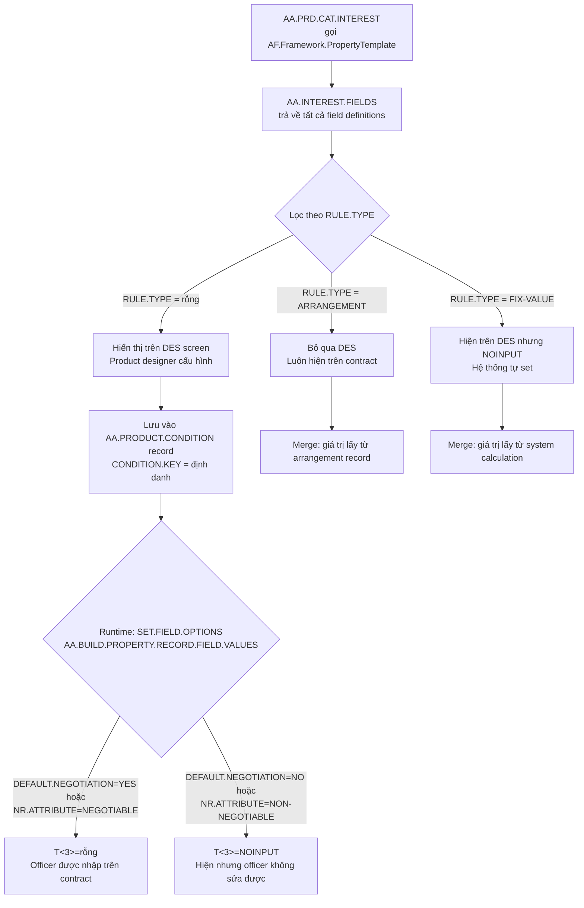
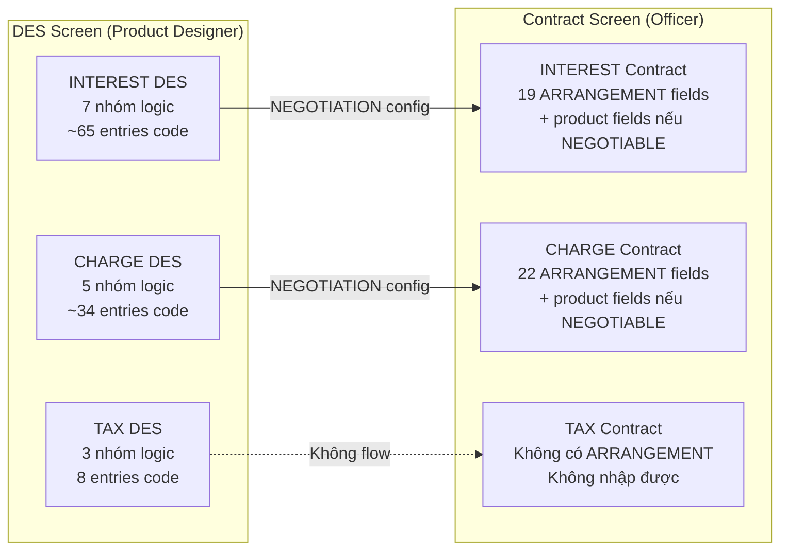
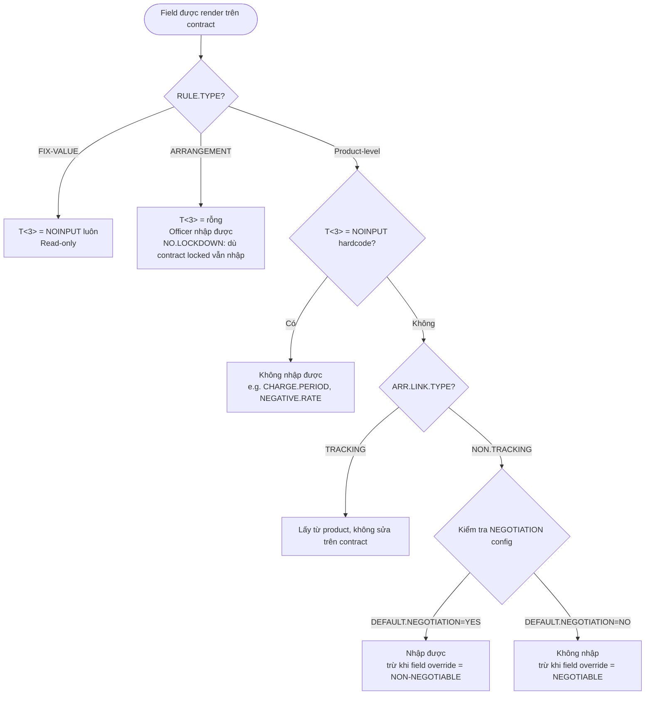

# AA Property Fields & DES Screen Architecture

> Đọc từ source code: `AA.INTEREST.FIELDS.b`, `AA.CHARGE.FIELDS.b`, `AA.TAX.FIELDS.b`, `AA.PRD.CAT.INTEREST.b`, `AA.BUILD.PROPERTY.RECORD.FIELD.VALUES.b`, `AA.MERGE.PRODUCT.ARR.CONDITIONS.b`

---

## 1. Kiến trúc tổng quan: Một FIELDS subroutine, hai màn hình

T24 AA dùng **một subroutine duy nhất** để định nghĩa field cho cả màn hình DES (thiết kế sản phẩm) lẫn màn hình hợp đồng (arrangement). Sự phân chia được điều khiển bởi tham số `OUT.RULE.TYPE` của mỗi field.

```
AA.INTEREST.FIELDS(OUT.ASSOC, OUT.F, OUT.N, OUT.T, OUT.CHECKFILE, OUT.RULE.TYPE, ...)
AA.CHARGE.FIELDS(OUT.ASSOC, OUT.F, OUT.N, OUT.T, OUT.CHECKFILE, OUT.RULE.TYPE, ...)
AA.TAX.FIELDS(OUT.ASSOC, OUT.F, OUT.N, OUT.T, OUT.CHECKFILE, OUT.RULE.TYPE, ...)
```

### 1.1 Ba loại field theo RULE.TYPE

| RULE.TYPE | Tên gọi | Hiển thị DES | Hiển thị Contract | Ai nhập |
|-----------|---------|:------------:|:-----------------:|---------|
| `""` (rỗng) | **Product-level** | ✅ Có | Tuỳ NEGOTIATION config | Product designer + có thể officer |
| `"ARRANGEMENT"` | **Arrangement-level** | ❌ Không | ✅ Luôn có | Chỉ officer khi tạo/sửa hợp đồng |
| `"FIX-VALUE"` | **System-computed** | ✅ Có (read-only) | ✅ Có (read-only) | Hệ thống tự tính, không nhập được |

### 1.2 ASSOC notation – ký hiệu cấu trúc MV/SM

`OUT.ASSOC` cho biết field đó thuộc nhóm MV nào, giải thích tại sao "nhiều field" trên code thực ra là ít "quyết định cấu hình":

| ASSOC | Ý nghĩa |
|-------|---------|
| `""` | Standalone field – một hàng độc lập |
| `"XX<"` | **Bắt đầu** nhóm MV – mỗi MV row = một tập giá trị |
| `"XX-"` | **Tiếp tục** trong cùng nhóm MV |
| `"XX>"` | **Kết thúc** nhóm MV |
| `"XX-XX<"` | Bắt đầu sub-MV lồng trong MV cha |
| `"XX-XX-"` | Tiếp tục sub-MV |
| `"XX-XX>"` | Kết thúc sub-MV |
| `"XX-XX."` | SM (sub-multivalued) trong MV |
| `"XX>XX."` | SM cuối cùng trong MV |

**Ví dụ:** Rate tier MV của INTEREST có 15 field trong code nhưng thực tế chỉ là **một row của bảng tiers** – mỗi row chứa: loại rate, giá trị rate, margin, min/max rate, effective rate (computed), tier amount. Người dùng thêm bao nhiêu tier thì có bấy nhiêu row.

### 1.3 Luồng từ DES đến Contract



### 1.4 Cấu trúc bảng AA.PRODUCT.CONDITION

Bảng này lưu **metadata** của một product condition record. Nó không lưu trực tiếp các field của property – các giá trị đó được lưu trong record riêng qua cơ chế PropertyTemplate.

```
AA.PRODUCT.CONDITION
├── DESCRIPTION          – Tên ngắn, theo ngôn ngữ
├── FULL.DESCRIPTION     – Mô tả đầy đủ
├── CONTEXT.TYPE (MV)    – LINE_GROUP (áp dụng cho product line nào)
├── CONTEXT (MV)         – ID của product line / group
├── PROPERTY.CLASS       – Tên property class (INTEREST, CHARGE, TAX, ...)
└── CONDITION.KEY (80c)  – Key tra cứu condition record
```

Màn hình `AA.PRD.CAT.INTEREST` (DES) được gọi bởi T24 khi user vào product designer cho property INTEREST. Nó chỉ làm một việc:

```basic
SAVE.APPL = EB.SystemTables.getApplication()
EB.SystemTables.setApplication('AA.PRD.CAT.INTEREST')
AF.Framework.PropertyTemplate()      ← framework tự build màn hình từ AA.INTEREST.FIELDS
EB.SystemTables.setApplication(SAVE.APPL)
```

---

## 2. INTEREST Property Class

### Tại sao có nhiều field?

INTEREST phức tạp nhất vì phải hỗ trợ:
- **Nhiều loại rate**: FIXED, FLOATING (market rate), PERIODIC (reset theo kỳ), CUSTOM (custom logic), LINKED (link sang sản phẩm khác)
- **Rate tiers**: mỗi sản phẩm có thể có N tier (dải lãi suất theo số dư) – mỗi tier là 1 MV row với ~15 sub-field
- **USER.* fields**: một bộ field song song với rate tier, dùng để định nghĩa giao diện nhập lãi suất cho user cuối trên contract (thay vì hiển thị hết 15 sub-field kỹ thuật của tier)
- **Islamic finance**: ACCOUNTING.MODE, ACTUAL.PROFIT.AMT, ORIG.PROFIT.AMOUNT
- **Advanced pricing** (ARRANGEMENT-level): relationship pricing, regional pricing, pricing rules, package pricing

### 2.1 Product-level fields – hiển thị trên DES

#### Nhóm A: Thông số tính toán cơ bản

| Field | Kiểu | Giá trị / Checkfile | Ghi chú |
|-------|------|---------------------|---------|
| `CALC.THRESHOLD` | AMT | – | Ngưỡng số dư để tính lãi |
| `DAY.BASIS` | A | INTEREST.BASIS | Quy ước tính ngày (ACT/365, ACT/360, 30/360, ...) |
| `ACCRUAL.RULE` | A | EB.ACCRUAL.PARAM | Quy tắc dồn tích lãi |
| `COMPOUND.TYPE` | COMPFQU | – | Loại lãi kép (tần suất) |
| `NEGATIVE.RATE` | Options | YES/NO/BLOCK.MARGIN/FLOOR.MARGIN | Xử lý lãi âm – **NOINPUT** (system-set từ rate config) |
| `RATE.TIER.TYPE` | Options | SINGLE / BAND / LEVEL | Kiểu phân bậc: không bậc / dải / lũy tiến |
| `USE.PRICING.GRID` | Options | YES/_ | Dùng pricing grid hay không |

#### Nhóm B: Giao diện nhập lãi suất cho user (USER.* fields)

Bộ field này định nghĩa **loại trường lãi suất nào hiển thị trên màn hình hợp đồng** cho người dùng cuối. Nó là "lớp UI" đơn giản hóa, song song với rate tier kỹ thuật ở Nhóm C.

| Field | Mô tả |
|-------|-------|
| `USER.RATE.TYPE` | Loại rate: FIXED / FLOATING / PERIODIC / CUSTOM / LINKED |
| `USER.FIXED.RATE` | Lãi suất cố định (nếu type = FIXED) |
| `USER.FLOATING.INDEX` | Chỉ số thả nổi – checkfile BASIC.RATE.TEXT |
| `USER.FLOATING.NOTICE` | Kỳ notice cho lãi thả nổi |
| `USER.PERIODIC.INDEX` | Index cho lãi periodic |
| `USER.PERIODIC.PERIOD.TYPE` | Loại kỳ reset: MATURITY / RENEWAL / RESET.PERIOD / PERIODIC.PERIOD |
| `USER.PERIODIC.RATE` | Lãi suất periodic |
| `USER.PERIODIC.PERIOD` | Kỳ periodic |
| `USER.PERIODIC.METHOD` | Phương pháp nội suy: INTERPOLATE / PREVIOUS / NEXT / CLOSEST |
| `USER.INITIAL.RESET.DATE` | Ngày reset đầu tiên |
| `USER.PERIODIC.RESET` | Tần suất reset (FQU) |
| `USER.CUSTOM.RATE` | Dùng custom rate hay không |
| `USER.LINKED.RATE` | Dùng linked rate hay không |
| **`USER.MARGIN.*`** | **MV group** – margin áp dụng lên user rate |
| └─ `USER.MARGIN.TYPE` | Loại margin (ADD/PREMIUM/BASE) – checkfile AA.MARGIN.TYPE |
| └─ `USER.MARGIN.OPER` | Toán tử: ADD / SUB / MULTIPLY |
| └─ `USER.MARGIN.RATE` | Giá trị margin (%) |

> **Lưu ý:** USER.* fields và rate tier ở Nhóm C **không nhất thiết trùng nhau**. USER.* là những gì officer nhập; tier là cách hệ thống tính toán thực tế. Cơ chế `IntUserRateType` / `IntUsrFixedRate` runtime sẽ map giá trị user nhập vào đúng tier.

#### Nhóm C: Rate Tiers (MV block – Nhóm trung tâm)

**Mỗi MV row = một tier lãi suất.** Toàn bộ block dưới đây là CỦA MỘT TIER:

| ASSOC | Field | Mô tả |
|-------|-------|-------|
| `XX<` | `FIXED.RATE` | Lãi suất cố định của tier này |
| `XX-` | `FLOATING.INDEX` | Index thị trường – checkfile BASIC.RATE.TEXT |
| `XX-` | `FLOATING.NOTICE` | Kỳ notice |
| `XX-` | `PERIODIC.INDEX` | Index periodic |
| `XX-` | `PERIODIC.PERIOD.TYPE` | Loại kỳ periodic |
| `XX-` | `PERIODIC.RATE` | Lãi suất periodic |
| `XX-` | `PERIODIC.PERIOD` | Kỳ periodic |
| `XX-` | `PERIODIC.METHOD` | Phương pháp nội suy |
| `XX-` | `INITIAL.RESET.DATE` | Ngày reset đầu |
| `XX-` | `PERIODIC.RESET` | Tần suất reset (FQU) |
| `XX-` | `CUSTOM.RATE` | Dùng custom rate |
| `XX-` | `LINKED.RATE` | Dùng linked rate |
| `XX-` | `USAGE.PERCENT` | Tỷ lệ phần trăm sử dụng balance |
| `XX-XX<` | `MARGIN.TYPE` | **Sub-MV:** Loại margin trong tier |
| `XX-XX-` | `MARGIN.OPER` | Toán tử margin: ADD / SUB / MULTIPLY |
| `XX-XX>` | `MARGIN.RATE` | Giá trị margin |
| `XX-` | `TIER.MIN.RATE` | Lãi tối thiểu của tier |
| `XX-` | `TIER.MAX.RATE` | Lãi tối đa của tier |
| `XX-` | `TIER.NEGATIVE.RATE` | Xử lý lãi âm riêng cho tier |
| `XX-` | **`EFFECTIVE.RATE`** | **FIX-VALUE + NOINPUT** – lãi thực tế hệ thống tính |
| `XX-` | `TIER.AMOUNT` | Ngưỡng số dư của tier |
| `XX>` | `TIER.PERCENT` | Phần trăm áp dụng của tier |

> 22 entries trong code = **1 tier row** của một bảng tier. Nhiều tier = nhiều MV row, nhưng cấu trúc là như nhau.

#### Nhóm D: Recalculate on Activity (MV)

| ASSOC | Field | Mô tả |
|-------|-------|-------|
| `XX<` | `ON.ACTIVITY` | AA Activity code kích hoạt recalculate |
| `XX>` | `RECALCULATE` | Tính lại gì: NOTHING / RATE / PROFIT.AMOUNT.AND.RATE / PROFIT.AMOUNT |

#### Nhóm E: Adjustment (điều chỉnh lãi suất tạm thời)

Cho phép override/adjust lãi suất trong khoảng thời gian nhất định:

| Field | Mô tả |
|-------|-------|
| `ADJUST.TYPE` | ADJUST (điều chỉnh biên) / OVERRIDE (ghi đè hoàn toàn) |
| `ADJUST.OPERAND` | ADD / SUBTRACT / MULTIPLY |
| `ADJUST.MARGIN` | Biên điều chỉnh (%) |
| `ADJUST.OVERRIDE.RATE` | Lãi suất ghi đè |
| `ADJUST.REASON` | Lý do – checkfile AA.ADJUSTMENT.REASON |
| `ADJUST.EXPIRY.DATE` | Ngày hết hiệu lực điều chỉnh |

#### Nhóm F: Thông số phụ

| Field | T3 | Mô tả |
|-------|-----|-------|
| `COMPOUND.YIELD.METHOD` | – | YIELD/_ – phương pháp tính yield lãi kép |
| `REFER.LIMIT` | NOINPUT nếu LI/IC chưa cài | Tham chiếu đến limit của LI/IC |
| `MIN.INT.AMOUNT` | – | Số tiền lãi tối thiểu |
| `MIN.INT.WAIVE` | – | Bỏ qua lãi tối thiểu (YES) |
| `SUPPRESS.ACCRUAL` | – | YES / ALTERNATE / INFO.ONLY |
| `DATE.CONVENTION` | – | ARRANGEMENT / PERIODIC INTEREST |
| `LINKED.ARRANGEMENT` | – | Hợp đồng liên kết (Islamic) |
| `LINKED.PROPERTY` | – | Property liên kết |
| `INTEREST.METHOD` | NOCHANGE | FIXED – không đổi sau khi nhập |
| `RATE.TYPE` | – | REDUCING.RATE / FLAT.RATE / FLAT.AMOUNT |
| `ACTUAL.PROFIT.AMT` | – | Số tiền lợi nhuận thực (Islamic) |
| `ORIG.PROFIT.AMOUNT` | NOCHANGE | Lợi nhuận gốc ban đầu |
| `INTERNAL.BOOKING` | – | YES – chỉ hạch toán nội bộ |
| `CUSTOM.RATE.CALC` | – | Tên custom rate type |
| `RUNTIME.RATE.CALC` | – | YES/_ – tính rate runtime |
| **`CUSTOM.*`** (MV) | – | **MV group**: CUSTOM.TYPE / CUSTOM.NAME / CUSTOM.VALUE |

### 2.2 FIX-VALUE fields

| Field | ASSOC | T<3> | Mô tả |
|-------|-------|------|-------|
| `EFFECTIVE.RATE` | `XX-` (trong rate tier MV) | NOINPUT | Lãi suất thực tế sau khi áp margin – hệ thống tính, không nhập |
| `ACCOUNTING.MODE` | `""` | NOCHANGE | ADVANCE / UPFRONT.PROFIT – chỉ set một lần khi tạo, không sửa được |

### 2.3 ARRANGEMENT-level fields – hiển thị trực tiếp trên contract

Các field này **không xuất hiện trong DES screen**. Chúng luôn hiện trên màn hình hợp đồng với `NO.LOCKDOWN` (vẫn sửa được dù hợp đồng đã lock).

#### Relationship Pricing (liên kết lãi suất theo bundle sản phẩm)

| Field | Mô tả |
|-------|-------|
| `RELATIONSHIP.PRODUCT` | AA Product của hợp đồng chủ |
| `RELATIONSHIP.OPERAND` | ADD / SUBTRACT / MULTIPLY |
| `RELATIONSHIP.MARGIN` | Biên lãi suất so với hợp đồng chủ |
| `RELATIONSHIP.VARIATION` | Biến thể – checkfile AA.PRODUCT.VARIATION |
| `RELATIONSHIP.FIXED.RATE` | Lãi suất cố định theo relationship |

#### Regional Pricing (lãi suất theo chi nhánh/vùng)

| Field | Mô tả |
|-------|-------|
| `REGIONAL.PRICING.LEVEL` | Cấp tổ chức: checkfile ST.ORGANIZATIONSTRUCTURE.LEVEL |
| `REGIONAL.PRICING.CODE` | Mã chi nhánh/vùng |
| `REGIONAL.PRICING.OPERAND` | ADD / SUBTRACT / MULTIPLY |
| `REGIONAL.PRICING.MARGIN` | Biên lãi suất theo vùng |
| `REGIONAL.PRICING.FIXED.RATE` | Lãi suất cố định theo vùng |
| `REGIONAL.PRODUCT` | Product tham chiếu theo vùng |
| `REGIONAL.PROPERTY.CONTROL` | SUPPRESS / REPLACE / MERGE |

#### Pricing Rules (MV – giảm lãi theo quy tắc ưu đãi)

| ASSOC | Field | Mô tả |
|-------|-------|-------|
| `XX<` | `PRICING.RULES.BENEFIT` | Loại benefit – checkfile AA.PRICING.BENEFIT |
| `XX-` | `PRICING.RULES.OPERAND` | ADD / SUBTRACT / MULTIPLY |
| `XX-` | `PRICING.RULES.MARGIN` | Biên điều chỉnh |
| `XX>` | `PRICING.RULES.FIXED.RATE` | Lãi suất cố định theo rule |

#### Package & Program

| Field | Mô tả |
|-------|-------|
| `PROGRAM.LIMIT` | Giới hạn theo chương trình |
| `PACKAGE.PRODUCT` | Product chủ của package |
| `PACKAGE.PROPERTY.CONTROL` | SUPPRESS / REPLACE / MERGE |

### 2.4 Tóm tắt số lượng – INTEREST

| Phân loại | Số nhóm logic | Số field trong code | Ghi chú |
|-----------|:-------------:|:-------------------:|---------|
| Product-level (DES) | **7 nhóm** | ~65 entries | Bao gồm rate tier MV (22 entries = 1 tier row) |
| FIX-VALUE | 2 | 2 | EFFECTIVE.RATE + ACCOUNTING.MODE |
| ARRANGEMENT (contract only) | **4 nhóm** | 19 | Relationship + Regional + Pricing Rules + Package |
| Reserved (NOINPUT) | – | 4 | RESERVED7-10 |

---

## 3. CHARGE Property Class

### 3.1 Product-level fields – hiển thị trên DES

#### Nhóm A: Thông số phí cơ bản

| Field | T<3> | Mô tả |
|-------|------|-------|
| `CURRENCY` | – | CCY của phí (nếu khác CCY hợp đồng) |
| `CHARGE.TYPE` | – | FIXED (số tiền cố định) / CALCULATED (tính theo công thức) |
| `FIXED.AMOUNT` | – | Số tiền phí cố định |
| `CHARGE.PERIOD` | **NOINPUT** | Kỳ thu phí – system-set, không nhập |
| `CALC.THRESHOLD` | – | Ngưỡng tính phí |
| `FREE.AMOUNT` | – | Miễn phí dưới mức này |
| `TIER.GROUPS` | – | BANDS / LEVELS – kiểu phân bậc |
| `ROUNDING.RULE` | – | Quy tắc làm tròn – checkfile EB.ROUNDING.RULE |
| `CHARGE.ROUTINE` | – | Custom calc API (HOOKOTHER: HOOK.AA.CALCULATE.CHARGE) |

#### Nhóm B: Rate Tiers (MV block)

**Mỗi MV row = một tier phí:**

| ASSOC | Field | Mô tả |
|-------|-------|-------|
| `XX<` | `CALC.TIER.TYPE` | BAND (dải) / LEVEL (lũy tiến) |
| `XX-` | `CALC.TYPE` | FLAT (tiền cố định) / PERCENTAGE / UNIT |
| `XX-` | `CHARGE.RATE` | Tỷ lệ phí (%) |
| `XX-` | `CHG.AMOUNT` | Số tiền phí cố định của tier |
| `XX-` | `TIER.MIN.CHARGE` | Phí tối thiểu của tier |
| `XX-` | `TIER.MAX.CHARGE` | Phí tối đa của tier |
| `XX-` | `TIER.AMOUNT` | Ngưỡng số tiền / số dư của tier |
| `XX-` | `TIER.COUNT` | Ngưỡng số lần giao dịch |
| `XX-` | `TIER.TERM` | Kỳ hạn của tier |
| `XX>` | `TIER.EXCLUSIVE` | YES/_ – áp dụng độc quyền tier này |

> 10 entries trong code = **1 tier row**.

#### Nhóm C: Giới hạn và ngưỡng

| Field | Ghi chú |
|-------|---------|
| `REFER.LIMIT` | NOINPUT nếu LI/IC chưa cài |
| `MIN.CHG.AMOUNT` | Số tiền phí tối thiểu |
| `MIN.CHG.WAIVE` | Miễn phí tối thiểu (YES) |

#### Nhóm D: Adjustment (điều chỉnh phí tạm thời)

| Field | Mô tả |
|-------|-------|
| `ADJUST.TYPE` | ADJUST / OVERRIDE / WAIVE (bỏ phí) |
| `ADJUST.AMOUNT` | Số tiền điều chỉnh |
| `ADJUST.PERCENTAGE` | Tỷ lệ điều chỉnh |
| `ADJUST.OVERRIDE.AMOUNT` | Số tiền ghi đè |
| `ADJUST.REASON` | Lý do |
| `ADJUST.EXPIRY.DATE` | Ngày hết hiệu lực |

#### Nhóm E: Thông số phụ

| Field | T<3> | Mô tả |
|-------|------|-------|
| `CANCEL.PERIOD` | – | Kỳ hủy phí |
| `ACCRUAL.RULE` | – | Quy tắc dồn tích – checkfile EB.ACCRUAL.PARAM |
| `INTERNAL.BOOKING` | – | YES – hạch toán nội bộ |
| `CHARGE.OVERRIDE.ROUTINE` | – | API ghi đè phí (HOOKOTHER: HOOK.AA.CHARGE.OVERRIDE) |
| `HANDOFF.CHARGE` | – | YES / NO / _ – chuyển phí sang module khác |
| `SUPPRESS` | – | YES/_ – tắt phí |

### 3.2 FIX-VALUE fields

CHARGE **không có** FIX-VALUE field.

### 3.3 ARRANGEMENT-level fields – hiển thị trực tiếp trên contract

#### Relationship Pricing (phí theo bundle sản phẩm)

| Field | Mô tả |
|-------|-------|
| `RELATIONSHIP.PRODUCT` | AA Product của hợp đồng chủ |
| `RELATIONSHIP.PERCENTAGE` | Tỷ lệ phí so với hợp đồng chủ |
| `RELATIONSHIP.AMOUNT` | Số tiền theo relationship |
| `RELATIONSHIP.VARIATION` | Biến thể |
| `RELATIONSHIP.ADJ.OPERAND` | ADD / SUBTRACT / MULTIPLY |
| `RELATIONSHIP.ADJ.AMOUNT` | Số tiền điều chỉnh theo relationship |

#### Regional Pricing (phí theo vùng)

| Field | Mô tả |
|-------|-------|
| `REGIONAL.PRICING.LEVEL` | Cấp tổ chức |
| `REGIONAL.PRICING.CODE` | Mã vùng |
| `REGIONAL.PRICING.ADJ.OPERAND` | ADD / SUBTRACT / MULTIPLY |
| `REGIONAL.PRICING.ADJ.PERCENT` | Tỷ lệ điều chỉnh theo vùng |
| `REGIONAL.PRICING.ADJ.AMOUNT` | Số tiền điều chỉnh theo vùng |
| `REGIONAL.PRICING.AMOUNT` | Số tiền phí theo vùng |
| `REGIONAL.PRODUCT` | Product tham chiếu theo vùng |
| `REGIONAL.PROPERTY.CONTROL` | SUPPRESS / REPLACE / MERGE |

#### Pricing Rules (MV – ưu đãi theo rule)

| ASSOC | Field | Mô tả |
|-------|-------|-------|
| `XX<` | `PRICING.RULES.BENEFIT` | Loại benefit |
| `XX-` | `PRICING.RULES.ADJ.OPERAND` | ADD / SUBTRACT / MULTIPLY |
| `XX-` | `PRICING.RULES.ADJ.PERCENTAGE` | Tỷ lệ ưu đãi |
| `XX-` | `PRICING.RULES.ADJ.AMOUNT` | Số tiền ưu đãi |
| `XX>` | `PRICING.RULES.AMOUNT` | Số tiền phí sau ưu đãi |

#### Package & Program

| Field | Mô tả |
|-------|-------|
| `PROGRAM.LIMIT` | Giới hạn theo chương trình |
| `PACKAGE.PRODUCT` | Product chủ của package |
| `PACKAGE.PROPERTY.CONTROL` | SUPPRESS / REPLACE / MERGE |

### 3.4 Tóm tắt số lượng – CHARGE

| Phân loại | Số nhóm logic | Số field trong code |
|-----------|:-------------:|:-------------------:|
| Product-level (DES) | **5 nhóm** | ~34 entries |
| FIX-VALUE | 0 | 0 |
| ARRANGEMENT (contract only) | **4 nhóm** | 22 |
| Reserved (NOINPUT) | – | 7 |

---

## 4. TAX Property Class

TAX là property class đơn giản nhất – **tất cả field đều là product-level**, không có ARRANGEMENT hay FIX-VALUE.

### 4.1 Product-level fields

TAX cho phép gắn nhiều loại thuế vào một property class (ví dụ: lãi suất của contract chịu VAT và WHT đồng thời).

#### Nhóm A: Tax theo Property Class (MV group 1)

Áp dụng thuế cho toàn bộ property class (ví dụ: mọi khoản lãi đều chịu VAT):

| ASSOC | Field | Mô tả |
|-------|-------|-------|
| `XX<` | `PROPERTY.CLASS` | Property class chịu thuế – checkfile AA.PROPERTY.CLASS |
| `XX-XX.` | `TAX.CODE` | Mã thuế – checkfile TAX |
| `XX>XX.` | `TAX.CONDITION` | Điều kiện thuế – checkfile TAX.TYPE.CONDITION |

> Mỗi MV row = một property class + danh sách tax code áp dụng.

#### Nhóm B: Tax theo Property cụ thể (MV group 2)

Áp dụng thuế cho một property instance cụ thể (ví dụ: chỉ khoản lãi định kỳ mới chịu WHT):

| ASSOC | Field | Mô tả |
|-------|-------|-------|
| `XX<` | `PROPERTY` | AA Property instance – checkfile AA.PROPERTY |
| `XX-XX.` | `PROP.TAX.CODE` | Mã thuế |
| `XX>XX.` | `PROP.TAX.COND` | Điều kiện thuế |

#### Nhóm C: Netting

| Field | Mô tả |
|-------|-------|
| `NET.TAX` | YES/_ – gộp thuế từ nhiều source |
| `XX.PROP.NET.TAX` | MV – các property được gộp thuế |

### 4.2 Tóm tắt – TAX

| Phân loại | Số nhóm logic | Số field trong code |
|-----------|:-------------:|:-------------------:|
| Product-level (DES) | **3 nhóm** | 8 meaningful |
| FIX-VALUE | 0 | 0 |
| ARRANGEMENT (contract only) | 0 | 0 |
| Reserved (NOINPUT) | – | 5 |

> TAX hoàn toàn do product designer kiểm soát. Officer không thể thay đổi cấu hình thuế trên hợp đồng.

---

## 5. So sánh ba Property Class



| Tiêu chí | INTEREST | CHARGE | TAX |
|---------|:--------:|:------:|:---:|
| Số nhóm product-level | 7 | 5 | 3 |
| FIX-VALUE fields | 2 | 0 | 0 |
| ARRANGEMENT fields | 19 | 22 | 0 |
| Rate tier MV | Có (22 sub-field/tier) | Có (10 sub-field/tier) | Không |
| USER.* mirror fields | Có | Không | Không |
| Adjustment fields | Có | Có (+ WAIVE) | Không |
| Officer có thể sửa | Có (nếu NEGOTIABLE) | Có (nếu NEGOTIABLE) | Không |
| Islamic finance | Có | Không | Không |

---

## 6. Cơ chế NEGOTIATION: Field nào officer được nhập trên contract

### 6.1 Luồng quyết định



### 6.2 Ý nghĩa của ARR.LINK.TYPE

| ARR.LINK.TYPE | Ý nghĩa | Cách merge khi lấy giá trị |
|--------------|---------|--------------------------|
| `TRACKING` | Luôn theo product – không sửa được trên contract | Lấy từ product condition record |
| `NON.TRACKING` | Có thể tách rời khỏi product | Lấy từ arrangement record (đã lưu lúc tạo) |
| `CUSTOM.TRACKING` | Tracking một số field, không tracking field khác | Tùy từng field + NEGOTIATION |

### 6.3 Ví dụ thực tế với INTEREST

Giả sử một sản phẩm vay thế chấp được cấu hình:
- `DEFAULT.NEGOTIATION = NO` (mặc định: không cho sửa lãi suất)
- `NR.ATTRIBUTE<1> = "FIXED.RATE"`, `NR.OPTIONS<1> = "NEGOTIABLE"` (cho phép sửa lãi suất cố định)
- `NR.ATTRIBUTE<2> = "DAY.BASIS"`, `NR.OPTIONS<2> = "NON-NEGOTIABLE"` (không cho sửa day basis)

Kết quả trên màn hình hợp đồng:
- `FIXED.RATE` → có thể nhập (NEGOTIABLE override)
- `DAY.BASIS` → NOINPUT (explicit NON-NEGOTIABLE)
- `MARGIN.RATE` → NOINPUT (default NO không áp override)
- `RELATIONSHIP.PRODUCT` → luôn nhập được (ARRANGEMENT field, không qua NEGOTIATION)

---

## 7. Tóm tắt: Tại sao có "nhiều trường"?

Câu hỏi ban đầu là tại sao mỗi property class lại có quá nhiều trường. Câu trả lời:

1. **MV structure làm số đếm tăng ảo**: Rate tier của INTEREST có 22 entries trong code nhưng thực tế chỉ là **1 row của bảng tier**. Sản phẩm thực tế thường chỉ dùng 1-3 tier.

2. **Dual-purpose: DES + Contract**: Cùng một FIELDS subroutine phục vụ cả hai màn hình, nên tổng số field = product fields + arrangement fields. Thực tế mỗi màn hình chỉ thấy một subset.

3. **Nhiều paradigm lãi suất (INTEREST)**: FIXED, FLOATING, PERIODIC, CUSTOM, LINKED – mỗi loại có sub-fields riêng. Một sản phẩm thực tế chỉ dùng 1 loại; các field của loại khác để trống.

4. **Advanced pricing**: RELATIONSHIP, REGIONAL, PRICING.RULES, PACKAGE – đây là các tính năng mở rộng cho ngân hàng lớn có nhiều kênh. Ngân hàng nhỏ thường không dùng nhóm này.

5. **TAX đơn giản nhất**: Chỉ 8 meaningful fields – vì thuế không có tiers phức tạp và không cần override tại contract.

| Property | Fields thực sự cần cấu hình (typical) | Fields advanced (optional) |
|---------|:-----------------------------------:|:--------------------------:|
| INTEREST | ~10 (base params + 1-2 tiers) | ~30 (USER.*, adjust, Islamic) |
| CHARGE | ~8 (currency, type, 1-2 tiers) | ~20 (adjust, override routines) |
| TAX | ~4 (1-2 property class + tax codes) | ~4 (netting) |
