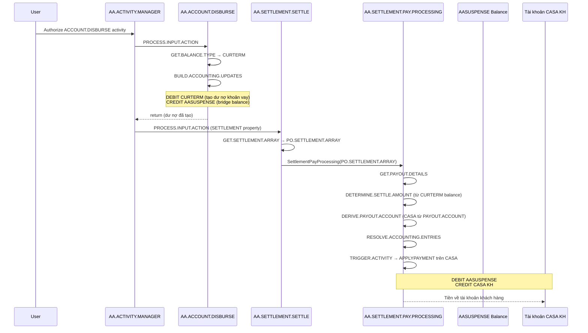
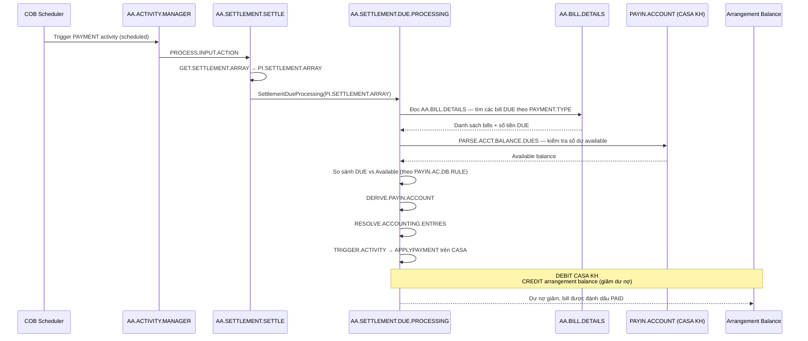
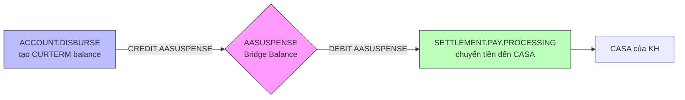
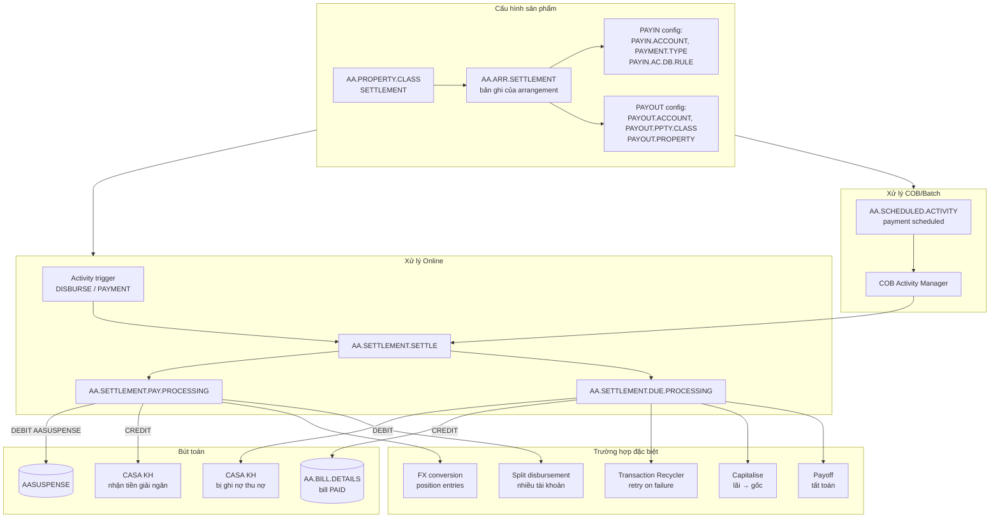
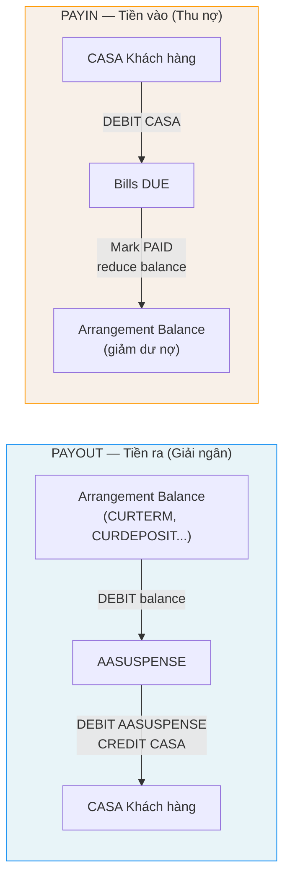

# Báo cáo kỹ thuật: SETTLEMENT Property Class trong T24 AA Framework

**Phạm vi:** Toàn bộ cấu hình trường dữ liệu, action routines, luồng PAYOUT (giải ngân) và PAYIN (thu nợ)  
**Source files:** `AA.SETTLEMENT.FIELDS.b`, `AA.SETTLEMENT.SETTLE.b`, `AA.SETTLEMENT.PAY.PROCESSING.b`, `AA.SETTLEMENT.DUE.PROCESSING.b`, `AA.BUILD.SETTLEMENT.ARRAY.b`, `AA.ACCOUNT.DISBURSE.b`

---

## Mục lục

1. [Tổng quan kiến trúc](#1-tổng-quan-kiến-trúc)
2. [Cấu trúc trường dữ liệu](#2-cấu-trúc-trường-dữ-liệu)
   - [2.1 Nhóm PAYIN (thu nợ)](#21-nhóm-payin-thu-nợ)
   - [2.2 Nhóm PAYOUT (giải ngân / chi trả)](#22-nhóm-payout-giải-ngân--chi-trả)
   - [2.3 Nhóm FX Settlement](#23-nhóm-fx-settlement)
   - [2.4 Nhóm OFFSET](#24-nhóm-offset)
   - [2.5 Các trường đơn lẻ](#25-các-trường-đơn-lẻ)
   - [2.6 Counter Booking](#26-counter-booking)
3. [Action Routines](#3-action-routines)
   - [3.1 AA.SETTLEMENT.SETTLE — Dispatcher](#31-aasettlementsettle--dispatcher)
   - [3.2 AA.SETTLEMENT.PAY.PROCESSING — Luồng PAYOUT](#32-aasettlementpayprocessing--luồng-payout)
   - [3.3 AA.SETTLEMENT.DUE.PROCESSING — Luồng PAYIN](#33-aasettlementdueprocessing--luồng-payin)
4. [Luồng giải ngân (PAYOUT) chi tiết](#4-luồng-giải-ngân-payout-chi-tiết)
5. [Luồng thu nợ (PAYIN) chi tiết](#5-luồng-thu-nợ-payin-chi-tiết)
6. [Cơ chế AASUSPENSE — cầu nối giữa ACCOUNT và SETTLEMENT](#6-cơ-chế-aasuspense--cầu-nối-giữa-account-và-settlement)
7. [Các trường hợp đặc biệt](#7-các-trường-hợp-đặc-biệt)
8. [Sơ đồ tổng hợp](#8-sơ-đồ-tổng-hợp)

---

## 1. Tổng quan kiến trúc

SETTLEMENT là property class trung tâm điều phối **toàn bộ dòng tiền vào/ra** của một arrangement. Không giống LD truyền thống có trường account cứng trên màn hình, AA dùng mô hình **property record** — mỗi arrangement có một bản ghi SETTLEMENT riêng trong file `AA.ARR.SETTLEMENT`.

### Hai hướng tiền tệ

| Hướng | Thuật ngữ | Ý nghĩa thực tế |
|---|---|---|
| Arrangement → Khách hàng | **PAYOUT** | Giải ngân, trả lãi tiết kiệm, hoàn tiền |
| Khách hàng → Arrangement | **PAYIN** | Thu gốc, thu lãi vay, thu phí |

### Mô hình multi-value

Cả PAYIN và PAYOUT đều được thiết kế dạng **multi-value (MV)** — nghĩa là một arrangement có thể có nhiều tài khoản thu/chi song song. Ví dụ:
- PAYOUT: 70% giải ngân vào tài khoản CASA, 30% vào tài khoản tiết kiệm
- PAYIN: Thu lãi từ CASA thứ nhất, thu gốc từ CASA thứ hai

---

## 2. Cấu trúc trường dữ liệu

> Source: `T24.BP/AA.SETTLEMENT.FIELDS.b`

### 2.1 Nhóm PAYIN (thu nợ)

Cú pháp màn hình: `XX< ... XX>` (MV group)

| Trường | Kích thước | Loại | Mô tả |
|---|---|---|---|
| `PAYIN.CURRENCY` | 3 | NOINPUT | Đồng tiền thu nợ (tự động từ product line) |
| `PAYIN.PRD.GROUP` | 35 | NOINPUT | Product group của PAYIN property |
| `PAYIN.PRODUCT` | 35 | NOINPUT | Product của PAYIN property |
| `PAYMENT.TYPE` | SM list | Options | Loại thanh toán: xác định loại dư nợ cần thu (PRINCIPAL, INTEREST, CHARGE...) |
| `PAYIN.SETTLE.ACTIVITY` | 35 | Checkfile AA.ACTIVITY | Activity thứ cấp kích hoạt trên tài khoản PAYIN (thường là APPLYPAYMENT) |
| `PAYIN.SETTLEMENT` | YES/NO | Options | Bật/tắt cơ chế auto-settlement cho luồng này |
| `RESERVED.16` | 35 | NOINPUT | Reserved |
| `PAYIN.AC.DB.RULE` | 35 | Checkfile AA.SETTLEMENT.TYPE | Quy tắc ghi nợ: FULL (toàn bộ), PARTIAL (theo số dư) |
| `DD.MANDATE.REF` | Sub-MV | A | Tham chiếu Direct Debit mandate |
| `PAYIN.ACCOUNT` | Sub-MV | A | Tài khoản CASA bị ghi nợ để thu nợ |
| `PAYIN.BENEFICIARY` | Sub-MV | A | Beneficiary thay thế nếu không có PAYIN.ACCOUNT |
| `PAYIN.PO.PRODUCT` | Sub-MV | A | Product dùng cho payment order |
| `PAYIN.PERCENTAGE` | Sub-MV | A | % phân bổ thu nợ cho tài khoản này (nếu nhiều PAYIN.ACCOUNT) |
| `PAYIN.AMOUNT` | Sub-MV | A | Số tiền cố định thu từ tài khoản này |
| `PAYIN.ACTIVITY` | Sub-MV | Checkfile AA.ACTIVITY | Activity kích hoạt trên arrangement khi PAYIN.ACCOUNT là AA arrangement |
| `PAYIN.RC.TYPE` | 35 | NOINPUT nếu RC chưa cài | Loại RC (Transaction Recycler) cho luồng PAYIN |
| `PAYIN.RC.CONDITION` | 35 | NOINPUT nếu RC chưa cài | Điều kiện trigger RC |

**Lưu ý:** `PAYIN.AC.DB.RULE` trỏ đến `AA.SETTLEMENT.TYPE` — một bản ghi định nghĩa routine xử lý settlement tùy chỉnh. Giá trị thường gặp: FULL (thu đủ nếu có đủ tiền) hoặc PARTIAL (thu bao nhiêu có bấy nhiêu).

---

### 2.2 Nhóm PAYOUT (giải ngân / chi trả)

Cú pháp màn hình: MV group riêng biệt

| Trường | Kích thước | Loại | Mô tả |
|---|---|---|---|
| `PAYOUT.CURRENCY` | 3 | NOINPUT | Đồng tiền giải ngân |
| `PAYOUT.PRD.GROUP` | 35 | NOINPUT | Product group của PAYOUT property |
| `PAYOUT.PRODUCT` | 35 | NOINPUT | Product của PAYOUT property |
| `PAYOUT.PPTY.CLASS` | SM | A | Property class nguồn — xác định balance type nào được giải ngân |
| `PAYOUT.PROPERTY` | SM | A | Property cụ thể trong arrangement cần giải ngân |
| `PAYOUT.SETTLE.ACTIVITY` | 35 | Checkfile AA.ACTIVITY | Activity thứ cấp kích hoạt trên tài khoản PAYOUT (thường là APPLYPAYMENT) |
| `PAYOUT.SETTLEMENT` | YES/NO | Options | Bật/tắt auto-settlement cho luồng PAYOUT |
| `PAYOUT.AC.CR.RULE` | 35 | Checkfile AA.SETTLEMENT.TYPE | Quy tắc ghi có tài khoản đích |
| `PAYOUT.ACCOUNT` | Sub-MV | A | Tài khoản CASA nhận tiền giải ngân |
| `PAYOUT.BENEFICIARY` | Sub-MV | A | Beneficiary thay thế |
| `PAYOUT.PO.PRODUCT` | Sub-MV | A | Product dùng cho payment order |
| `PAYOUT.PERCENTAGE` | Sub-MV | A | % phân bổ giải ngân cho tài khoản này |
| `PAYOUT.AMOUNT` | Sub-MV | A | Số tiền cố định giải ngân cho tài khoản này |
| `PAYOUT.ACTIVITY` | Sub-MV | Checkfile AA.ACTIVITY | Activity kích hoạt trên arrangement khi PAYOUT.ACCOUNT là AA arrangement |
| `PAYOUT.RC.TYPE` | 35 | NOINPUT nếu RC chưa cài | Loại RC cho luồng PAYOUT |
| `PAYOUT.RC.CONDITION` | 35 | NOINPUT nếu RC chưa cài | Điều kiện trigger RC |

**Lưu ý quan trọng về `PAYOUT.PPTY.CLASS` / `PAYOUT.PROPERTY`:** Đây là "nguồn dư nợ" cần giải ngân. Ví dụ: với khoản vay, `PAYOUT.PPTY.CLASS = ACCOUNT` và `PAYOUT.PROPERTY = TERM` — nghĩa là giải ngân bằng cách giảm balance của property TERM trong property class ACCOUNT. Hệ thống sẽ tìm balance type tương ứng (ví dụ `CURTERM`) để build accounting event.

---

### 2.3 Nhóm FX Settlement

| Trường | Kích thước | Loại | Mô tả |
|---|---|---|---|
| `FX.SETTLEMENT.CCY` | MV | A | Đồng tiền FX dùng cho settlement |
| `FX.SETTLEMENT.ACC` | MV | A | Tài khoản FX tương ứng |

Dùng khi arrangement và tài khoản settlement có đồng tiền khác nhau. Hệ thống tự quy đổi và ghi vào position accounts.

---

### 2.4 Nhóm OFFSET

| Trường | Kích thước | Loại | Mô tả |
|---|---|---|---|
| `OFFSET.PPTY.CLASS` | MV | A | Property class của arrangement offset |
| `OFFSET.PROPERTY` | MV | A | Property cụ thể của arrangement offset |
| `OFFSET.REQUIRED` | MV | YES/NO | Bắt buộc xử lý offset trước khi settlement |
| `OFFSET.PAYIN.ACTIVITY` | MV | Checkfile AA.ACTIVITY | Activity kích hoạt trên offset arrangement khi thu |
| `OFFSET.PAYOUT.ACTIVITY` | MV | Checkfile AA.ACTIVITY | Activity kích hoạt trên offset arrangement khi chi |

OFFSET dùng cho cấu trúc sản phẩm phức tạp (ví dụ: current account offset với mortgage — số dư CASA bù trừ dư nợ vay khi tính lãi).

---

### 2.5 Các trường đơn lẻ

| Trường | Kích thước | Loại | Mô tả |
|---|---|---|---|
| `DEFAULT.CURRENCY` | 3 | NOINPUT | Đồng tiền mặc định nếu không xác định được từ context |
| `CUST.SETT.INSTR` | 35 | NOINPUT | Customer settlement instruction (tham chiếu đến hướng dẫn settlement của khách hàng) |

---

### 2.6 Counter Booking

| Trường | Kích thước | Loại | Mô tả |
|---|---|---|---|
| `COUNTER.BOOKING.ACCOUNT` | 35 | A | Tài khoản đối xứng cho off-balance arrangements |
| `DR.COUNTER.BOOKING.ACTIVITY` | 35 | Checkfile AA.ACTIVITY | Activity dùng khi ghi nợ counter booking account |
| `CR.COUNTER.BOOKING.ACTIVITY` | 35 | Checkfile AA.ACTIVITY | Activity dùng khi ghi có counter booking account |
| `DEFAULT.SETTLEMENT.ACCOUNT` | 35 | A | Tài khoản settlement mặc định khi không tìm thấy từ khách hàng |
| `UPDATE.PENDING.RETRY` | YES/NO | Options | Cho phép retry settlement pending khi có lỗi |

**Counter Booking** dùng cho **off-balance arrangements** (ví dụ: loan ở dạng MEMO/INF — không nằm trên balance sheet). Thay vì ghi vào AASUSPENSE, hệ thống ghi vào COUNTER.BOOKING.ACCOUNT — một tài khoản nội bộ trung gian.

---

## 3. Action Routines

### 3.1 AA.SETTLEMENT.SETTLE — Dispatcher

> Source: `T24.BP/AA.SETTLEMENT.SETTLE.b`

Đây là **action chính** được gọi bởi AA.ACTIVITY.MANAGER khi xử lý một activity có SETTLEMENT property class.

#### Luồng xử lý chính

```
PROCESS.INPUT.ACTION:
    GOSUB GET.SETTLEMENT.ARRAY        ← đọc bản ghi SETTLEMENT vào SETTLEMENT.ARRAY
    GOSUB PERFORM.PAYOUT.PROCESSING   ← gọi AA.Settlement.SettlementPayProcessing(PO.SETTLEMENT.ARRAY)
    GOSUB PERFORM.PAYIN.PROCESSING    ← gọi AA.Settlement.SettlementDueProcessing(PI.SETTLEMENT.ARRAY)
```

#### REQUEST.TYPE

Dispatcher set biến `REQUEST.TYPE` trước khi gọi các sub-routine:

| Giá trị | Trường hợp | Mô tả |
|---|---|---|
| `""` (rỗng) | Normal activity | Settlement thông thường |
| `CAPITALISE` | Capitalise activity | Vốn hóa lãi/phí vào gốc |
| `PAYOFF` | Payoff activity | Tất toán hợp đồng — lấy số dư thực tế để tính |

**Lưu ý:** SETTLEMENT.SETTLE **không hỗ trợ REVERSE/REPLAY** — nếu activity bị reversed, hệ thống gọi SETTLEMENT.DUE.PROCESSING.REVERSAL.PROCESS trực tiếp.

#### GET.SETTLEMENT.ARRAY

Gọi `AA.BUILD.SETTLEMENT.ARRAY` để xây dựng hai mảng:
- `PO.SETTLEMENT.ARRAY` — toàn bộ thông tin PAYOUT (accounts, activities, switches, percentages...)
- `PI.SETTLEMENT.ARRAY` — toàn bộ thông tin PAYIN

---

### 3.2 AA.SETTLEMENT.PAY.PROCESSING — Luồng PAYOUT

> Source: `T24.BP/AA.SETTLEMENT.PAY.PROCESSING.b`

Xử lý giải ngân tiền từ arrangement ra tài khoản khách hàng.

#### Các bước chính

```
INITIALISE               ← khởi tạo biến, xác định ARR.ID, CCY, dates
GET.PAYOUT.DETAILS       ← đọc SETTLEMENT.ARRAY: ALL.PAYOUT.ACCOUNTS, ALL.PAYOUT.SWITCHES...
    ├── GetPostingRestrict(PAYOUT.ACCOUNTS)  ← kiểm tra posting restriction
    └── GetPostingRestrict(COUNTER.BOOKING)  ← kiểm tra counter booking account

SETTLEMENT.PAY.PROCESSING:
    FOR PAY.LOOP = 1 TO NO.PPTY.PPTY.CLASS.VM   ← vòng lặp theo từng MV row
        GET.PAYOUT.PPTY.LIST        ← lấy danh sách property cần giải ngân
        DETERMINE.SETTLE.AMOUNT     ← tính số tiền giải ngân (từ dư nợ balance)
        CHECK.PAYOUT.ACCT           ← lọc accounts có posting restriction
        DetermineSplitAmount        ← tính toán phân bổ % / số tiền
        DERIVE.COUNTER.BOOKING.ACCOUNT  ← xác định counter booking (nếu off-balance)
        PROCESS.COUNTER.BOOKING.ACCOUNTS ← xây dựng activity balance cho counter booking
        FOR PAY.ACCT = 1 TO NO.OF.SETTLE.ACCOUNTS
            DERIVE.PAYOUT.ACCOUNT   ← xác định tài khoản đích (CASA hoặc AA arrangement)
            PROCESS.PAYOUT.ACCOUNTS ← gọi RESOLVE.ACCOUNTING.ENTRIES + TRIGGER.ACTIVITY
        NEXT PAY.ACCT
    NEXT PAY.LOOP
```

#### DERIVE.PAYOUT.ACCOUNT

Xác định loại tài khoản đích:

| Loại | Account type | Cách xử lý |
|---|---|---|
| CASA thông thường | `CURRENT.ACCOUNT` | Ghi thẳng vào account |
| AA arrangement | `SETTLEMENT.ACCOUNT` | Kích hoạt secondary activity (PAYOUT.ACTIVITY) trên arrangement đó |
| Beneficiary | Qua FT/payment order | Build payment order qua `PAYOUT.PO.PRODUCT` |

#### RESOLVE.ACCOUNTING.ENTRIES

Build activity balance record với các thông tin:
- Tài khoản đích (`PAYOUT.ACCOUNT`)
- Ký hiệu: `CREDIT` (ghi có vào tài khoản khách hàng)
- Đồng tiền, số tiền
- Balance property string

#### TRIGGER.ACTIVITY

Kích hoạt secondary activity `APPLYPAYMENT` (hoặc `PAYOUT.SETTLE.ACTIVITY`) trên tài khoản PAYOUT:
- Gọi `AA.SECONDARY.ACTIVITY.MANAGER` với thông tin arrangement PAYOUT
- Ghi bút toán: DEBIT AASUSPENSE (phía vay), CREDIT PAYOUT.ACCOUNT (phía CASA)

#### Xử lý FX

Khi arrangement CCY ≠ PAYOUT.ACCOUNT CCY:
- Tính toán tỷ giá khách hàng (`RATE.TO.USE`)
- Ghi thêm position entries vào tài khoản nội bộ FX
- Cập nhật `SETTLEMENT.AMOUNT.LCY` với giá trị đã quy đổi

---

### 3.3 AA.SETTLEMENT.DUE.PROCESSING — Luồng PAYIN

> Source: `T24.BP/AA.SETTLEMENT.DUE.PROCESSING.b`

Xử lý thu nợ từ tài khoản khách hàng vào arrangement.

#### Các bước chính

```
INITIALISE               ← khởi tạo: BAL.TYPE='DUE', xác định REVERSAL.MODE, COB.PROCESSING
GET.PAYIN.DETAILS        ← đọc SETTLEMENT.ARRAY: ALL.PAYIN.ACCOUNTS, ALL.PAYMENT.TYPES...
    ├── GetPostingRestrict(PAYIN.ACCOUNTS, 'PAY')  ← kiểm tra debit restriction
    ├── GetPostingRestrict(LINKED.ACCOUNT, 'PAY')  ← kiểm tra arrangement account
    └── GetPostingRestrict(COUNTER.BOOKING.ACCOUNT, 'PAY')

SETTLEMENT.DUE.PROCESSING:
    FOR DUE.LOOP = 1 TO NO.PAY.TYPES.VM
        DETERMINE.SETTLE.AMOUNT     ← tính số tiền cần thu theo PAYMENT.TYPE
        CHECK.PAYIN.ACCT            ← lọc accounts có posting restriction
        PARSE.ACCT.BALANCE.DUES     ← đọc số dư available của PAYIN.ACCOUNT, so với DUE
        DERIVE.COUNTER.BOOKING.ACCOUNT  ← xác định counter booking nếu cần
        DERIVE.PAYIN.ACCOUNT        ← xác định tài khoản ghi nợ
        PROCESS.ACTIVITY.BALANCE    ← build activity balance record
        UPDATE.ACTIVITY.BALANCE     ← lưu activity balance
        RESOLVE.ACCOUNTING.ENTRIES  ← build accounting entries
        TRIGGER.ACTIVITY            ← kích hoạt APPLYPAYMENT / PAYIN.SETTLE.ACTIVITY
    NEXT DUE.LOOP
```

#### DETERMINE.SETTLE.AMOUNT

Tính số tiền DUE theo từng `PAYMENT.TYPE`:
- Đọc AA.BILL.DETAILS tìm các bill chưa thanh toán với loại tương ứng
- Cộng dồn số tiền DUE
- Nếu `PAYOFF.PROCESS`: gọi `AA.Settlement.GetPayoffAmount` để lấy số tất toán chính xác

#### PARSE.ACCT.BALANCE.DUES

So sánh số dư available của PAYIN.ACCOUNT với số tiền DUE:
- Nếu PAYIN.AC.DB.RULE = FULL: chỉ thu khi đủ tiền
- Nếu PAYIN.AC.DB.RULE = PARTIAL: thu bao nhiêu có bấy nhiêu (ghi nợ từng phần)

#### Xử lý đặc biệt

| Cờ | Trường hợp | Hành động |
|---|---|---|
| `REVERSAL.MODE` | Activity bị reversed | Gọi SETTLEMENT.REVERSAL.PROCESS thay vì normal flow |
| `CAPITALISE.PROCESS` | Vốn hóa lãi/phí | Gọi SETTLEMENT.CAPITALISE.PROCESSING |
| `CHARGE.HANDOFF.PROCESS` | Charge handoff | Gọi CAPITALISE.PROCESSING đặc biệt cho charge handoff |
| `COB.PROCESSING` | Đang chạy batch EOD | Skip nếu RC.TYPE được cấu hình (RC xử lý thay) |
| `POST.RESTRICT.ARR.ACCOUNT = "NULL"` | Arrangement bị block | Bỏ qua toàn bộ xử lý |

---

## 4. Luồng giải ngân (PAYOUT) chi tiết

### Sequence diagram



### Bút toán kế toán giải ngân

| # | Dr/Cr | Tài khoản / Balance | Mô tả |
|---|---|---|---|
| 1 | **DEBIT** | `CURTERM` (balance type của loan arrangement) | Tạo dư nợ khoản vay — thực hiện bởi `AA.ACCOUNT.DISBURSE` |
| 2 | **CREDIT** | `AASUSPENSE` (internal bridge) | Phía đối xứng — ghi có tạm thời |
| 3 | **DEBIT** | `AASUSPENSE` | Đảo bridge — thực hiện bởi `AA.SETTLEMENT.PAY.PROCESSING` |
| 4 | **CREDIT** | CASA của khách hàng | Tiền thực sự về tài khoản KH |

Bút toán 1+2 do `AA.ACCOUNT.DISBURSE` thực hiện.  
Bút toán 3+4 do `AA.SETTLEMENT.PAY.PROCESSING` thực hiện qua APPLYPAYMENT secondary activity.

---

## 5. Luồng thu nợ (PAYIN) chi tiết

### Sequence diagram



### Bút toán kế toán thu nợ

| # | Dr/Cr | Tài khoản / Balance | Mô tả |
|---|---|---|---|
| 1 | **DEBIT** | CASA của khách hàng (`PAYIN.ACCOUNT`) | Ghi nợ tài khoản KH |
| 2 | **CREDIT** | Balance type tương ứng (DUE prefix) | Giảm dư nợ / bills đã thu |

---

## 6. Cơ chế AASUSPENSE — cầu nối giữa ACCOUNT và SETTLEMENT

### Tại sao cần AASUSPENSE?

Trong AA, property class ACCOUNT và SETTLEMENT được thiết kế **độc lập** với nhau theo nguyên tắc separation of concerns:
- `ACCOUNT`: chỉ biết về balance type, lifecycle, dư nợ — **không biết tài khoản CASA nào**
- `SETTLEMENT`: chỉ biết tài khoản CASA, routing — **không biết balance type nào**

AASUSPENSE (`AC.SoftAccounting.SuspBalanceType`) là balance type **nội bộ** dùng làm cầu nối giữa hai property class này.

### Nguyên tắc hoạt động



### Code reference

Trong `AA.ACCOUNT.DISBURSE.b` (phần BUILD.ACCOUNTING.UPDATES):

```basic
EVENT.REC<E_sign>        = "DEBIT"
EVENT.REC<E_balanceType> = BALANCE.TYPE      ;* CURTERM (balance type của khoản vay)
IF SUB.TYPE EQ "BANK" AND NOT(PARTICIPANT.FLAG) THEN
    EVENT.REC<E_contraTarget> = "BAL*":AC.SoftAccounting.SuspBalanceType  ;* → AASUSPENSE
END
```

Trong `AA.SETTLEMENT.PAY.PROCESSING.b` (phần RESOLVE.ACCOUNTING.ENTRIES):

```basic
;* Ghi nợ AASUSPENSE (đảo bridge), ghi có CASA KH
;* Kích hoạt APPLYPAYMENT trên PAYOUT.ACCOUNT
```

---

## 7. Các trường hợp đặc biệt

### 7.1 Nhiều tài khoản PAYOUT / PAYIN (Split Settlement)

Khi cấu hình nhiều PAYOUT.ACCOUNT với PAYOUT.PERCENTAGE:

```
PAYOUT.ACCOUNT.1 = "CASA-001"  PAYOUT.PERCENTAGE.1 = "70"
PAYOUT.ACCOUNT.2 = "SAVINGS-002"  PAYOUT.PERCENTAGE.2 = "30"
```

`DetermineSplitAmount` tính toán số tiền cho từng account và hệ thống tạo riêng từng cặp bút toán DEBIT AASUSPENSE / CREDIT account.

### 7.2 Giải ngân ngoại tệ (FX Disbursement)

Khi khoản vay EUR nhưng PAYOUT.ACCOUNT là VND:
- Hệ thống dùng `RATE.TO.USE` (customer rate) để quy đổi
- Ghi thêm position entries vào `FX.SETTLEMENT.ACC`
- `SETTLEMENT.AMOUNT.LCY` = số tiền sau quy đổi sang LCY

### 7.3 Off-balance Arrangements (MEMO / INF)

Khi arrangement không nằm trên balance sheet (MasterType = MASTER.LOAN với PARTICIPANT.FLAG):
- Không dùng AASUSPENSE
- Thay vào đó dùng `COUNTER.BOOKING.ACCOUNT`
- Gọi `SETTLEMENT.CAPITALISE.PROCESSING` thay vì normal PAYOUT flow

### 7.4 Transaction Recycler (RC)

Khi `PAYIN.RC.TYPE` / `PAYOUT.RC.TYPE` được cấu hình:
- Trong COB: SETTLEMENT.DUE.PROCESSING bỏ qua (set `PROCESS.FLAG = 0`)
- RC module (`RCYC.MODULE`) sẽ thực hiện settlement riêng theo lịch retry đã định nghĩa
- Dùng khi CASA KH không đủ tiền và cần retry settlement vào ngày khác

### 7.5 Posting Restrictions

| Restriction | Hành động |
|---|---|
| PAYIN.ACCOUNT bị block debit | Bỏ qua account đó trong danh sách PAYIN |
| Arrangement account bị block | Skip toàn bộ settlement (`POST.RESTRICT.ARR.ACCOUNT = "NULL"`) |
| COUNTER.BOOKING.ACCOUNT bị block | Stop processing, raise error `AA.SET.POST.RESTRICT.CB.ACCT` |

### 7.6 Reversal

Khi activity bị reversed (`REVERSAL.MODE = "YES"`):
- `SETTLEMENT.DUE.PROCESSING` → gọi `SETTLEMENT.REVERSAL.PROCESS`
- Các bút toán được đảo ngược
- Các bills được đánh dấu UNPAID trở lại

### 7.7 Vốn hóa lãi (Capitalise)

Khi `REQUEST.TYPE = "CAPITALISE"`:
- `SETTLEMENT.DUE.PROCESSING` → gọi `SETTLEMENT.CAPITALISE.PROCESSING`
- Thay vì debit CASA KH, hệ thống chuyển số tiền lãi vào gốc (PRINCIPAL balance)
- Dùng counter booking account để xử lý bút toán nội bộ

### 7.8 Tất toán (Payoff)

Khi `REQUEST.TYPE = "PAYOFF"`:
- Gọi `AA.Settlement.GetPayoffAmount` để lấy số tiền tất toán chính xác (bao gồm lãi tích lũy đến ngày tất toán)
- Sử dụng `PAYOFF.ACTIVITY` thay vì `SETTLE.ACTIVITY.VM` thông thường

---

## 8. Sơ đồ tổng hợp

### Toàn cảnh SETTLEMENT trong vòng đời arrangement



### Phân biệt PAYIN vs PAYOUT



---

## Tóm tắt nhanh

| Khía cạnh | Chi tiết |
|---|---|
| **File bản ghi** | `AA.ARR.SETTLEMENT` |
| **Field definition** | `AA.SETTLEMENT.FIELDS.b` |
| **Action dispatcher** | `AA.SETTLEMENT.SETTLE.b` |
| **Xử lý PAYOUT** | `AA.SETTLEMENT.PAY.PROCESSING.b` |
| **Xử lý PAYIN** | `AA.SETTLEMENT.DUE.PROCESSING.b` |
| **Bridge balance** | `AASUSPENSE` (giữa ACCOUNT.DISBURSE và PAY.PROCESSING) |
| **Tài khoản PAYOUT** | `PAYOUT.ACCOUNT` (CASA nhận tiền giải ngân) |
| **Tài khoản PAYIN** | `PAYIN.ACCOUNT` (CASA bị ghi nợ thu nợ) |
| **Multi-account** | Hỗ trợ nhiều accounts với phân bổ % hoặc số tiền cố định |
| **FX** | Tự động quy đổi nếu CCY khác nhau |
| **Off-balance** | Dùng COUNTER.BOOKING.ACCOUNT thay AASUSPENSE |
| **Retry** | Transaction Recycler (RC) cho trường hợp CASA không đủ tiền |
