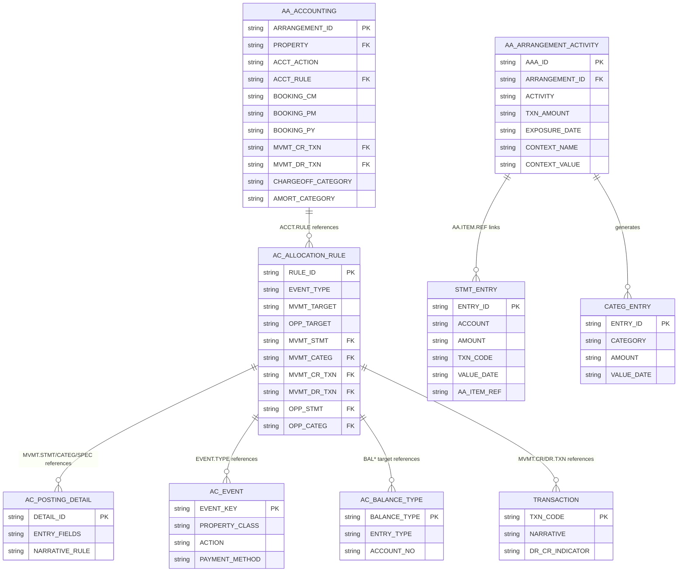
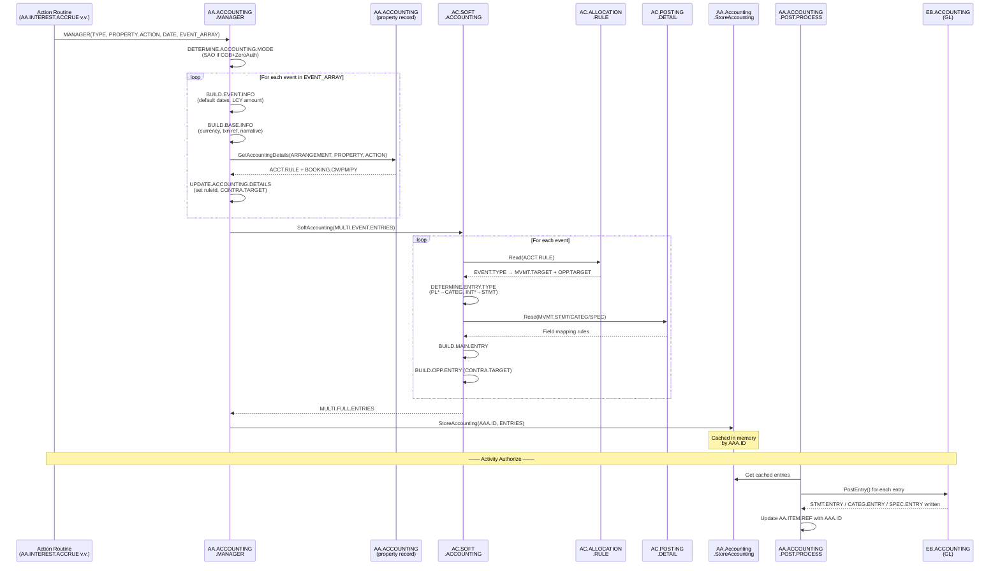
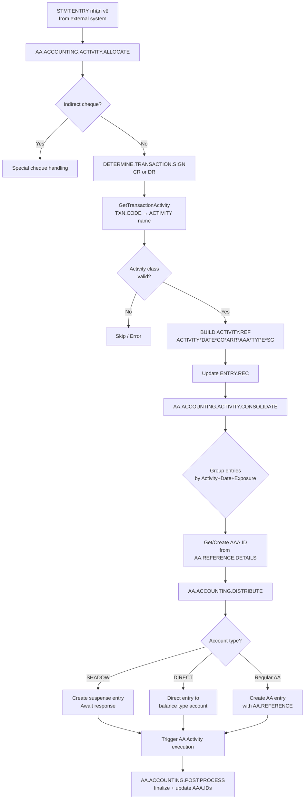
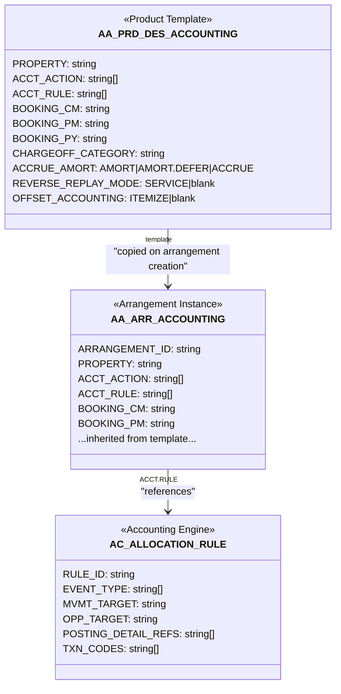

# Báo cáo: Luồng Soft Accounting trong AA (Arrangement Architecture)

> Phạm vi: từ thời điểm một activity được thực thi và phát sinh kế toán trên property, đến khi bút toán được đăng vào GL.  
> Nguồn: phân tích code nguồn tại `/T24.BP/`.

---

## Mục lục

1. [Tổng quan về Soft Accounting trong AA](#1-tổng-quan)
2. [Các bảng tham gia vào luồng](#2-các-bảng-tham-gia)
3. [Cấu trúc bảng AA.ACCOUNTING (property)](#3-bảng-aaaccounting)
4. [Cấu trúc bảng AC.ALLOCATION.RULE](#4-bảng-acallocationrule)
5. [Loại bút toán: STMT, CATEG, SPEC](#5-loại-bút-toán)
6. [Luồng xử lý chi tiết](#6-luồng-xử-lý-chi-tiết)
7. [Luồng ngược: entry từ bên ngoài → AA Activity](#7-luồng-ngược)
8. [Các chế độ đặc biệt](#8-các-chế-độ-đặc-biệt)
9. [Sơ đồ tổng thể](#9-sơ-đồ-tổng-thể)

---

## 1. Tổng quan

**Soft Accounting** trong T24 là cơ chế tự động sinh bút toán kế toán dựa trên rule cấu hình (AC.ALLOCATION.RULE) thay vì hard-code logic trong từng routine. Từ "soft" phân biệt với "hard accounting" (bút toán hard-code cho từng module cụ thể).

Trong khung AA, mỗi khi một activity được thực thi (ví dụ: tính lãi, thu phí, giải ngân, trả nợ), action routine tương ứng sẽ:

1. Tính toán số tiền phát sinh
2. Gọi `AA.ACCOUNTING.MANAGER` với thông tin tối thiểu (số tiền, loại action)
3. `AA.ACCOUNTING.MANAGER` tra cứu rule cấu hình và chuyển sang `AC.SOFT.ACCOUNTING`
4. `AC.SOFT.ACCOUNTING` sinh bút toán đầy đủ (main entry + opposite entry)
5. Bút toán được cache trong memory cho đến khi activity được authorize
6. Khi authorize: `EB.ACCOUNTING` đăng bút toán vào GL

**Hai chiều của soft accounting trong AA:**
- **Outbound** (AA → GL): Activity sinh bút toán → đăng vào GL
- **Inbound** (GL entry → AA): Một STMT.ENTRY đến từ hệ thống ngoài → map vào AA activity → trigger activity xử lý

---

## 2. Các bảng tham gia

### 2.1 Bảng cấu hình (setup tĩnh)

| Bảng | Loại | Mô tả |
|------|------|-------|
| `AA.ACCOUNTING` | H-file (property record) | Cấu hình accounting tại cấp arrangement: Property → Action → ACCT.RULE + PL categories. Template: `AA.PRD.DES.ACCOUNTING` |
| `AC.ALLOCATION.RULE` | H-file | Rule trung tâm: ánh xạ EVENT.TYPE → MVMT.TARGET + OPP.TARGET + transaction codes |
| `AC.POSTING.DETAIL` | H-file | Chi tiết posting rule cho từng loại entry (STMT/CATEG/SPEC): định nghĩa các trường sẽ được populate |
| `AC.EVENT` | H-file | Lookup danh sách event type hợp lệ. Key: `PROPERTY.CLASS*ACTION*PAYMENT.METHOD...` |
| `AC.BALANCE.TYPE` | H-file | Định nghĩa balance type: loại entry (STMT/CATEG/SPEC), account number mặc định |
| `TRANSACTION` | H-file | Mã transaction code (TXN code) cho STMT entry, xác định narrative/purpose |
| `RE.TXN.CODE` | H-file | Mã RE transaction code cho SPEC (contingent) entry |

### 2.2 Bảng giao dịch (dữ liệu runtime)

| Bảng | Loại | Mô tả |
|------|------|-------|
| `AA.ARRANGEMENT.ACTIVITY` | H-file | Record activity đang được xử lý, chứa context values, exposure date, TXN refs |
| `STMT.ENTRY` | Entry file | Bút toán sổ kế toán tài khoản (account statement), do EB.ACCOUNTING ghi |
| `CATEG.ENTRY` | Entry file | Bút toán P&L (profit & loss category), do EB.ACCOUNTING ghi |
| `SPEC.ENTRY` | Entry file | Bút toán off-balance / contingent, do EB.ACCOUNTING ghi |

### 2.3 Bảng AA hỗ trợ

| Bảng | Loại | Mô tả |
|------|------|-------|
| `AA.ACTIVITY.BALANCES` | L-file | Balance tổng hợp theo arrangement: due, accrued, paid per property |
| `AA.REFERENCE.DETAILS` | L-file | Index: account → AAA ID, dùng cho allocate/consolidate entries |
| `AA.ACCOUNT.MOVEMENT` | L-file | Tổng hợp movement trong ngày trên account của arrangement |

---

## 3. Bảng AA.ACCOUNTING (property)

`AA.ACCOUNTING` là một **property class** trong khung AA. Bản ghi tại cấp arrangement được lưu tại `AA.ARR.ACCOUNTING`; bản template tại Product Designer là `AA.PRD.DES.ACCOUNTING`.

### 3.1 Cấu trúc phân tầng

```
AA.ACCOUNTING record
│
├── [PROPERTY]         ← tên property (ví dụ: INTEREST-1, PERIODIC.FEE)
│   │
│   ├── [ACCT.ACTION]  ← loại action (BOOKING, ADJUST, MAKE.DUE, REPAY, PAY, WAIVING, CAPITALISE...)
│   │   │
│   │   └── [ACCT.RULE]       ← ID của AC.ALLOCATION.RULE
│   │
│   ├── BOOKING.CM            ← PL category / internal account — booking trong tháng hiện tại
│   ├── ADJUST.CM             ← PL category / internal account — điều chỉnh tháng hiện tại
│   ├── BOOKING.PM            ← PL category — booking tháng trước
│   ├── BOOKING.PY            ← PL category — booking năm trước
│   ├── NEG.BOOKING.CM/PM/PY  ← PL category khi số tiền âm
│   ├── INT.BOOKING.CM/PM/PY  ← PL category cho interest (tách riêng)
│   ├── INT.WAIVING.CM        ← PL category khi waive interest
│   ├── WAIVING.CM            ← PL category khi waive charge
│   ├── CHARGEOFF.CATEGORY    ← Internal account cho charge-off
│   ├── CHGOFF.SPECIAL.INCOME ← PL category cho special income khi charge-off
│   ├── AMORT.CATEGORY        ← Internal account cho fee amortization
│   ├── ACCRUE.AMORT          ← Loại amortization: AMORT / AMORT.DEFER / ACCRUE
│   ├── ACCRUE.PERIOD         ← Kỳ amortization
│   ├── MVMT.CR.TXN           ← TXN code cho credit STMT entry
│   ├── MVMT.DR.TXN           ← TXN code cho debit STMT entry
│   ├── MVMT.RE.CR            ← RE TXN code cho credit SPEC entry
│   └── MVMT.RE.DR            ← RE TXN code cho debit SPEC entry
│
├── [PROPERTY.CLASS]   ← tên property class (fallback nếu không tìm thấy theo PROPERTY)
│   ├── [PC.ACTION]
│   │   └── [PC.RULE]         ← ID của AC.ALLOCATION.RULE (class-level)
│   ├── PC.BOOKING.CM/PM/PY
│   ├── PC.MVMT.CR/DR.TXN
│   └── ... (tương tự PROPERTY level)
│
├── DEF.MVMT.CR.TXN    ← Default TXN code CR (áp dụng khi không có per-property)
├── DEF.MVMT.DR.TXN    ← Default TXN code DR
├── DEF.MVMT.RE.CR/DR  ← Default RE TXN codes
│
├── [PC.CONSOLIDATION] ← Property class để consolidate entries
│   └── PC.CONSOL.METHOD ← NET hoặc ITEMIZED
│
├── REVERSE.REPLAY.MODE ← SERVICE: replay trong SAO mode
├── ADJUSTMENT.OPTION   ← NEXT.CAP: đưa chênh lệch vào kỳ tiếp
├── ROUNDING.CATEG      ← Category để book chênh lệch làm tròn
└── OFFSET.ACCOUNTING   ← ITEMIZE: sinh thêm offset entry
```

**Lookup priority khi tìm ACCT.RULE:**
1. Tra cứu theo `PROPERTY` (tên property cụ thể, ví dụ: "INTEREST-1") + `ACCT.ACTION`
2. Nếu không tìm thấy → fallback sang `PROPERTY.CLASS` (ví dụ: "INTEREST") + `PC.ACTION`

---

## 4. Bảng AC.ALLOCATION.RULE

Đây là trái tim của soft accounting: một rule định nghĩa bút toán nào sẽ được sinh ra cho từng loại sự kiện kế toán.

### 4.1 Cấu trúc record

```
AC.ALLOCATION.RULE
│
├── RULE.ID              ← Key: mã rule (ví dụ: AA-INT-ACCRUE, AA-CHARGE-BOOKING)
├── DESCRIPTION
│
├── [EVENT.TYPE]         ← Multivalue: danh sách event type (key: PROPERTY.CLASS*ACTION*PAYMENT.METHOD)
│   ├── ENTRY.PRINT.MASK ← YES: mask (ẩn) các entry khớp main/opposite
│   │
│   ├── [MVMT.TARGET]    ← Main leg: balance type target
│   │   ├── MVMT.CR.TXN  ← TXN code khi credit
│   │   ├── MVMT.DR.TXN  ← TXN code khi debit
│   │   ├── MVMT.CR.RE.T ← RE TXN code khi credit (SPEC entry)
│   │   ├── MVMT.DR.RE.T ← RE TXN code khi debit (SPEC entry)
│   │   ├── MVMT.STMT    ← AC.POSTING.DETAIL rule cho STMT entry
│   │   ├── MVMT.CATEG   ← AC.POSTING.DETAIL rule cho CATEG entry
│   │   └── MVMT.SPEC    ← AC.POSTING.DETAIL rule cho SPEC entry
│   │
│   ├── [OPP.TARGET]     ← Opposite leg: balance type / PL category của bút toán đối ứng
│   │   ├── OPP.CR.TXN / OPP.DR.TXN
│   │   ├── OPP.CR.RE.T / OPP.DR.RE.T
│   │   ├── OPP.STMT / OPP.CATEG / OPP.SPEC
│   │   └── ...
│
├── DEF.CR.TXN           ← Default TXN code CR (toàn rule)
├── DEF.DR.TXN           ← Default TXN code DR
├── DEF.CR.RE.T / DEF.DR.RE.T ← Default RE TXN codes
└── LOCAL.REF            ← (NOINPUT) tham chiếu local
```

### 4.2 Định dạng MVMT.TARGET (quan trọng)

Tiền tố của `MVMT.TARGET` quyết định **loại entry** sẽ được sinh:

| Tiền tố | Ví dụ | Loại entry | Ý nghĩa |
|---------|-------|------------|---------|
| `PL*`   | `PL*40100` | CATEG.ENTRY | P&L account bằng local currency |
| `PLF*`  | `PLF*40100` | CATEG.ENTRY | P&L account bằng ngoại tệ |
| `INT*`  | `INT*BK001` | STMT.ENTRY  | Internal account bằng deal currency |
| `INTL*` | `INTL*BK001` | STMT.ENTRY | Internal account bằng local currency |
| `AC*`   | `AC*1234567` | STMT.ENTRY | Account number cụ thể |
| `TXN`   | `TXN` | (từ AC.BALANCE.TYPE) | Lấy entry type từ AC.BALANCE.TYPE |
| `BAL*`  | `BAL*ACCRUED` | (từ AC.BALANCE.TYPE) | Lấy entry type từ AC.BALANCE.TYPE đã chỉ định |

---

## 5. Loại bút toán

### 5.1 Ba loại entry trong T24 Soft Accounting

| Loại | File | Mô tả | Ví dụ dùng |
|------|------|-------|-----------|
| `STMT.ENTRY` | Account ledger | Bút toán trên tài khoản khách hàng hoặc internal account (NOSTRO). Ảnh hưởng số dư tài khoản. | Giải ngân vào TK khách hàng, ghi nhận lãi phải thu |
| `CATEG.ENTRY` | P&L ledger | Bút toán vào category P&L (thu nhập, chi phí). Ảnh hưởng lãi/lỗ. | Ghi nhận thu nhập lãi (interest income), dự phòng phí |
| `SPEC.ENTRY` | Off-balance sheet | Bút toán off-balance / contingent (RE system). | Cam kết ngoại bảng, dự phòng contingent |

### 5.2 Bút toán kép (double-entry)

Mỗi lần gọi soft accounting sinh **2 legs** cân bằng:
- **Main entry (MVMT.TARGET)**: ghi vào tài khoản/category chính
- **Opposite entry (OPP.TARGET)**: ghi vào tài khoản/category đối ứng

**Ví dụ: Accrual lãi hàng ngày**
```
MVMT.TARGET = PL*40100 (Interest Income PL category)  → CATEG.ENTRY DR 1,000
OPP.TARGET  = INT*BK999 (Interest Receivable internal) → STMT.ENTRY  CR 1,000
```

**Ví dụ: Thu lãi (booking)**
```
MVMT.TARGET = INT*BK999 (Interest Receivable)  → STMT.ENTRY  DR 1,000
OPP.TARGET  = AC*CUST001 (Customer account)    → STMT.ENTRY  CR 1,000
```

---

## 6. Luồng xử lý chi tiết

### 6.1 Các routine tham gia (outbound direction)

| Routine | Vai trò |
|---------|---------|
| `AA.ACCOUNTING.MANAGER` | Orchestrator: nhận event array từ action routine, orchestrate toàn bộ quá trình |
| `AC.SOFT.ACCOUNTING` | Core processor: đọc AC.ALLOCATION.RULE, sinh bút toán đầy đủ |
| `AA.Accounting.GetAccountingDetails` | Tra cứu bảng AA.ACCOUNTING để lấy ACCT.RULE và PL categories |
| `AA.Accounting.StoreAccounting` | Cache entries vào memory trong context của AAA đang xử lý |
| `AA.ACCOUNTING.POST.PROCESS` | Sau khi authorize: gọi EB.ACCOUNTING để đăng entries vào GL |

### 6.2 Tham số của AA.ACCOUNTING.MANAGER

```
AA.ACCOUNTING.MANAGER(TYPE, ACCT.PROPERTY, ACCT.ACTION, ACCT.DATE, ACCT.EVENT.ARRAY, RET.ERROR)
```

| Tham số | Bắt buộc | Giá trị mẫu | Ý nghĩa |
|---------|----------|-------------|---------|
| `TYPE` | Bắt buộc | `VAL`, `CHG`, `REV`, `COB`, `SAO`, `AUT` | Loại xử lý. `VAL`=input, `AUT`=authorize, `REV`=reverse, `COB`=batch |
| `ACCT.PROPERTY` | Tùy chọn | `INTEREST-1`, `PERIODIC.FEE-1` | Tên property phát sinh kế toán. Default: property hiện tại từ context |
| `ACCT.ACTION` | Tùy chọn | `BOOKING`, `ADJUST`, `MAKE.DUE`, `REPAY` | Action kế toán. Default: action hiện tại từ context |
| `ACCT.DATE` | Tùy chọn | `20240115` | Ngày hiệu lực. Default: effective date của activity |
| `ACCT.EVENT.ARRAY` | Bắt buộc | Array (xem bên dưới) | Thông tin event tối thiểu, **AMOUNT bắt buộc** |

**Cấu trúc ACCT.EVENT.ARRAY** (mỗi phần tử là một event):

| Field position | Tên (AC.SoftAccounting.E_*) | Bắt buộc | Mô tả |
|----------------|----------------------------|----------|-------|
| E_amount | Amount | **Bắt buộc** | Số tiền sự kiện |
| E_sign | Sign | Bắt buộc | Dấu (+/-) của amount |
| E_amountLcy | AmountLcy | Tùy chọn | Số tiền local currency |
| E_exchrate | Exchrate | Tùy chọn | Tỷ giá |
| E_eventType | EventType | Tùy chọn | Event type string |
| E_valueDate | ValueDate | Tùy chọn | Ngày hiệu lực (default: activity effective date) |
| E_bookingDate | BookingDate | Tùy chọn | Ngày booking (default: TODAY) |
| E_exposureDate | ExposureDate | Tùy chọn | Ngày exposure date (cho CRF) |
| E_contractId | ContractId | Tùy chọn | Account number hoặc PL category |
| E_contraTarget | ContraTarget | Tùy chọn | Override contra account |
| E_directAcct | DirectAcct | Tùy chọn | Flag: direct accounting (không qua suspense) |
| E_balSubType | BalSubType | Tùy chọn | Balance sub-type |

### 6.3 Chi tiết từng bước xử lý

```
ACTION ROUTINE
(AA.INTEREST.ACCRUE, AA.PERIODIC.CHARGES.ACCRUE, v.v.)
        │
        │ gọi AA.ACCOUNTING.MANAGER(TYPE, PROPERTY, ACTION, DATE, EVENT_ARRAY)
        ▼
┌─────────────────────────────────────────────────────────────┐
│              AA.ACCOUNTING.MANAGER                          │
│                                                             │
│  1. INITIALISE                                              │
│     - Lấy AAA.ID, ARRANGEMENT.ID từ common                 │
│     - Lấy COB.PROCESS flag, ZERO.AUTH flag                  │
│                                                             │
│  2. CHECK.ARGUMENTS                                         │
│     - Nếu ACCT.PROPERTY trống → lấy từ AF.Framework        │
│     - Nếu ACCT.ACTION trống → lấy current action           │
│     - Kiểm tra nếu property class = INTEREST và MEMO.ONLY   │
│                                                             │
│  3. DETERMINE.ACCOUNTING.MODE                               │
│     - Nếu COB.PROCESS=1 AND ZERO.AUTH=1:                    │
│       * TYPE=AUT → bỏ qua (đã raise lúc input)             │
│       * Khác → ACCT.MODE = "SAO"                           │
│                                                             │
│  4. PROCESS.ACCOUNTING (nếu DO.ACCOUNTING=1)               │
│     ├─ TYPE in VAL/CHG/REV/COB/SAO/ADD → BUILD.ENTRIES     │
│     └─ TYPE in DEL/AUT → bỏ qua                            │
│                                                             │
│  BUILD.ENTRIES: vòng lặp qua ACCT.EVENT.ARRAY              │
│  ┌─────────────────────────────────────────────────────┐   │
│  │ For each event:                                     │   │
│  │                                                     │   │
│  │ a) CHECK.EVENT.INFO                                 │   │
│  │    - Amount và Sign bắt buộc                        │   │
│  │    - Nếu numeric account: chỉ xử lý khi real acct  │   │
│  │    - off-balance account → PROCESS.ENTRY = 0       │   │
│  │                                                     │   │
│  │ b) BUILD.EVENT.INFO                                 │   │
│  │    - Default VALUE.DATE = activity effective date   │   │
│  │    - Tính LCY amount qua mid-rate nếu ngoại tệ     │   │
│  │    - Default BOOKING.DATE = TODAY                   │   │
│  │    - Set EXPOSURE.DATE từ AAA record                │   │
│  │                                                     │   │
│  │ c) BUILD.BASE.INFO                                  │   │
│  │    - EVENT.CCY = arrangement currency               │   │
│  │    - TRANSACTION.ID = AAA.ID (arrangement activity) │   │
│  │    - TRANSACTION.SYS.ID = "AAAA"                   │   │
│  │    - CONTRACT.ID = linked account                   │   │
│  │    - Narrative từ AA.Accounting.GetNarrative()      │   │
│  │    - Variable names: ARRANGEMENT.ACTIVITY, ACTIVITY │   │
│  │      PROPERTY, PROPERTY.ID, MASTER.AAA              │   │
│  │    - Context values: PARENT.TXN.ID, PROCESSING.DATE │   │
│  │                                                     │   │
│  │ d) GET.ACCOUNTING.DETAILS                           │   │
│  │    → gọi AA.Accounting.GetAccountingDetails()       │   │
│  │    → đọc AA.ACCOUNTING record                       │   │
│  │    → lookup: PROPERTY → ACCT.ACTION → ACCT.RULE    │   │
│  │    → fallback: PROPERTY.CLASS → PC.ACTION → PC.RULE│   │
│  │                                                     │   │
│  │ e) UPDATE.ACCOUNTING.DETAILS                        │   │
│  │    - Set E_ruleId = ACCT.RULE (key của allocation rule)│ │
│  │    - Xác định CONTRA.TARGET (PL category):          │   │
│  │      * CM → BOOKING.CM / NEG.BOOKING.CM             │   │
│  │      * PM → BOOKING.PM / NEG.BOOKING.PM             │   │
│  │      * PY → BOOKING.PY / NEG.BOOKING.PY             │   │
│  │      * INT.CM/PM/PY → INT.BOOKING.*                 │   │
│  │      * WAIVING.CM → WAIVING.CM/INT.WAIVING.CM       │   │
│  │    - Set E_bookingCompany từ ACCOUNTING record       │   │
│  │                                                     │   │
│  │ f) ADD.ENTRIES → append vào MULTI.EVENT.ENTRIES     │   │
│  └─────────────────────────────────────────────────────┘   │
│                                                             │
│  5. CALL.SOFT.ACCOUNTING                                   │
│     → AC.SoftAccounting.SoftAccounting(                    │
│          MULTI.EVENT.ENTRIES, MULTI.FULL.ENTRIES, ERROR)   │
│                                                             │
│  6. UPDATE.LOCAL.REF                                        │
│     - Lấy context values từ AAA cho "ACCOUNTING.LRF:n"     │
│     - Ghi vào LOCAL.REF field của mỗi entry                │
│                                                             │
│  7. UPDATE.OUR.REFERENCE                                    │
│     - Lấy OUR.REFERENCE từ master activity context         │
│                                                             │
│  8. CALL.ACCOUNTING → AA.Accounting.StoreAccounting()      │
│     - Cache MULTI.FULL.ENTRIES vào memory (theo AAA.ID)     │
│     - ACCT.TYPE = VAL (nếu COB) hoặc SAO (nếu batch mode) │
│                                                             │
│  9. UPDATE.LOG (debug logging)                              │
└─────────────────────────────────────────────────────────────┘
        │
        │ gọi AC.SoftAccounting.SoftAccounting()
        ▼
┌─────────────────────────────────────────────────────────────┐
│              AC.SOFT.ACCOUNTING (1415 dòng)                 │
│                                                             │
│  PROCESS.EVENTS: vòng lặp qua MULTI.EVENT.ENTRIES          │
│  ┌─────────────────────────────────────────────────────┐   │
│  │ For each event:                                     │   │
│  │                                                     │   │
│  │ a) GET.CONTRACT                                     │   │
│  │    - Đọc contract/account record                    │   │
│  │    - Lấy thông tin account type, currency           │   │
│  │                                                     │   │
│  │ b) GET.ACCOUNTING.RULE                              │   │
│  │    → đọc AC.ALLOCATION.RULE theo E_ruleId           │   │
│  │    → LOCATE EVENT.TYPE trong ArEventType array      │   │
│  │    → Xác định MVMT.TARGET (main leg) và OPP.TARGET  │   │
│  │                                                     │   │
│  │ c) GET.BALANCE.TYPE                                 │   │
│  │    → nếu MVMT.TARGET bắt đầu "BAL*" hoặc "TXN"     │   │
│  │    → đọc AC.BALANCE.TYPE để lấy entry type          │   │
│  │                                                     │   │
│  │ d) DETERMINE.ENTRY.TYPE                             │   │
│  │    PL* / PLF* → CATEG                               │   │
│  │    INT* / INTL* / AC* → STMT                        │   │
│  │    TXN / BAL* → từ AC.BALANCE.TYPE                  │   │
│  │                                                     │   │
│  │ e) GET.MVMT.DETAIL.RULE                             │   │
│  │    → đọc AC.POSTING.DETAIL (ArMvmtStmt/Categ/Spec)  │   │
│  │    → định nghĩa cách map các fields vào entry        │   │
│  │                                                     │   │
│  │ f) SET.TXN.CODE                                     │   │
│  │    Ưu tiên: override từ AA.ACCOUNTING > ALLOCATION.RULE│ │
│  │    CR/DR TXN code, RE TXN code                      │   │
│  │                                                     │   │
│  │ g) BUILD.MAIN.ENTRY                                 │   │
│  │    - Sinh entry cho MVMT.TARGET                     │   │
│  │    - Set: account/category, amount, date, txn code  │   │
│  │    - Map các variable names → values (narrative)    │   │
│  │                                                     │   │
│  │ h) BUILD.OPP.ENTRY (đối ứng)                        │   │
│  │    - OPP.TARGET = CONTRA.TARGET từ AA.ACCOUNTING    │   │
│  │      (BOOKING.CM/PM/PY) hoặc từ ALLOCATION.RULE     │   │
│  │    - Sinh entry đối ứng (ngược dấu)                 │   │
│  │                                                     │   │
│  │ i) UPDATE.TRACE (debug)                             │   │
│  └─────────────────────────────────────────────────────┘   │
│                                                             │
│  → Trả về MULTI.FULL.ENTRIES (array các entry đầy đủ)      │
└─────────────────────────────────────────────────────────────┘
        │
        │ StoreAccounting() cache entries
        ▼
┌────────────────────────────────────────────────────────────┐
│        Khi Activity được AUTHORIZE                         │
│                                                            │
│  AA.ACCOUNTING.POST.PROCESS                                │
│  ├─ Lấy cached entries từ memory (theo AAA.ID)             │
│  ├─ Update AA.ITEM.REF với AAA ID                          │
│  └─ Gọi EB.ACCOUNTING.PostEntry() cho mỗi entry           │
│       ├─ STMT.ENTRY → ghi vào account ledger               │
│       ├─ CATEG.ENTRY → ghi vào P&L category               │
│       └─ SPEC.ENTRY → ghi vào off-balance sheet            │
└────────────────────────────────────────────────────────────┘
```

---

## 7. Luồng ngược: Entry từ ngoài → AA Activity

Khi một entry STMT.ENTRY đến từ hệ thống ngoài (ví dụ: trả nợ qua ngân hàng, SWIFT credit):

### 7.1 AA.ACCOUNTING.ACTIVITY.ALLOCATE

```
STMT.ENTRY nhận về
    │
    ▼
AA.ACCOUNTING.ACTIVITY.ALLOCATE
├─ Lấy TXN.CODE, SYSTEM.ID từ STMT.ENTRY
├─ CHECK.INDIRECT.CHEQUE (có phải séc gián tiếp không)
├─ DETERMINE.ACTIVITIES
│   ├─ DETERMINE.TRANSACTION.SIGN (CR/DR → xác định chiều)
│   ├─ GetTransactionActivity(TXN.CODE) → tìm ACTIVITY tương ứng
│   └─ Validate ACTIVITY.CLASS có flag DIRECT.ACCOUNTING hoặc DDA
├─ UPDATE.ENTRY
│   └─ ENTRY.REC<SteAaItemRef> = ACTIVITY.REF
│      Format: "ACTIVITY*DATE*COMPANY*ARRANGEMENT.ID*AAA.ID*ACCT.TYPE*SERVICE.GROUP"
└─ CONSOLIDATE.ACTIVITIES → AA.ACCOUNTING.ACTIVITY.CONSOLIDATE
```

### 7.2 AA.ACCOUNTING.ACTIVITY.CONSOLIDATE

```
├─ Group entries theo: ACTIVITY + VALUE.DATE + EXPOSURE.DATE
├─ Kiểm tra có cần tạo AAA mới không (vs. update existing)
├─ Lấy AAA.ID từ AA.REFERENCE.DETAILS nếu là linked activity
├─ Maintain AA$ACTIVITY.DETAILS array (common block)
├─ Xử lý reversal (đảo lại), sweeping, payment stops
└─ → Trigger activity execution với tổng số tiền consolidated
```

### 7.3 AA.ACCOUNTING.DISTRIBUTE

```
Xác định cách post vào AA account:
│
├─ Nếu account có ArrangementId:
│   ├─ SHADOW mode → tạo suspense entry (AA không trực tiếp nhận)
│   ├─ DIRECT mode → tạo entry trực tiếp với balance type
│   └─ Regular AA → tạo entry với AA reference
│
└─ CREATE.NEW.ENTRY
    ├─ TECHNICAL.LOAN entries (cho master arrangement)
    ├─ Set balance type, account officer, department code
    └─ Update AA.ITEM.REF với AA.REFERENCE
```

---

## 8. Các chế độ đặc biệt

### 8.1 SAO Mode (Synchronous Accounting Override)

Kích hoạt khi: `COB.PROCESS = 1 AND ZERO.AUTH = 1` (batch + zero authorization)

- Accounting được raise trong lúc **input** (không đợi authorize)
- Lúc authorize: bỏ qua (đã done)
- Tránh double-posting trong COB

```
TYPE=VAL → ACCT.MODE = "SAO" → StoreAccounting type = "SAO"
TYPE=AUT → DO.ACCOUNTING = 0 (skip)
```

### 8.2 Direct Accounting

Khi activity có flag `DIRECT.ACCOUNTING = YES` trong AA.ACTIVITY.CLASS:

- Entry đi thẳng vào settlement account (CT/CS/SA/TR accounts)
- Không qua suspense
- `E_directAcct` field được set
- `AA.ACCOUNTING.DISTRIBUTE` route entry theo direct path

Logic kiểm tra trong `PROCESS.DIRECT.ACCOUNTING`:
- Nếu `SECONDARY.TYPE = NO.SECONDARY` → không raise accounting
- Nếu master activity là SETTLE-SETTLEMENT → không raise accounting (đã raise bởi settle)
- Ngược lại → `RAISE.ACCOUNTING = 1`

### 8.3 MEMO.ONLY Property

Khi Interest property có type `MEMO.ONLY`:
- `CONTRA.TARGET = ""` (không sinh entry đối ứng)
- Chỉ ghi nhận số tiền trong balance, không post vào GL

### 8.4 Consolidation Methods

Cấu hình trong `AA.ACCOUNTING`:
- `PC.CONSOL.METHOD = NET`: gộp nhiều entries cùng property class thành 1 entry
- `PC.CONSOL.METHOD = ITEMIZED`: giữ từng entry riêng biệt
- `OFFSET.ACCOUNTING = ITEMIZE`: sinh thêm offset entry cho mỗi itemized movement

---

## 9. Sơ đồ tổng thể

### 9.1 Kiến trúc bảng (ER Diagram)



### 9.2 Luồng outbound: Activity → GL (Sequence Diagram)



### 9.3 Luồng inbound: External Entry → AA Activity (Flowchart)



### 9.4 Cấu trúc AA.ACCOUNTING tại product designer (sơ đồ)



---

## Tóm tắt Lookup Flow

Khi một action routine muốn ghi nhận kế toán, hệ thống thực hiện **4 lần tra bảng**:

```
1. AA.ACCOUNTING (property record)
   └─ Input: ARRANGEMENT.ID + PROPERTY + ACCT.ACTION
   └─ Output: ACCT.RULE (key vào bước 2) + CONTRA.TARGET (PL category)

2. AC.ALLOCATION.RULE
   └─ Input: ACCT.RULE + EVENT.TYPE
   └─ Output: MVMT.TARGET (loại entry chính) + OPP.TARGET + TXN codes
              + MVMT.STMT/CATEG/SPEC (key vào bước 3)

3. AC.POSTING.DETAIL
   └─ Input: MVMT.STMT hoặc MVMT.CATEG hoặc MVMT.SPEC
   └─ Output: Field mapping rules (cách populate các trường của entry)

4. TRANSACTION / RE.TXN.CODE
   └─ Input: MVMT.CR.TXN / MVMT.DR.TXN từ bước 2
   └─ Output: Narrative, DR/CR indicator cho STMT entry
```

Từ 4 lần tra bảng này, hệ thống tạo ra 2 bút toán cân bằng (**main + opposite**) và đăng vào GL khi activity được authorize.
